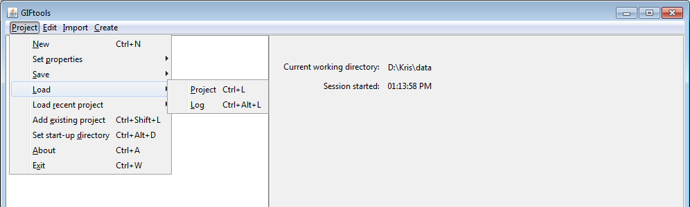

.. _projLoad:

.. include:: <isonum.txt>

Load an existing project
========================

To load an existing project, use the menu structure below. You will be asked to if you want to discard your changes (even if you have just saved). Select **Yes** and the project will load and update, if necessary.

**Project** |rarr| **Load** |rarr| **Project**

**NOTE:** The shortcut for the functionality is ``control + L`` (lower case).

