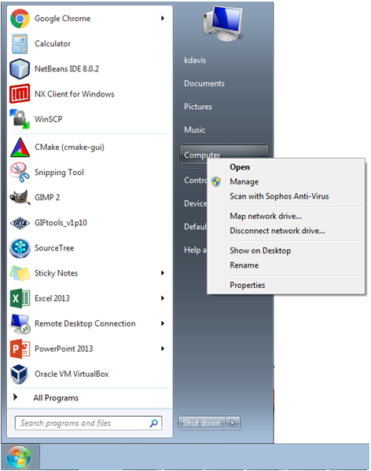

.. _set_properties:

.. include:: <isonum.txt>

Properties
==========

Properties allows the user to manage certain aspects of the GIFtools program and how it interacts with your computer. Under properties, the user may:

  - :ref:`Set the project's working directory <projSetWorkdir>`
  - :ref:`Set the start-up directory for GIFtools <projsetStartDir>`
  - :ref:`Set the number of threads to run an inversion <setOMPthreads>`
  - :ref:`Project auto-save functionality <projAutoSave>`
  - :ref:`HDF5 Options <projHDF5opts>`

**NOTE:** Setting the working directory at the start of a new project is strongly advised, as it will make files relevant to the project easy to find. Although the auto-save time is set to a default value (5 min), you may wish to change it when starting a new project

.. _projSetWorkDir:

Set the project's working directory
-----------------------------------

The project's working directory tells GIFtools where to output files general files and where to begin choosing files in the directory. Other working directories (e.g., folders, inversions, etc.) are saved as a relative path the project directory so that everything can be reproduced on multiple computers. To change the project's working directory use the menu:

**Project** |rarr| **Set properties** |rarr| **Set working directory**

**NOTE:** The shortcut for the functionality is ``control + shift + d``.

.. _projsetStartDir:

Set the start-up directory for GIFtools
---------------------------------------

By default, GIFtools starts with the working directory where the executable is located. Users may change this directory by using the menu below. GIFtools will then begin in the start-up directory when the executable starts.

**Project** |rarr| **Set start-up directory**

.. figure:: ../../../images/projectMenu.png
    :align: center
    :scale: 50%

**NOTE:** The shortcut for the functionality is ``control + alt + d``.

.. _setOMPthreads:

Set the number of threads to run an inversion
---------------------------------------------

GIF inversion programs use OpenMP to parallelize matrix-vector multiplication and sensitivity calculations in linear inversions. GIFtools allows the user to change the number of OpenMP threads so the inversions do not slow down the CPU. Use the menu structure:

**Project** |rarr| **Set properties** |rarr| **Set openMP threads for Fortran codes**

**NOTE 1:** The shortcut for the functionality is ``control + shift + d``.

**NOTE 2:** GIFtools will only find out the number of *cores* the CPU is operating on and not the actual threads. If you would like to manage the number of threads the inversions use, the environment variable ``OMP_NUM_THREADS`` will need to be set (see below).

Setting environment variable for OpenMP threads (optional)
^^^^^^^^^^^^^^^^^^^^^^^^^^^^^^^^^^^^^^^^^^^^^^^^^^^^^^^^^^

To set the maximum number of OpenMP threads, an environment variable will need to be established. Follow these steps:

1. Click on the windows menu and then *right-click* on **Computer** and click on **Properties**

2. Click on **Advanced System Settings** to get the the window below.

3. Click on **Environment variables** and then create a new variable (or edit if the variable ``OMP_NUM_THREADS`` exists) by clicking **new**:

4. Click **OK** then **Apply** and exit. Re-start GIFtools and the number of threads will appear.

**NOTE:** If you are unsure how many threads the computer has there are two ways of finding out:

#. Run a GIF program such as PFWEIGHT or MAGINV3D. The program will tell you how many threads it uses without by just bringing up a command prompt (``shift + right-click + open command window here``). The program will have to be pathed or perform this task in the parental directory of GIFtools.

#. Open Windows task manager (``right-click`` on bottom task bar then ``Start task manager``) and go to **Performance**. Count the number of windows in CPU Usage History (below is an example of 12):

.. _projAutoSave:

Project auto-save functionality
-------------------------------

GIFtools will auto-save a *copy* of the project. The feature is helpful in case something was deleted, for some reason the program crashed, or you forgot to save the project before quitting GIFtools. The auto-save copy is called "GIFtoolsAutoSave.mat" and is located in the ``\Windows\Users\yourUserName`` (i.e., home) folder. Please note that the **current project file is not touched** when auto saving and that the auto-save project will be *over-written* each time this function is called. The project can be saved in its normal location by using the :ref:`Save project <projSave>` feature. The user may select the amount of passing time (in minutes) between auto saves. To set this time, use the menu structure below:

- **Project** |rarr| **Set properties** |rarr| **Set time between auto save**

**NOTE 1:** The shortcut for saving a project is ``control + shift + t``.

**NOTE 2:** The counter for auto save automatically re-sets after a project has been saved. The user can see the last time an auto save occurred in the information panel by clicking on the project in the tree.

.. _projHDF5opts:

HDF5 file options
-----------------

GIFtools projects are stored in compressed HDF5 file format. Two basics options are available to the user

- **Change compression**: Allow to set the level of compression used by HDF5 [default 8]
- **Select project H5 file**: Option to pull data from a specific file *H5* file.

