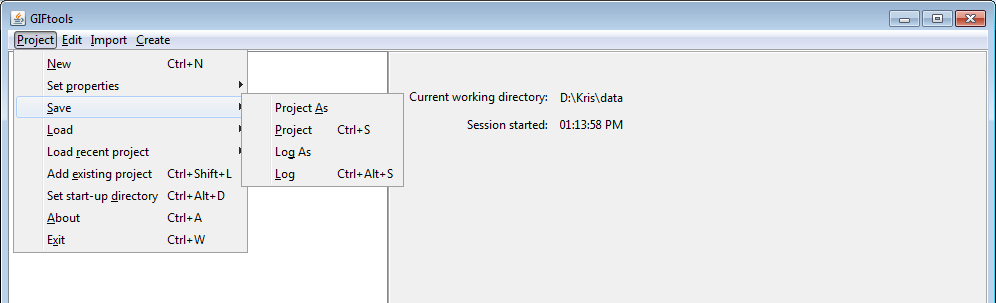

.. _projSave:

.. include:: <isonum.txt>

Save the project
================

To save your project, use the menu structure below. The "Save-as" will save the project under the new name.

- **Project** |rarr| **Save** |rarr| **Project**
- **Project** |rarr| **Save** |rarr| **Project As**

**NOTE:** The shortcut for saving a project is ``control + s``.

