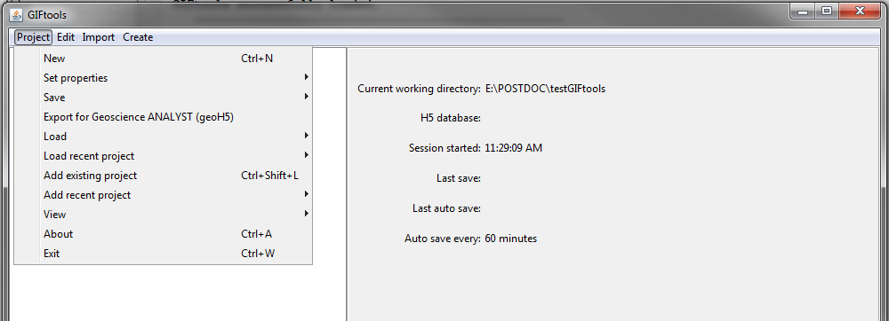

.. _projView:

.. include:: <isonum.txt>

View
====

To open your current working directory, collapse all folders within GIF project or expand all folders within GIF project, use the menu structure below.

- **Project** |rarr| **View** |rarr| **View working directory**
- **Project** |rarr| **View** |rarr| **Collapse all folders**
- **Project** |rarr| **View** |rarr| **Expand all folders**

