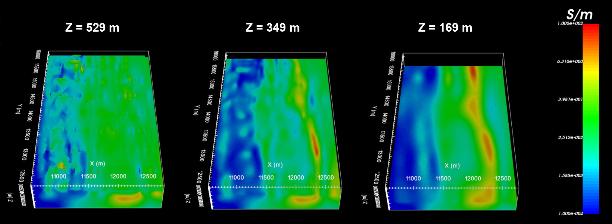

.. _comprehensive_workflow_dcip_10:

.. include:: <isonum.txt>

DC OcTree Inversion using Weights and Reference Models
======================================================

The final inversion result depends strongly on the regularization parameters, reference/starting model and on the weighting provided. Here, we

    - invert the data for several cases
    - discuss the choice in input parameters, models and weightings for each inversion, and
    - compare the inversion results

.. _comprehensive_workflow_dcip_10_smoothest:

Smoothest Inversion with Near-Surface Interface Weights
-------------------------------------------------------

The parameters chosen for this inversion approach are meant to recover a model that is constrained by the data, not constrained by any a-priori information, and limits near-surface artifacts with near-surface lateral smoothing.

Discussion of Parameters
^^^^^^^^^^^^^^^^^^^^^^^^

.. figure:: images/edit_options_dcinv_smoothest.png
    :align: center
    :width: 700

    Parameters used to invert for the smoothest model using interface weights.

**Beta cooling schedule:** The custom cooling schedule was determined by using *Default* for cursory inversion. We determined the range of beta values in which the inversion started to converge and used it for subsequent inversions.

**Weighting constants (alpha S, E, N, Z):** To recover the smoothest model, we set *alpha S* = 1e-6 (or something else very small). By doing this, the contribution of the :ref:`smallness term in the model objective function <modelObjectiveFunction>` becomes negligible. By setting *alpha E* = 0.5, *alpha N* = 8 and *alpha Z* = 1, we wanted the recovered model to be very smooth in the NS direction and somewhat less smooth in the EW direction. Our goal for the smoothness was to smooth out artifacts associated with EW survey lines and to recover geological structures that trended NS (known at the survey site).

**Initial and reference models:** Based on the range of apparent resistivities observe in the data, a reference and starting model of 0.01 S/m was chosen.

**Role of mref in model objective function:** Since *alpha S* is extremely small, the smallness term is negligible. However, by choosing *Update reference model throughout*, the inversion will replace the reference model with the current model for each new beta value. And by setting *SMOOTH_MOD_DIF*, the inversion will attempt to preserve the derivatives (interfaces and smooth areas) that are evolving over the course of the inversion.

**Interface weights:** Earlier attempts to invert the data used larger interfaces weights and more layers, however the inversion struggled to reach target misfit in this case. It was thought that by applying very large interface weights, we were not able to recover near-surface inhomogeneities that exist in the true conductivity model.

Discussion of Results
^^^^^^^^^^^^^^^^^^^^^

The conductivity model recovered at the 9th iteration is shown below at 3 depths. According to the recovered model:

    - We can see some near-surface inhomogeneity but it is not highly pixelated. Since the inversion would not converge when large interface weights were applied, we have likely applies reasonable interface weighting for this problem.
    - There is a large NS conductor between X = 12,000 m and 12,500.
    - There is a large resistive unit West of X = 11,500 m
    - The electrical resistivities lie within the range of apparent resistivities observed and lie within the known range of electrical resistivities for these units.

Without a-priori information, the inversion was able to produce a model which adequately recovers the expected conductive and resistive structures.

    Recovered model at iteration 9.

.. _comprehensive_workflow_dcip_10_smoothest_sens:

Smoothest Inversion with Sensitivity Weights
--------------------------------------------

The parameters chosen for this inversion approach are meant to recover a model that is constrained by the data, not constrained by any a-priori information, and limits sensitivity-based artifacts through sensitivity weighting.

Discussion of Parameters
^^^^^^^^^^^^^^^^^^^^^^^^

.. figure:: images/edit_options_dcinv_smoothest_sens.png
    :align: center
    :width: 700

    Parameters used to invert for the smoothest model using sensitivity weighting.

**Beta cooling schedule:** The custom cooling schedule was determined by using *Default* for cursory inversion. We determined the range of beta values in which the inversion started to converge and used it for subsequent inversions.

**Weighting constants (alpha S, E, N, Z):** To recover the smoothest model, we set *alpha S* = 1e-6 (or something else very small). By doing this, the contribution of the :ref:`smallness term in the model objective function <modelObjectiveFunction>` becomes negligible. By setting *alpha E* = 0.5, *alpha N* = 8 and *alpha Z* = 1, we wanted the recovered model to be very smooth in the NS direction and somewhat less smooth in the EW direction. Our goal for the smoothness was to smooth out artifacts associated with EW survey lines and to recover geological structures that trended NS (known at the survey site).

**Initial and reference models:** Based on the range of apparent resistivities observe in the data, a reference and starting model of 0.01 S/m was chosen.

**Role of mref in model objective function:** Since *alpha S* is extremely small, the smallness term is negligible. However, by choosing *Update reference model throughout*, the inversion will replace the reference model with the current model for each new beta value. And by setting *SMOOTH_MOD_DIF*, the inversion will attempt to preserve the derivatives (interfaces and smooth areas) that are evolving over the course of the inversion.

**Sensitivity weights:** Earlier attempts to invert the data used a smaller truncation value so that we had very large cell weights in the region of high sensitivity. However we found that large sensitivity weights forced near-surface conductive structures to collect in the space between surface lines.

Discussion of Results
^^^^^^^^^^^^^^^^^^^^^

The conductivity model recovered at the 9th iteration is shown below at 3 depths. According to the recovered model:

    - The near-surface shows much more prominent near-surface artifacts than the previous inversion.
    - Here the sensitivity weighting was not high enough to push conductive structures to their correct depth, but was high enough to push conductive structures laterally away from the electrodes. 
    - There is a large NS conductor between X = 12,000 m and 12,500 but it is clustered significantly nearer to the surface.
    - There is a large resistive unit West of X = 11,500 m that is recovered fairly well.
    - The electrical resistivities lie within the range of apparent resistivities observed and lie within the known range of electrical resistivities for these units.

Without a-priori information, the inversion was able to generally reproduce the features of the previous inversion. However, the sensitivity weights applied were not able to mitigate near-surface artifacts are successfully as the near-surface interface weighting. The inversion result also clusters conductors too near to the surface. We have less confidence in this results, and attempts to invert IP data will likely produce and incorrect chargeability model.

.. figure:: images/model_dcinv_smoothest_sens_iter9.png
    :align: center
    :width: 700

    Recovered model at iteration 9.

.. _comprehensive_workflow_dcip_10_mref:

Inversion Constrained by Reference Model
----------------------------------------

The parameters chosen for this inversion approach are meant to recover a model that is constrained by a-priori information in the form of a reference model but also explains the data sufficiently.

Discussion of Parameters
^^^^^^^^^^^^^^^^^^^^^^^^

    Parameters used to constrain the inversion with the reference model.

**Beta cooling schedule:** The custom cooling schedule was determined by using *Default* for cursory inversion. We determined the range of beta values in which the inversion started to converge and used it for subsequent inversions.

**Weighting constants (alpha S, E, N, Z):** Where *dh* is the cell dimension, and assuming *alpha E = alpha N = alpha Z = 1*, the impact of the smallness and smoothness on the model objective function is thought to be somewhat balanced when *alpha S* :math:`\sim \; 1/dh^2`. Here we set *alpha S* = 0.001 to balance the smallness and smoothness. We let *alpha N* = 4 to encourage smoothness in the NS direction.

**Initial and reference models:** Here we use the :ref:`OcTree model <comprehensive_workflow_dcip_8_mref>` that was interpolated from the batch 2D inversion results.

**Role of mref in model objective function:** Here we use *SMOOTH_MOD*. This implies we want to preserve structures in the reference model but NOT the gradients. Our thought was that the 2D inversion result generally placed anomalous structures in the correct areas. However, the exact dimensions and locations were distorted due to interpolation and 3D effects. We attempt to reduce this distortion by *Updating reference model throughout*.

**Interface weights:** Since the interface weights worked well for the :ref:`smoothest inversion with interface weights <comprehensive_workflow_dcip_10_smoothest>` , we used the same interface weights here to reduce near-surface artifacts.

Discussion of Results
^^^^^^^^^^^^^^^^^^^^^

The conductivity model recovered at the 10th iteration is shown below at 3 depths. According to the recovered model:

    - We can see some modest artifacts due to the reference model but in general this results matches that of the smoothest inversion with interface weights.
    - There is a large NS conductor between X = 12,000 m and 12,500.
    - There is a large resistive unit West of X = 11,500 m
    - With less emphasis on NS smoothing, it is more likely that we can recover the NS margins of anomalous features using the reference model.

With a reference model, the inversion was able to produce a model which has more well-defined margins for each unit; whereas the smoothest inversion does not.

.. figure:: images/model_dcinv_mref_iter10.png
    :align: center
    :width: 700

    Recovered model at iteration 10.

Largest Conductor for Each Inversion
------------------------------------

Here, we plot the reference model and recovered models for a cutoff of :math:`\sigma` > 1 S/m. We notice 2 important things here:

    1. That unlike the reference model and other inversions, the inversion with sensitivity weights clusters the conductor much nearer to the surface.
    2. Large conductive structures observed in the Western portion of the reference model are not reproduced by any of the inversion results and are likely artifacts.

