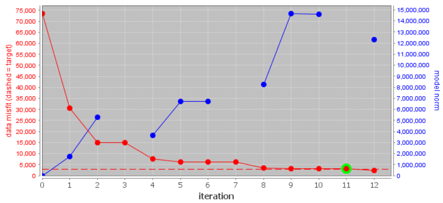
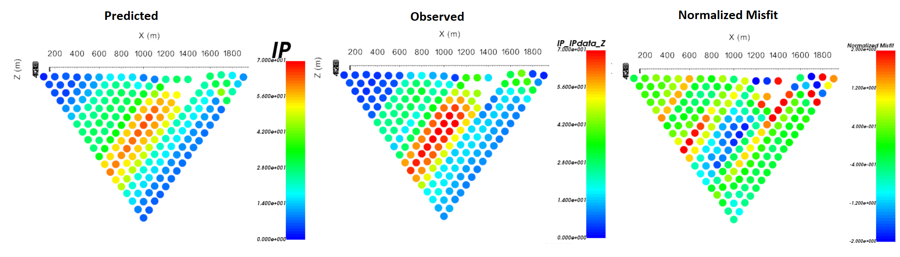
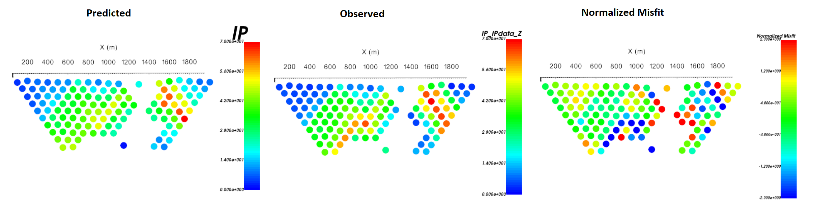

.. _comprehensive_workflow_dcip_12:

.. include:: <isonum.txt>

General IP OcTree Inversion
===========================

Here we present the standard steps for completing an IP OcTree inversion and performing a general analysis of results. The steps are organized as follows:

    1. Set up, run and load inversion results
    2. Examine the convergence
    3. Examine the data misfit
    4. Examine the recovered model

Create, Run and Load Inversion
------------------------------

We can now invert DC data using the DCIP OcTree package. To do this:

    - :ref:`Create an IP OcTree inversion object <createDCIPInv>`
    - Use :ref:`edit options <invEditOptions_dcipoctree>` to set the inversion parameters
    - Click *Apply and write files*
    - :ref:`Run the inversion <invRun>`
    - :ref:`Load results <invLoadResults>`

**For the tutorial data**, the following parameters were used in the inversion. A thorough discussion of the input parameters and their impact on the final inversion result is discussed in the :ref:`DC OcTree Inversion using Weights and Reference Models <comprehensive_workflow_dcip_13>` section. For now, we invert to recover the smoothest model with modest near-surface interface weights.

.. figure:: images/edit_options_ipinv_smoothest.png
    :align: center
    :width: 700

    Parameters used to invert the field dataset.

Convergence
-----------

Once the inversion has completed:

    - :ref:`View convergence <convergence_curve>`

**For the tutorial data**, the Tikhonov curve is shown below. According to the figure and the *log* file:

    - the inversion converges over the course the cooling schedule.
    - the inversion reaches target misfit (chi-factor = 1 in this case) between iteration 2 and 3, at which point the curve begins to 'flatten'; recall that there are several Gauss-Newton iteration for each beta. And the algorithm is converging over the course of the beta cooling schedule.

Data Misfit
-----------

According the Tikhonov curve, the recovered model at iteration 3 has a good chance of explaining the data without fitting the noise. To be sure however, we must examine the observed data, predicted data and data misfit for the corresponding model. Here are some good questions to ask during this step:

    - Are the prominent anomaly features identified in the observed data also found in the predicted data?
    - Are there obvious coherent features in the normalized misfit maps? If so, this indicates you are over-fitting certain regions at the expense of others and that you must assign new uncertainties and re-run the inversion.
    - Are the ranges of normalized misfits for each for each survey line balanced? If not, you may need to adjust the uncertainties and re-run the inversion.

**For the tutorial data**, we have both pole-dipole and dipole-pole data along each survey line. To examine the misfit maps, we needed to:

    1. :ref:`Assign line IDs <comprehensive_workflow_dcip_2_lineid>` to the IP3D predicted data object
    2. :ref:`Create 2D survey lines from line ID <comprehensive_workflow_dcip_2_2Dlines>` and split the pole-dipole and dipole-pole data based on electrode geometry.
    3. :ref:`Plot with VTK <viewData>` to examine observed data, predicted data and normalized misfit.

For line 5, the predicted data reproduces the field observations well but slightly under-fits the amplitude of the IP anomaly in the dipole-pole data. Normalized misfits lie within [-2, 2]. The misfit map for the pole-dipole data shows uncorrelated errors but the dipole-pole misfit map shows some small coherent features associated with under-fitting the anomaly amplitude. We will not do it here, but the user is encouraged to examine the misfit maps for other survey lines.

    Predicted data, observed data and normalized data misfit (dipole-pole) for the 5th survey line. Predicted data are plotted on the same scale. Normalized misfits are plotted on a color scale from -2 to 2.

    Predicted data, observed data and normalized data misfit (pole-dipole) for the 5th survey line. Predicted data are plotted on the same scale. Normalized misfits are plotted on a color scale from -2 to 2.

Recovered Model
---------------

**For the tutorial data**, the chargeability model recovered at the 3rd iteration is shown below at 3 depths. According to the recovered model:

    - We can see some effects at the surface due to the sensitivity of the data to the electrodes, but it is manageable.
    - Several prominent chargeable features are observed in the Z = 349 m slice.
    - The large resistor to the West is non-chargeable
    - The large NS conductor does not exhibit chargeability
    

.. figure:: images/model_ipinv_smoothest_iter3.png
    :align: center
    :width: 700

    Recovered model at iteration 3.

