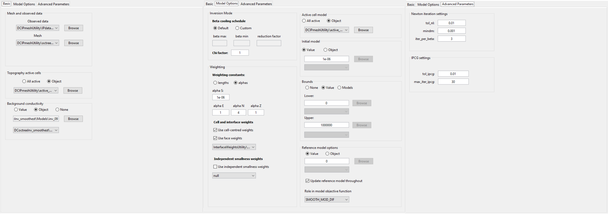
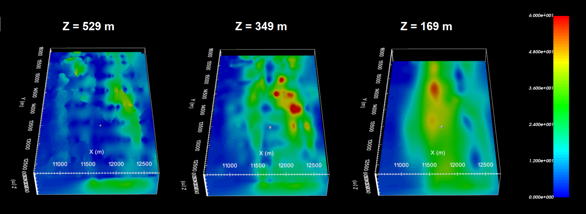
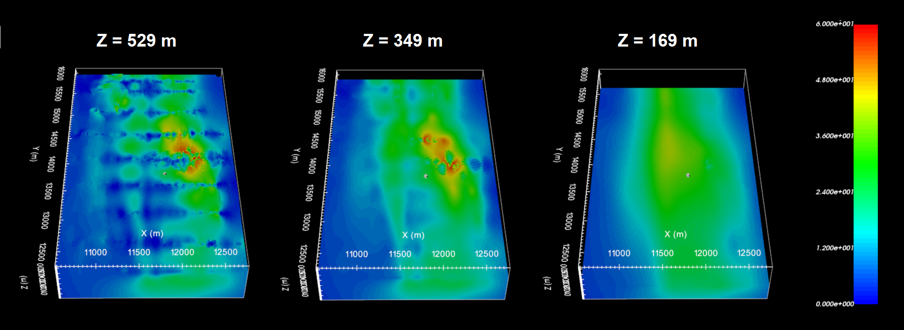
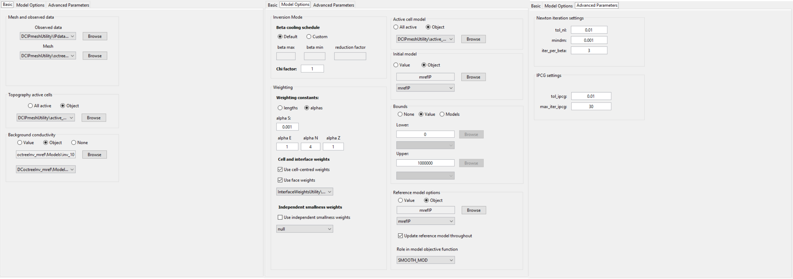
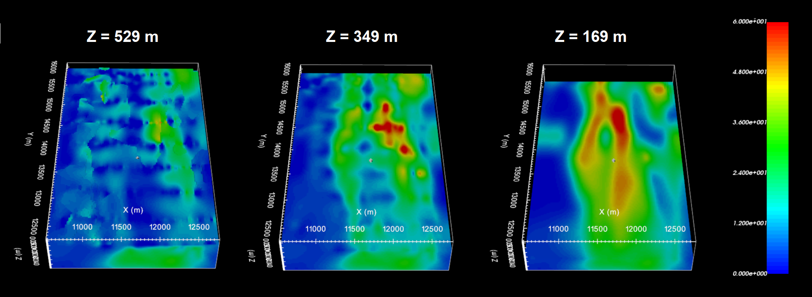
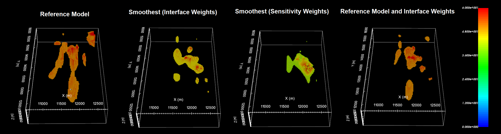

.. _comprehensive_workflow_dcip_13:

.. include:: <isonum.txt>

IP OcTree Inversion using Weights and Reference Models
======================================================

The final inversion result depends strongly on the regularization parameters, reference/starting model, background conductivity model and on the weighting provided. Here, we

    - invert the data for several cases
    - discuss the choice in input parameters, models and weightings for each inversion, and
    - compare the inversion results

Smoothest Inversion with Near-Surface Interface Weights
-------------------------------------------------------

The parameters chosen for this inversion approach are meant to recover a model that is constrained by the data, not constrained by any a-priori information, and limits near-surface artifacts with near-surface lateral smoothing.

Discussion of Parameters
^^^^^^^^^^^^^^^^^^^^^^^^

**Conductivity Model:** We used the conductivity model presented in the :ref:`smoothest DC inversion with interface weights section <comprehensive_workflow_dcip_10_smoothest>`

**Weighting constants (alpha S, E, N, Z):** To recover the smoothest model, we set *alpha S* = 1e-6 (or something else very small). By doing this, the contribution of the :ref:`smallness term in the model objective function <modelObjectiveFunction>` becomes negligible. By setting *alpha E* = 1, *alpha N* = 4 and *alpha Z* = 1, we wanted to smooth out artifacts associated with EW survey lines but did not want to excessively force NS smoothness in recovered chargeability structures.

**Initial and reference models:** Here, we assume that we are looking for chargeable bodies within a non-chargeable background. As a result, the *reference model* is set to zero. The inversion cannot produce a model update for a 0 model. As a result, the *starting model* is set to something sufficiently small.

**Bounds:** Chargeability is a strictly positive physical property. As a result we set a *lower bound* of 0. The *upper bound* is made redundant by choosing a value much larger than the range of apparent chargeabilities. Note that DC inversion does not have this problem because we invert for the log-conductivity which can be negative.

**Role of mref in model objective function:** Since *alpha S* is extremely small, the smallness term is negligible. However, by choosing *Update reference model throughout*, the inversion will replace the reference model with the current model for each new beta value. And by setting *SMOOTH_MOD_DIF*, the inversion will attempt to preserve the derivatives (interfaces and smooth areas) that are evolving over the course of the inversion.

**Interface weights:** Earlier attempts to invert the data used larger interfaces weights and more layers, however the inversion struggled to reach target misfit in this case. It was thought that by applying very large interface weights, we were not able to recover near-surface inhomogeneities that exist in the true conductivity model.

Discussion of Results
^^^^^^^^^^^^^^^^^^^^^

The chargeability model recovered at the 3rd iteration is shown below at 3 depths. According to the recovered model:

    - We can see some near-surface inhomogeneity but it is not highly pixelated.
    - Several compact chargeable bodies are recovered.
    - The range of recovered chargeabilities lies within the range of values for the apparent chargeability data.

Without a-priori information, the inversion was able to produce a model which adequately recovers plausible chargeable structures.

    Recovered model at iteration 3.

Smoothest Inversion with Sensitivity Weights
--------------------------------------------

Discussion of Parameters
^^^^^^^^^^^^^^^^^^^^^^^^

**Conductivity Model:** We used the conductivity model presented in the :ref:`smoothest DC inversion with sensitivity weights section <comprehensive_workflow_dcip_10_smoothest_sens>`

**Weighting constants (alpha S, E, N, Z):** To recover the smoothest model, we set *alpha S* = 1e-6 (or something else very small). By doing this, the contribution of the :ref:`smallness term in the model objective function <modelObjectiveFunction>` becomes negligible. By setting *alpha E* = 1, *alpha N* = 4 and *alpha Z* = 1, we wanted to smooth out artifacts associated with EW survey lines but did not want to excessively force NS smoothness in recovered chargeability structures.

**Initial and reference models:** Here, we assume that we are looking for chargeable bodies within a non-chargeable background. As a result, the *reference model* is set to zero. The inversion cannot produce a model update for a 0 model. As a result, the *starting model* is set to something sufficiently small.

**Bounds:** Chargeability is a strictly positive physical property. As a result we set a *lower bound* of 0. The *upper bound* is made redundant by choosing a value much larger than the range of apparent chargeabilities. Note that DC inversion does not have this problem because we invert for the log-conductivity which can be negative.

**Role of mref in model objective function:** Since *alpha S* is extremely small, the smallness term is negligible. However, by choosing *Update reference model throughout*, the inversion will replace the reference model with the current model for each new beta value. And by setting *SMOOTH_MOD_DIF*, the inversion will attempt to preserve the derivatives (interfaces and smooth areas) that are evolving over the course of the inversion.

**Sensitivity weights:** A standard *truncation factor* (= 0.05) was used when generating the sensitivity weights for the IP inversion.

Discussion of Results
^^^^^^^^^^^^^^^^^^^^^

The chargeability model recovered at the 2nd iteration is shown below at 3 depths. According to the recovered model:

    - Because the quality of the DC inversion for the sensitivity weights approach was poor and contained artifacts, the quality of the IP inversion was poor and contained artifacts.
    - Sensitivity to the near-surface resulted in chargeable bodies of lower amplitude being placed there.

It should be obvious this result in unsatisfactory.

    Recovered model at iteration 2.

Inversion Constrained by Reference Model
----------------------------------------

Discussion of Parameters
^^^^^^^^^^^^^^^^^^^^^^^^

**Conductivity Model:** We used the conductivity model presented in the :ref:`DC inversion constrained with reference model section <comprehensive_workflow_dcip_10_mref>`

**Weighting constants (alpha S, E, N, Z):** Where *dh* is the cell dimension, and assuming *alpha E = alpha N = alpha Z = 1*, the impact of the smallness and smoothness on the model objective function is thought to be somewhat balanced when *alpha S* :math:`\sim \; 1/dh^2`. Here we set *alpha S* = 0.001 to balance the smallness and smoothness. By setting *alpha E* = 1, *alpha N* = 4 and *alpha Z* = 1, we wanted to smooth out artifacts associated with EW survey lines but did not want to excessively force NS smoothness in recovered chargeability structures.

**Initial and reference models:** Here we use the :ref:`OcTree model <comprehensive_workflow_dcip_11_mref>` that was interpolated from the batch 2D inversion results.

**Role of mref in model objective function:** Here we use *SMOOTH_MOD*. This implies we want to preserve structures in the reference model but NOT the gradients. Our thought was that the 2D inversion result generally placed anomalous structures in the correct areas. However, the exact dimensions and locations were distorted due to interpolation and 3D effects. We attempt to reduce this distortion by *Updating reference model throughout*.

**Interface weights:** Since the interface weights worked well for the :ref:`smoothest inversion with interface weights <comprehensive_workflow_dcip_10_smoothest>` , we used the same interface weights here to reduce near-surface artifacts.

Discussion of Results
^^^^^^^^^^^^^^^^^^^^^

The chargeability model recovered at the 3rd iteration is shown below at 3 depths. According to the recovered model:

    - We can see some near-surface artifacts due to the reference model but they are not excessive.
    - Several compact chargeable bodies are recovered in generally the same location as in the smoothest inversion with sensitivity weights.
    - The range of recovered chargeabilities lies within the range of values for the apparent chargeability data but they are a little larger than the values recovered for the smoothest inversion with interface weights.

With this approach, we have recovered a model with the combined characteristics of the reference model and smoothest model.

    Recovered model at iteration 3.

Largest Chargeable Structure for Each Inversion
-----------------------------------------------

Here, we plot the reference model and recovered chargeability models on the same scale. Because the scale is linear and the range of recovered chargeabilities varies between models, the cutoff for each model is different. We notice several important things here:

    1. Because the quality of the DC inversion for the sensitivity weights approach was poor and contained artifacts, the quality of the IP inversion was poor and contained artifacts.
    2. The location of the highest chargeability anomaly is consistent amongst all models.
    3. Variations in smoothest model and geologically constrained model (mref) indicate some of the recovered chargeable features are not overly robust. And perhaps, some of the artifacts present in the reference model were not eliminated while performing the OcTree inversion.

