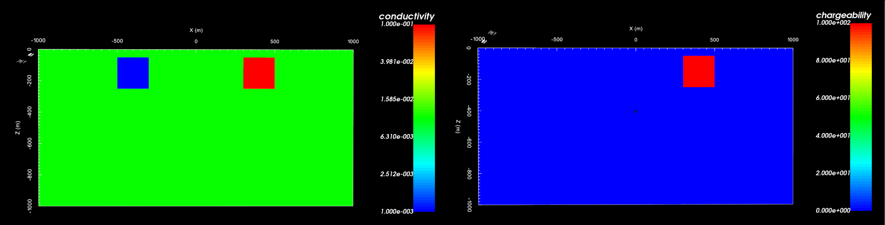
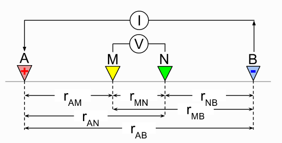
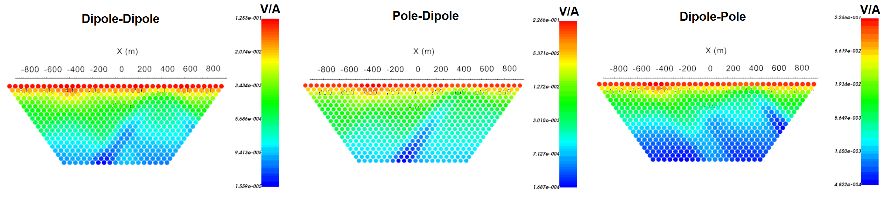
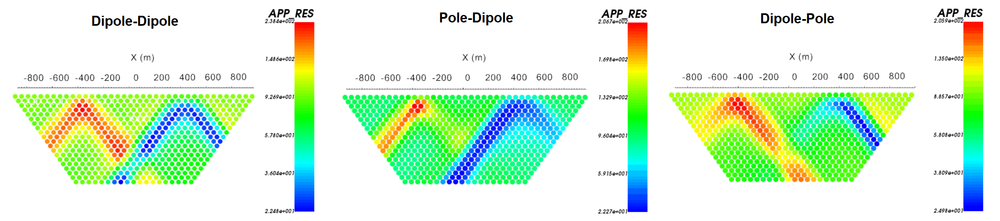
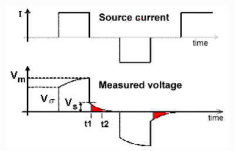
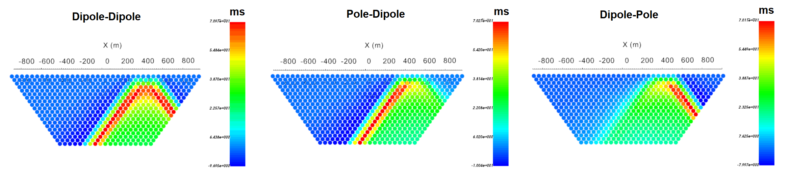
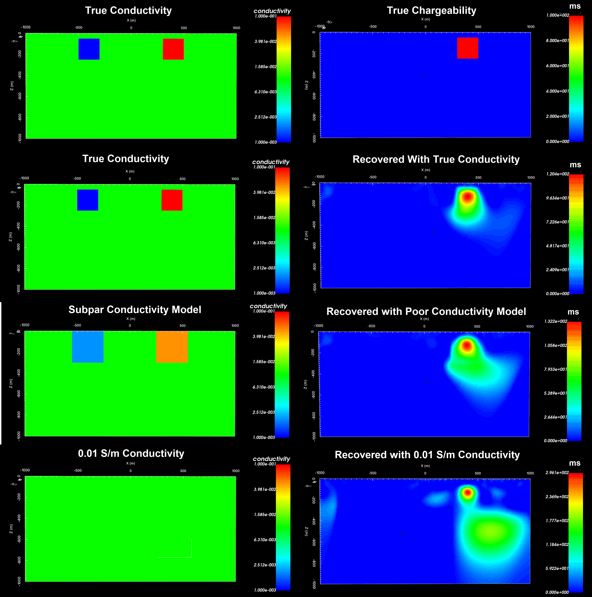

.. _comprehensive_workflow_dcip_1:

Understanding DC and IP Data
============================

In order to properly interpret DC and IP data, it is import to first understand the characteristics of the anomalies due to basic structures. We also need to understand the nature of DC and IP data. Here, we investigate the DC signatures produced by compact conductors and resistors. We also consider the IP signature when the conductor is also chargeable. The knowledge gained here can be used to infer a realistic background model and the locations of anomalous structures from DC/IP data.

For this section, we will simulate DC and IP data over a resistive block (:math:`\sigma` = 0.001 S/m) to the West and a conductive block (:math:`\sigma` = 0.1 S/m) to the East within a moderately conductive background (:math:`\sigma_b` = 0.01 S/m). The background and resistor are non-chargeable but the conductor has been given an integrated chargeability of :math:`\eta` = 100 ms. Both blocks extend from a depth of 50 m to a depth of 250 m and extend infinitely in the North-South direction. Data are simulated for dipole-dipole, pole-dipole and dipole-pole electrode configurations.

    Conductivity model (left) and chargeability model (right).

.. _comprehensive_workflow_dcip_1_voltage:

DC Resistivity
--------------

The DC resistivity technique injects electrical current at electrodes *A* and *B* and measures the difference in electric potential between electrodes *M* and *N*. Electrode *A* is generally designated the +ve current electrode (associated with a positive electric potential) and *B* is the -ve current electrode (associated with a negative electric potential). Electrodes *M* and *N* are referred to as the potential electrodes.

DC Data and Anomalies
^^^^^^^^^^^^^^^^^^^^^

For UBC-GIF codes and most other modeling software, DC data are defined as the measured difference in electric potential (voltage) between electrodes *M* and *N* normalized by the source current, i.e.:

.. math::
	d_{DC} = \frac{\Delta V}{I} = \frac{V_M - V_N}{I}

For a homogeneous Earth, the data depend on the electrode geometry and the resistivity (:math:`\rho`):

.. math::
	d_{DC} = \frac{\Delta V}{I} = \frac{\rho}{2\pi} \bigg [ \frac{1}{r_{AM}} - \frac{1}{r_{BM}} - \frac{1}{r_{AN}} + \frac{1}{r_{BN}} \bigg ]

where :math:`r_{AM}` is the distance between electrodes *A* and *M*; likewise for the other terms. It should be noted that depending on the convention of your current and potential electrodes, measured voltages can be positive or negative.

Below, we see DC data in `pseudo-section <https://gpg.geosci.xyz/content/DC_resistivity/DC_data.html#plotting-raw-data>`__ for our example conductivity model for 3 standard electrode configurations. Note that:

	- the data values decrease in magnitude as the electrode spacing increases. This is expected based on our expression for defining DC data.
	- data sensitive to conductors will manifest as an anomalous decrease in the magnitude of the normalized voltage. And data sensitive to resistors will manifest as an anomalous increase in the magnitude of the normalized voltage. This is consistent with our definition of DC data.
	- the anomalous structures corresponding to each electrode configuration have different shapes. This is expected given the data are dependent on the electrode geometry.

Apparent Resistivity
^^^^^^^^^^^^^^^^^^^^

Apparent resistivities are a good way to interpret DC data. They can be computed easily and they represent the data in a way that negates the impact of electrode spacing on the magnitude of the data. The apparent resistivity is given by:

.. math::
	\rho_a = \frac{d_{DC}}{G} = \frac{\Delta V}{I G}

where

.. math::
	G = \frac{1}{2\pi} \bigg [ \frac{1}{r_{AM}} - \frac{1}{r_{BM}} - \frac{1}{r_{AN}} + \frac{1}{r_{BN}} \bigg ]

By computing apparent resistivities, you can:

	- estimate the background resistivity of your survey region
	- locate the general position of anomalous conductive and/or resistive targets

Below, we see apparent resistivities for our example conductivity model for 3 standard electrode configurations. Note that:

	- for data that are only sensitive to the background, the apparent resistivity is equal to the true background resistivity (:math:`\rho_b = 1/\sigma_b = 100 \; \Omega m` ).
	- data sensitive to the conductor results in lower apparent resistivities and data sensitive to the resistor results in higher apparent resistivities.
	- since the data are dependent on the electrode geometry, so are the apparent resistivities.
	- the horizontal and vertical position of signatures in the pseudo-section are correlated with the locations of their respective anomalous bodies.

.. _comprehensive_workflow_dcip_1_ip:

Induced Polarization
--------------------

When collecting DC (and IP) data, repeated measurements are acquired by applying a duty cycle for the source current. When the Earth is chargeable, a decaying voltage is observed during the off-time. The off-time decaying voltage is referred to as the IP response. The decay rate and magnitude of the IP response depends on the dimensions and character of the chargeable body and the electrode geometry. For reference:

	- :math:`V_m` is the observed voltage for a steady-state current
	- :math:`V_\sigma` is the instantaneous increase or decrease in voltage attributed to DC resistivity
	- :math:`V_s` is the magnitude of the IP contribution for a steady-state current

Chargeability Definitions
^^^^^^^^^^^^^^^^^^^^^^^^^

IP data can be somewhat confusing, as there are multiple definitions of chargeability used in practice. In addition, a multiplication factor may be applied so that chargeability values are more easy to work with. The most common definitions of chargeability are:

**1. Intrinsic Chargeability:** The intrinsic chargeability is the ratio between the IP voltage just after shutoff and the steady-state voltage, i.e.:

.. math::
	\eta = \frac{V_s}{V_m}

If we were to apply a steady-state current, the intrinsic chargeability defines the fraction of observed voltage attributed to the IP effect.

By the previous expression, **we expect** :math:`0 \leq \eta \leq 1` and for :math:`\eta` to be unitless. However since :math:`V_s \ll V_m` even for chargeable rocks, intrinsic chargeability values are **commonly provided in units of mV/V**; ie. multiplied by a factor of 1000 so that numbers are larger.

**2. Integrated Chargeability:**

The integrated chargeability is meant to define the magnitude and decay behaviour of the IP response over a range of off-times that typically exhibit the IP response. The integrated chargeability is given by:

.. math::
	\eta = \frac{1}{V_m} \int_{t_1}^{t_2} V(t) \, dt

where :math:`t_1` and :math:`t_2` denote the times over which the measured voltage is integrated. Once again the true values are small, so we typically represent the integrated chargeability in **units of ms** as opposed to seconds.

IP Data
^^^^^^^

IP data are generally represented as *apparent chargeabilities* (:math:`\eta_a`) or as *secondary potentials* (:math:`\phi_s`) attributed to the IP response. IP data can be challenging to work with because there are multiple definitions for the physical property. To remedy this, data are generally inverted using a linearized formulation.

Let :math:`\mathcal{F}[\sigma]` be the forward modeling operation that computes the DC electric potentials due to a conductivity model. According to the `theory section of the DCIP OcTree manual <https://dcipoctree.readthedocs.io/en/latest/content/theory.html#forward-modelling>`__, the secondary potentials attributed to IP are given by:

.. math::
	\phi_s = \mathcal{F}[\sigma (1-\eta )] - \mathcal{F}[\sigma]

where :math:`\eta` is the intrinsic chargeability. And the apparent chargeability is given by:

.. math::
	\eta_a = \frac{\mathcal{F}[\sigma (1-\eta )] - \mathcal{F}[\sigma]}{\mathcal{F}[\sigma (1-\eta )]}

To handle any definition and normalization for the chargeability model/data, the linearized forward model is given by:

.. math::
	\mathbf{d_{IP}} = \boldsymbol{J \eta} \;\;\textrm{where} \;\;
	\begin{cases}
	J_{ij} = \frac{\partial\, \phi_i [\sigma]}{\partial\, \textrm{ln}[\sigma_j]} \;\;\;\;\; \textrm{for} \; \mathbf{d_{IP}}=\phi_s \\
	J_{ij} = \frac{\partial\, \big [ \textrm{ln} \phi_i [\sigma] \big ]}{\partial\, [ \sigma_j ]} \; \textrm{for} \; \mathbf{d_{IP}}=\eta_a
	\end{cases}

Note that the linearized operator :math:`\mathbf{J}` **only** depends on the background electrical conductivity model and **not** on the chargeability. As a result:

	- **Any definition or normalization of apparent or intrinsic chargeability** can be used for apparent chargeability data. The inversion will recover a model that is defined using the same convention as the data.
	- If secondary potential data are being modeled, the user **must** use intrinsic chargeability with :math:`0 \leq \eta \leq 1` **or** normalize the data before inverting.

Below, we see apparent chargeability data for our example chargeability model for 3 standard electrode configurations. Note that:

	- the apparent chargeabilities fall within the range of values defined by the true chargeability model
	- data sensitive to the chargeable body manifests as higher apparent chargeabilities and data away from the chargeable body manifests as small apparent chargeability values
	- since the data are dependent on the electrode geometry, so are the apparent chargeabilities
	- the horizontal and vertical positions of signatures in the pseudo-section are correlated with the locations of their respective anomalous bodies

Effects of Conductivity Models on IP Inversion
^^^^^^^^^^^^^^^^^^^^^^^^^^^^^^^^^^^^^^^^^^^^^^

Successful IP inversion requires an accurate background conductivity model. That is because the background conductivity model is used to construct the forward modeling operator :math:`\mathbf{J}`.

Here we invert the apparent chargeability data for the practice example. On the left, we show the set of background conductivity models that were used. On the right, we show the recovered chargeability models. From the figure below, we see that:

	- the best result is obtained if the true conductivity model is used for the background model.
	- if the background conductivity model is generally similar to the true conductivity model, you will recover the region of largest chargeability with manageable artifacts. Depending on the quality of your background conductivity model, you may recover a reasonable chargeability model.
	- a homogeneous background model **may** place the region of highest chargeability in the correct location. **However**, the magnitude of the anomalous chargeable body may be incorrect and there will almost certainly be major artifacts.

