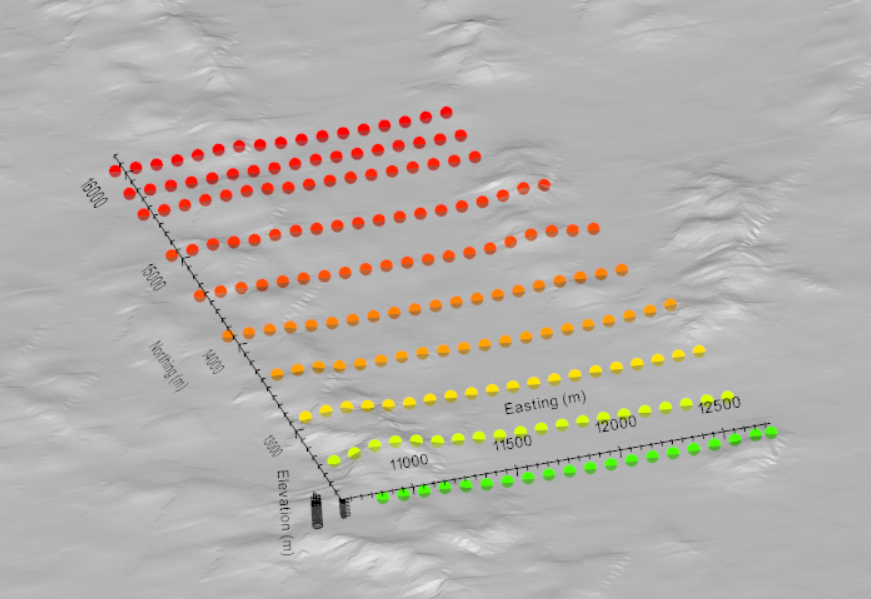
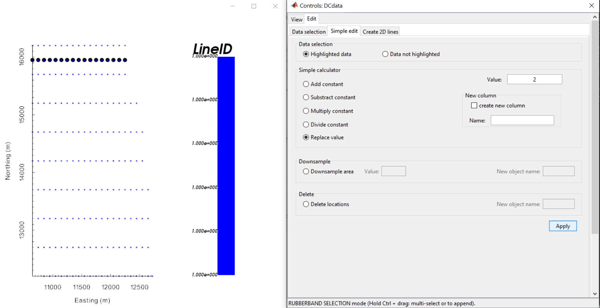
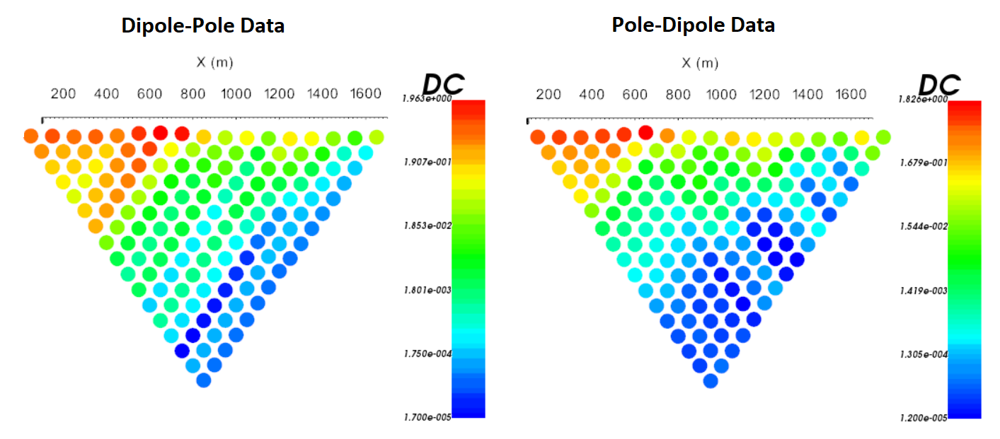
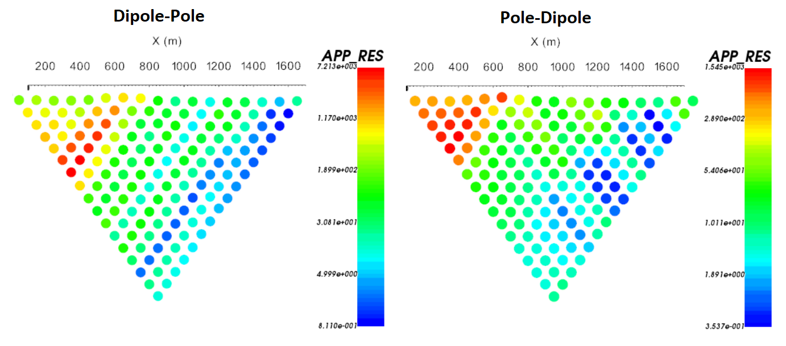
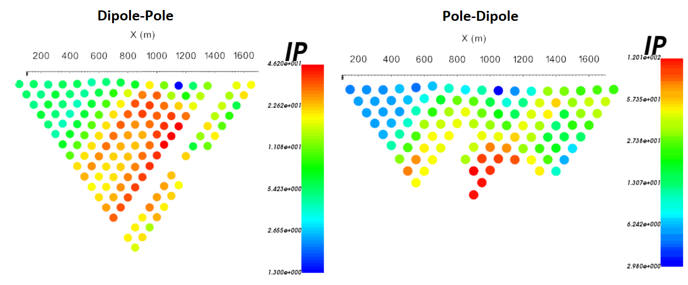

.. _comprehensive_workflow_dcip_2:

.. include:: <isonum.txt>

Loading 3D DC/IP Data and Cursory Interpretation
================================================

The first step in any project is to load field collected data and visualize it. Here, we will assume the data are in `UBC-GIF formatted observation files <https://dcipoctree.readthedocs.io/en/latest/content/files/obsFile.html>`__. However, we will explain how to load data which are in XYZ format. **The tutorial data** consists of 10 East-West lines of DC/IP data collected using a MIMDAS system.

Our goal is to load the 3D DC/IP data and visualize it in a meaningful way. DC/IP data can be a little challenging to visualize, as the measurements are not defined at distinct locations. If the dataset is comprised of a set of 2D DC/IP profiles, then each line can be plotted as a 2D pseudo-section. 

.. important:: Requires GIFtools v2.31 or later.

Starting Your Project
---------------------

    - Open GIFtools
    - :ref:`Set the working directory <projSetWorkDir>`

Import Files
------------

.. If you do not have UBC-GIF formatted data from which to work with, you may `download tutorial data <https://github.com/ubcgif/GIFtoolsCookbook/raw/master/assets/comprehensive_tutorial_dcip.zip>`_ . It is from this dataset that we will demonstrate the workflow.

Here, we import the DC, IP and topography data. **The tutorial data are in 3D UBC-GIF format**. If you have data of the same format:

    - :ref:`Import topography data (XYZ format) <importTopo>`. The data file is named *topo.xyz*.
    - :ref:`Import 3D DC data <importDCIP3Ddata>` as an observed data format file. The data file is named *DCdata.dat*.
    - :ref:`Import 3D IP data <importDCIP3Ddata>` as 'any format'. The data file is named *IPdata.dat*.
    - If the elevations of the electrodes are not defined in the data file, we strongly advise that you :ref:`apply topography <objectDCIPApplyTopo>`.

**Data in XYZ or CSV format** :ref:`can be imported <importDCIP3Ddata>` together or separately into GIFtools. In this case, GIFtools will require the user to select the columns corresponding to electrode positions and data. If DC and IP data are loaded into a single data object, the user can:

    - :ref:`Create IP data object from DC data object <objectdc3Dtoip3D>` or visa versa
    - :ref:`Set IO headers <objectSetioHeaders>` to define the columns correctly
    - If the elevation of the electrodes is not defined, you can :ref:`apply topography <objectDCIPApplyTopo>`. This is not necessary if the surface topography is flat.

.. note:: If data are UBC-GIF observed data format, the file will contain uncertainties. As part of this tutorial, we will discuss aspects of assigning appropriate uncertainties to the data.

    Tutorial data consists of 10 West to East DC/IP survey lines including topography.

Normalized Voltage to Apparent Resistivity
------------------------------------------

UBC-GIF codes define DC data as the measured voltage normalized by the transmitter current in units of V/A. **If** your data are raw voltages, you **must** normalize the data by the source current. To do this:

    - Use the :ref:`column calculator <objectCalculator>` to divide the raw voltage column by the source current column.
    - :ref:`Set the IO header <objectSetioHeaders>` for voltage data to the normalized voltage column.

Much can be gained by interpreting the data as apparent resistivities. Depending on your original data file, you may have voltage and/or apparent resistivity data. To convert between apparent resistivities and normalized voltages for your *DC3Ddata* object:

    - :ref:`Compute geometric factor <objectDCIPDataCalculate_geofactor>`
    - :ref:`Transform between normalized voltage and apparent resistivity <objectDCIPDataCalculate>`

UBC-GIF codes accept many definitions and normalizations for IP data, including intrinsic chargeability, integrated chargeability and secondary potential. If you would like to eventually view the data as apparent chargeabilities, select the *IP3Ddata* and:

    - :ref:`Compute geometric factor <objectDCIPDataCalculate_geofactor>`. Subsequent transform of the data is not required.

.. important:: If the elevations for electrode locations are **not** set, GIFtools will assume the surface topography is flat. This will impact the plotted locations of the apparent resistivity/chargeability data.

.. _comprehensive_workflow_dcip_2_lineid:

Assigning Survey Line Numbers
-----------------------------

If your data object has a column containing the line IDs, this step is not required. Data from UBC-GIF formatted data files does not contain line ID information. This information must be set manually. To create a line ID column:

    - :ref:`Add a constant column <objectAddConstantCol>` of 1s to the data object and name it *LineID*.
    - Open the :ref:`VTK viewer <viewData>`

        - In the control menu, set the *Current data* drop down menu to plot *LineID*. You will see all values being plotted are equal to 1.
        - Click the *Edit* tab, then click one of the data selection icons. When clicked, you can select data on the plot. If unselected, you will shift and rotate the plot.
        - Click the *Simple edit* tab. Select *Replace value* and unselect the *create new column* box.
        - For each survey line:

            - Select the corresponding data points
            - Enter an integer in the *Value* text field for that survey line
            - Click the *Apply* button

        - Close the windows when finished. If you re-open the :ref:`VTK viewer <viewData>`, you can check to see if the line IDs were assigned properly.

    Assigning line ID through VTK.

.. _comprehensive_workflow_dcip_2_2Dlines:

Create 2D Survey Lines
----------------------

.. note:: If you have a good estimate of your uncertainties for the entire 3D dataset, you may choose to assign them before creating 2D profiles. See the :ref:`assigning uncertainties <comprehensive_workflow_dcip_3>` section. If uncertainties have been assigned, the uncertainties column will be carried over when creating the 2D profiles.

Since we are unable to plot apparent resistivities/chargeabilities in 3D in a meaningful way, we must separate the data into a set 2D profiles. This is not possible without a data column which defines each line ID. To parse the 3D DC and/or IP datasets into a suite of 2D profiles:

    - :ref:`Convert DC/IP 3D data to 2D <objectdcip3Dto2D>` **from line ID**
    - Select the *LineID* column and make sure to apply topography if relevant
    - For the tutorial data, we used a sampling of 5 m

If the potential electrode measurements are on either side of the source electrodes, you will **not** be able to plot 2D pseudo-sections without data points being plotted on top of one another. The **tutorial data** was collected by a MIMDAS system which contains both pole-dipole and dipole-pole data. To separate the data:

    - Select any of the newly created 2D data objects
    - And under the *data manipulation* drop-down menu, select *split data* |rarr| *based on electrode geometry*

Cursory Interpretation
----------------------

**For the tutorial data**, the normalized voltage, apparent resistivity and apparent chargeability pseudo-sections for profile 1 (most Northern) are shown below. Since the dipole-pole and pole-dipole data have different sensitivities to the same structures, we see the pseudo-sections are not identical. Both datasets generally show a range of apparent resistivities spanning 4 orders of magnitude. A dominant resistive structure exists within the Western portion of the survey line. Whereas in the Eastern portion of the survey, there is a more conductive structure that may extend to significant depth. Both the dipole-pole and pole-dipole data show a notable IP signature near the middle of the survey line. However, the signatures manifest different in the dipole-pole and pole-dipole pseudo-sections.

    - To view the data, you may select any data object and :ref:`plot with VTK <viewData>`

    Normalize voltage pseudo-sections for Line 1 (log-scale).

    Apparent resistivity pseudo-sections for Line 1 (log-scale).

    Apparent chargeability pseudo-sections for Line 1 (log-scale).

