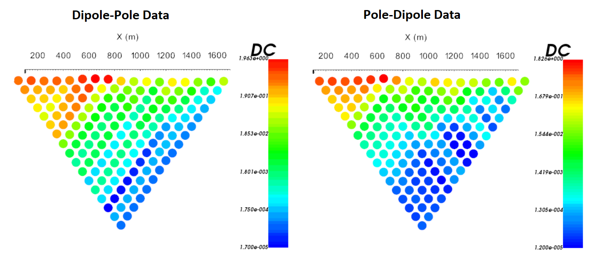
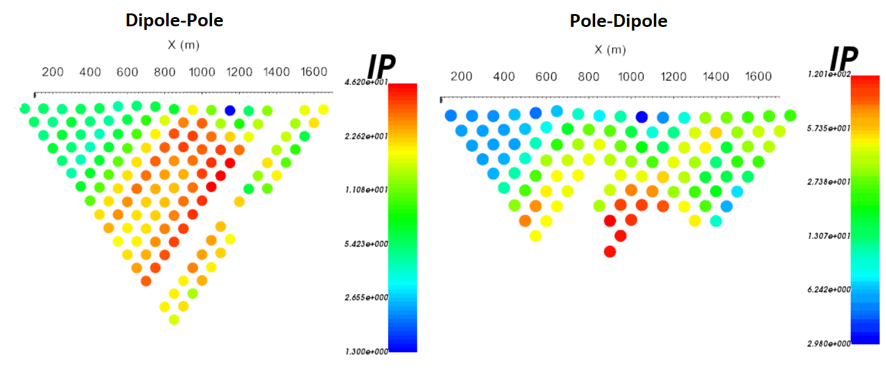

.. _comprehensive_workflow_dcip_3:

.. include:: <isonum.txt>

Assigning Uncertainties
=======================

At this point, we assume the data are loaded into GIFtools, that our DC data are in V/A, and that our IP data are represented as integrated or intrinsic chargeabilities. Here, we provide a basic approach for assigning uncertainties to DC resistivity and IP data. The role of uncertainties in geophysical inversion is presented in the :ref:`fundamentals of inversion <Fundamentals_Uncertainties>`. When assigning uncertainties, we want to ensure we fit the anomalies and not the background. We also want to ensure we fit each area of the survey region evenly. To assign a percent plus a floor uncertainty to the data:

	- :ref:`Assign simple uncertainties <objectAssignUncert>`

.. note:: You may decide to apply uncertainties to the full 3D data set or to 2D profiles individually.

Normalized Voltage Data
-----------------------

In the :ref:`basic anomalies: understanding voltage data <comprehensive_workflow_dcip_1_voltage>` section, we learned that:

	- measured voltages are smaller in magnitude when the electrode spacing is larger because the currents at the potential electrodes are weaker.
	- measured voltages are smaller in magnitude when the geology is more conductive.
	- larger electrode spacings are used to measure data that are sensitive to deeper structures.

The opposite of the previous three statements is also true.

The role of the percent uncertainty is to ensure we do not prioritize fitting resistive structures (higher voltages) at the expense of conductive structures (lower voltages). This can happen if only a floor uncertainty is applied. Assigning a percent uncertainty between 5\% and 10\% is common. But the ideal percent uncertainty will depend on the range of measured voltages and the data quality. It is not uncommon to assign uncertainties of 20\% if the data are very noisy.

A floor uncertainty is used to ensure the inversion does try to over-fit data with a poor signal to noise ratio. The signal to noise ratio generally becomes worse as the electrode spacing is increased and the measured voltages become too small for the instrument to measure accurately. If you do not assign a floor value, you may end up over-fitting these data. However if the floor you set is too large, you will not fit the data which are generally sensitive to deeper structures. 

**For the tutorial data set**, we assigned uncertainties of 2e-5 V/A + 5\%. For reference, the normalized voltages and uncertainties for Line 1 are plotted on pseudo-section below. The data and corresponding uncertainties are plotted on the same scale.

    Normalize voltage pseudo-sections for Line 1 (log-scale).

    Uncertainties in pseudo-sections for Line 1 (log-scale).

Chargeability Data
------------------

In the :ref:`basic anomalies: understanding voltage data <comprehensive_workflow_dcip_1_ip>` section, we learned that:

	- IP data depends on the DC data
	- the IP response is negligible unless we are in the presence of a chargeable structure

If only a percent uncertainty is applied, the inversion will fit the background instead of fitting IP anomalies. That is why an appropriate floor uncertainty is important. The floor uncertainty is set based on what the user believes is the "background IP response". The user may also choose the floor as being some percent of the maximum data value.

A percent uncertainty is added if the IP anomalies are noisy and/or there are some anomalously high apparent chargeabilities. Without including a percent uncertainty, it may be difficult to fit the data with geologically reasonable models in this case. Ultimately, the user is encourage to first assign a floor uncertainty, then add a percent if they feel it is necessary.

For the **tutorial data set**, we assigned uncertainties of 2ms + 5\%. For reference, the IP data and uncertainties for Line 1 are plotted on pseudo-section below. The data and corresponding uncertainties are plotted on the same scale.

    Apparent chargeability pseudo-sections for Line 1 (log-scale).

    Uncertainties in pseudo-sections for Line 1 (log-scale).

