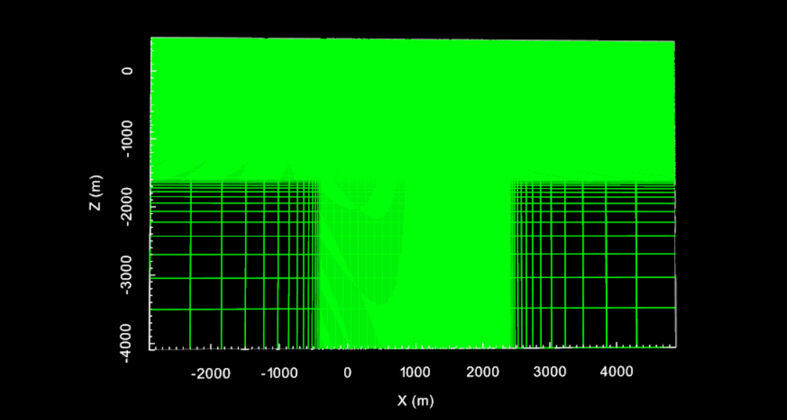
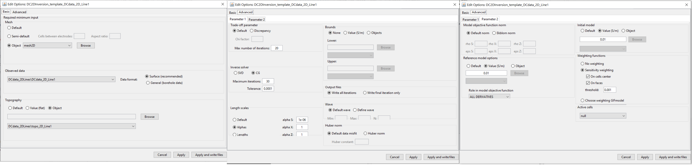
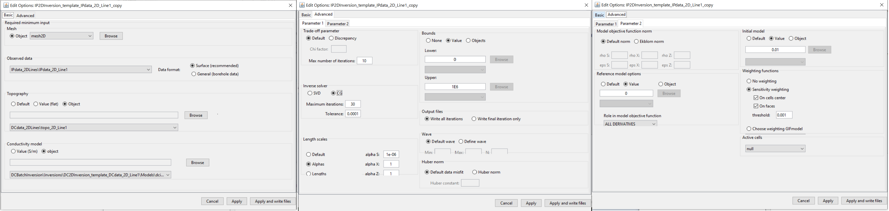

.. _comprehensive_workflow_dcip_4:

.. include:: <isonum.txt>

Create, Run and Load 2D Inversion
=================================

In :ref:`Loading 3D DC/IP Data and Cursory Interpretation <comprehensive_workflow_dcip_2>` we showed how to create a set of 2D profile lines from standard 3D DC or IP data. Here, we show how to independently invert any of the profiles using the 2.5D formulation. If geological structures strike perpendicular to the profile line, the recovered 2D model will offer a reasonable approximation if 3D effects are limited.

In this portion of the comprehensive workflow, we focus on:

    - A general approach for 2D tensor mesh design
    - Creating, running and loading results for 2D DC/IP inversions

Define 2D Tensor Mesh
---------------------

A 2D mesh must be defined on which the recovered conductivity and chargeability models will live. The mesh is also required for modeling the fields. When designing a 2D mesh for 2D DC/IP simulations, the general rules are as follows:

    - The minimum horizontal cell width *dx* depends on the minimum electrode spacing. Generally you would like to have 2.5 to 4 cells between each electrode.
    - The minimum vertical cell width *dz* is generally between *dx/2* and *dx*.
    - The depth of the core mesh region depends on the maximum electrode spacing (or length of the survey line). For dipole-dipole surveys, the depth should be at least 1/2 the maximum electrode spacing. For pole-dipole and dipole-pole surveys, the core mesh region should be 1/2 to 1 times the maximum electrode spacing.
    - The *X* coordinate generally defines the *along line spacing* as opposed to a real geographic coordinate. Thus your first electrode is almost certainly defined at *X* = 0 m. Keep this in mind when defining the horizontal extent of the core mesh region.
    - The padding thickness should be 1-2 times the depth of the core mesh.

To design a 2D mesh:

    - :ref:`Create 2D tensor mesh <create_mesh_2D>`. 

**For the tutorial data:**

    - The minimum electrode distance was 50 m. We chose to set *dx* = *dz* = 15 m.
    - The largest electrode separation was 2000 m. Since the data contain dipole-pole and pole-dipole, we set the core mesh to extend 2000 m below the surface.
    - The horizontal limits of the mesh were set to -400 m and 2400 m. Thus the core mesh extends 400 m horizontally past the first and last electrodes.
    - All padding, except in the air, was set to 2000 m with an expansion factor of 1.3.

    2D tensor mesh for tutorial data. The total number of cells was 33,100.

.. _comprehensive_workflow_dcip_4_DC:

2D DC Inversion
---------------

We can now use the DCIP2D package to invert DC data for a single profile line. To accomplish this:

    - :ref:`Create a 2D DC inversion object <createDCIPInv>` and select a working directory when prompted
    - Use :ref:`edit options <invEditOptions_dcip2d>` to set the parameters for the inversion.
    - Click *Apply and write files* when finished. At this point, GIFtools will open a command line and compute the sensitivity weighting. Please wait for this to finish.
    - When the sensitivity weighting has been completed, you may :ref:`run the inversion <invRun>`
    - When the inversion is completed, you have several options for :ref:`loading results <invLoadResults>`

    Parameters used for independent 2D inversion of tutorial data (line 1).

.. note:: The parameters chosen for inversion of the tutorial data set were experimentally derived. The numbers used here worked well for inverting this dataset but should not necessary be used as general default values!

**For the tutorial data**, use the Northernmost survey line (line 1). Parameters changed from their default value are shown below.

    - **Basic Tab:**

        - Set the 2D mesh as your mesh object
        - Set the observed data and keep as *surface format*
        - When creating 2D survey lines, 2D topography objects were created. Use the associated topography object here.

    - **Advanced Tab: Parameter 1**

        - *Trade-off parameter:* We set to *Default* and set the *max number of iterations* to 20
        - *Solver:* the maximum number of iterations for the CG solve was increased to 30
        - *Length scales:* Choose *Alphas* and set *alpha S* = 1e-6 and *alpha X* = *alpha Z* = 1

    - **Advanced Tab: Parameter 2**

        - *Reference model:* Set to 0.01 S/m and set the *role in the model objective function* to ALL_DERIVATIVES
        - *Starting model:* Set to 0.01 S/m

For synthetic modeling, we know the uncertainties on our data. With real data, we cannot be 100% sure that we have correctly estimated the uncertainties. We set the trade-off parameter to *Default* in order to see the entire Tikhonov curve and not make assumptions about the target misfit.

The starting and reference models were chosen from the distribution of apparent resistivity values observed in pseudo-section. *alpha S* was set very low because the reference model is almost certainly not a reasonable first approximation of the true resistivity structure. Thus were are providing a starting model for the inversion and letting the data constrain the result. This is known as inverting for the smoothest model.

.. _comprehensive_workflow_dcip_4_IP:

2D IP Inversion
---------------

We can now use the DCIP2D package to invert the IP data for a single profile line. To accomplish this:

    - :ref:`Create a 2D IP inversion object <createDCIPInv>` and select a working directory when prompted
    - Use :ref:`edit options <invEditOptions_dcip2d>` to set the parameters for the inversion.
    - Click *Apply and write files* when finished. At this point, GIFtools will open a command line and compute the sensitivity weighting. Please wait for this to finish.
    - When the sensitivity weighting has been completed, you may :ref:`run the inversion <invRun>`
    - When the inversion is completed, you have several options for :ref:`loading results <invLoadResults>`

    Parameters used for independent 2D inversion of tutorial data (line 1).

.. note:: The parameters chosen for inversion of the tutorial data set were experimentally derived. The numbers used here worked well for inverting this dataset but should not necessary be used as general default values!

**For the tutorial data**, use the Northernmost survey line (line 1). Parameters changed from their default value are shown below. The edit options GUI for the 2D IP inversion is nearly identical to that of the 2D DC inverion.

    - **Basic Tab:**

        - Set the 2D mesh as your mesh object
        - Set the observed data and keep as *surface format*
        - Set the background conductivity model as the recovered model from your 2D DC inversion (we chose iteration 12)
        - When creating 2D survey lines, 2D topography objects were created. Use the associated topography object here

    - **Advanced Tab: Parameter 1**

        - *Trade-off parameter:* Set to *Default* and set the *max number of iterations* to 10 (convergence for IP is fast)
        - *Length scales:* Choose *Alphas* and set *alpha S* = 1e-6 and *alpha X* = *alpha Z* = 1
        - *Solver:* the maximum number of iterations for the CG solve was increased to 30
        - *Bounds:* Set *Lower* = 0 and *Upper* = 1e6

    - **Advanced Tab: Parameter 2**

        - *Reference model:* Set to 0 ms and set the *role in the model objective function* to ALL_DERIVATIVES
        - *Starting model:* Set to 0.01 ms

For synthetic modeling, we know the uncertainties on our data. With real data, we cannot be 100% sure that we have correctly estimated the uncertainties. We set the trade-off parameter to *Default* in order to see the entire Tikhonov curve and not make assumptions about the target misfit. The IP inversion converges quickly so we can reduce the *max number of iterations* parameter.

*alpha S* was set very low because the reference model is almost certainly not a reasonable first approximation of the true resistivity structure. Thus were are providing a starting model for the inversion and letting the data constrain the result. This is known as the smoothest model. We set a lower bound of 0 to force the recovered chargeabilities to be positive. Because we do not have an upper bound for the inversion, we set the value to something very large.

The background conductivity model is chosen as the recovered model from the 2D DC inversion. Discussion regarding how this model was chosen is covered on the next page. In general, we are looking for chargeable structures in a non-chargeable background. As a result, the reference model was set to 0. To ensure a non-zero model update at the first iteration, a very small value (1e-2) is chosen for the starting model.

