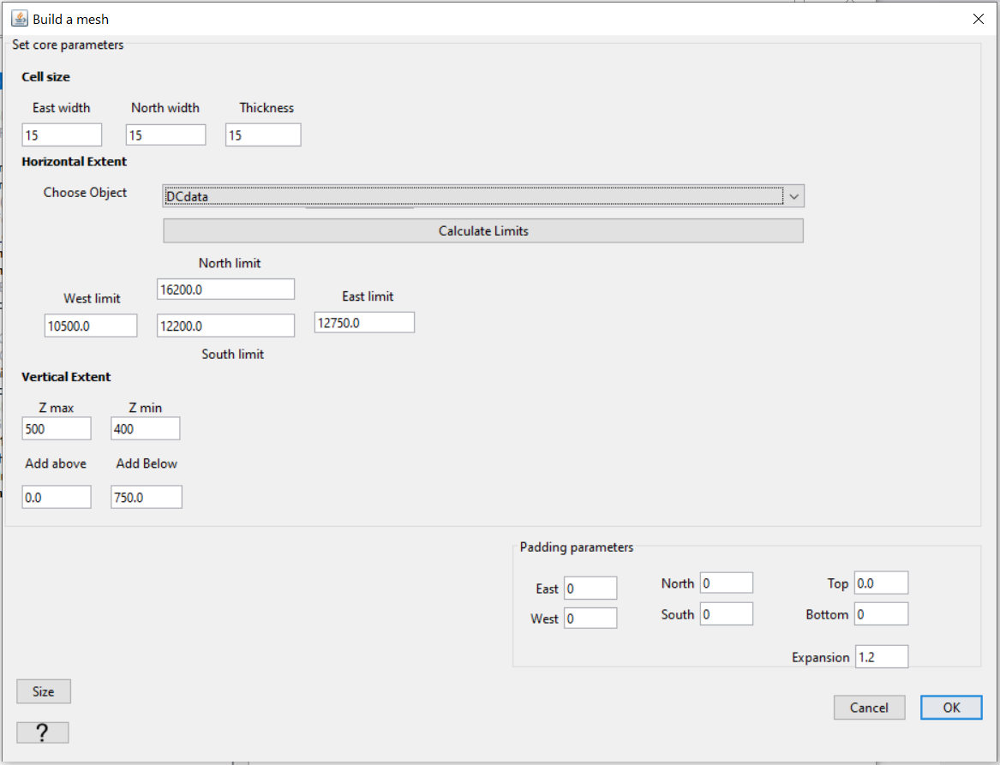
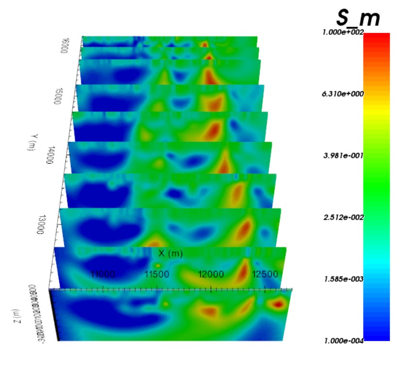
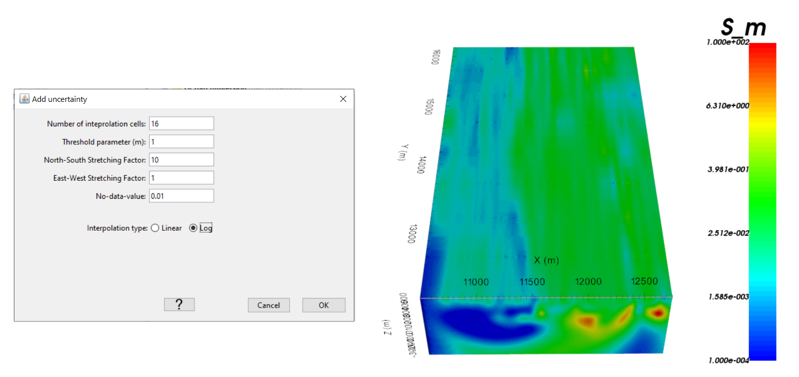
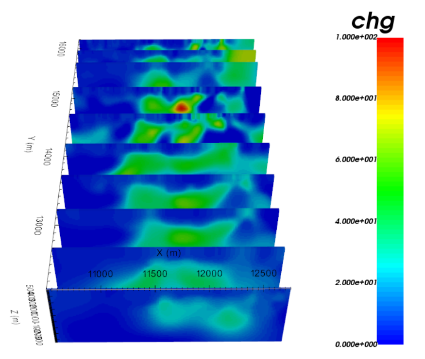
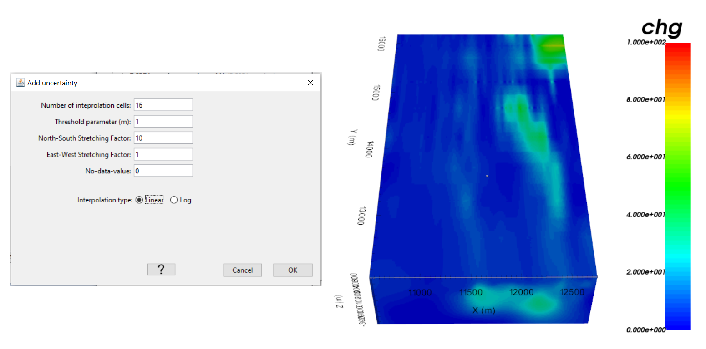

.. _comprehensive_workflow_dcip_6:

.. include:: <isonum.txt>

Batch 2D Inversion
==================

The user may choose to assign distinct uncertainties to each line of 2D DC/IP data and invert the respecitve lines independently. If the same set of parameters is to be used for each DC/IP line however, the inversions can be run as part of a batch. The batch inversion works well if 1) you have run test inversions on one or more survey lines and, 2) both the uncertainties and chi-factor are reasonable. Here, we demonstrate how to run a batch inversion for all DC and IP survey lines.

2D DC Batch Inversion
---------------------

Defining an Inversion Template
^^^^^^^^^^^^^^^^^^^^^^^^^^^^^^

Here, we define the parameters that will be used when inverting each survey line. To create the template:

    - :ref:`Create a new 2D DC inversion object <createDCIPInv>` and select a working directory when prompted. It is **important** that you create a new inversion object for this.
    - Use :ref:`edit options <invEditOptions_dcip2d>` to set the parameters for the inversion.
    - Click *Apply*. **Do not** write the files.

 **For the tutorial data**, we used the :ref:`same parameters as before <comprehensive_workflow_dcip_4_DC>`; except for the trade-off parameter which was set to *Discrepancy* option with a chi-factor of 1.

.. note::

    - You will need to enter placeholders for the data and topography, but they will be ignored during the batch inversion.
    - If you are confident in your misfits and chi-factor, use the *Discrepancy* option when defining the trade-off parameter.

Performing the Batch Inversion
^^^^^^^^^^^^^^^^^^^^^^^^^^^^^^

To set up and run the batch inversion, apply the following under the *Batch Inversion* menu:

    - :ref:`Set inversion template <batchInversionSetTemplate>` to the 2D DC inversion object you created
    - :ref:`Set the 2D DC data objects <batchInversionSetData>` (the data object for each survey line). If applicable, GIFtools will prompt you to select the associated topography objects.
    - :ref:`Create/Write all <batchInversionCreateInv>` 2D inversion objects. **If** sensitivity weighting is being applied, GIFtools will automatically compute the sensitivity weights. Please allows this step to finish before doing anything else.
    - :ref:`Run inversions <batchInversionRun>`

Results
^^^^^^^

If the **Discrepancy** option was used, the user believes the chi-factor is the same for all survey lines. You can use functionality under the *Batch Inversion* menu to:

    - :ref:`Load the final model or the first to reach the chi-factor <batchInversionLoad>` for all 2D inversions.

If the **Default** option was selected for the trade-off parameter, the user believes the chi-factor for each survey line could be different. For each 2D inversion object, the user must analyze the inversion results and choose a final model according to the :ref:`Analyzing 2D Inversion Results <comprehensive_workflow_dcip_5>` section of this tutorial.

Interpolation to 3D Mesh
^^^^^^^^^^^^^^^^^^^^^^^^

Once you have completed the batch inversion, it is benefitial to compare the set of recovered 2D models side by side. You may also want to interpolate the 2D slices to approximate 3D geometries. Here, we interpolate the set of recovered 2D models onto a 3D tensor mesh. We start by creating a 3D tensor mesh on which the 2D slices can live. Next, we place the set of 2D models onto the 3D mesh. Finally, we interpolate the 2D slices to create a 3D model.

**1. Creating the mesh:**

    - :ref:`Create 3D tensor mesh <create_mesh_3D>`

        - Use the 3D DC data object to calculate limits of the core mesh region
        - Make any adjustments to parameters
        - Click *OK*

**For the tutorial data**, the set of parameters used to create the 3D mesh is shown in the image below.

.. important::

    The user is strongly urged to:

        - Set *dx* and *dz* to match the values used for constructing the 2D mesh. And let *dx* = *dy*.
        - Remove any padding unless it is important for interpretation.

    Parameters used to create 3D tensor mesh.

**2. Placing 2D slices on the 3D mesh**

Once the 3D mesh has been created, select any of the *Batch Inversion* objects and:

    - :ref:`Merge all <batchInversionMerge>` to interpolate to 3D mesh.

**For the tutorial data**, we see the set of recovered 2D conductivity models below.

    2D conductivity models with *Discrepancy* and a chi-factor of 1.

**3. Interpolate 2D slices to create 3D model**

To gain insight with regards to 3D structures, you may want to interpolate the 2D slices to create the fully 3D model. To do this, you can use an inverse distance interpolation:

    - :ref:`Fill no data values with inverse disctance interpolation <objectFunctionalityFillNDValue>`

For the tutorial data, the parameters used for the interpolation and the final 3D model are shown below.

    Interpolation parameters and interpolated 3D conductivity model for tutorial data.

2D IP Batch Inversion
---------------------

The process for creating and running a 2D IP batch inversion is nearly identical to that of a 2D DC batch inversion. When prompted, the batch inversion will ask you for the associated set of 2D DC inversion objects. This is done to assign a background conductivity model for each IP inversion.

**For the tutorial data**, we used the :ref:`same parameters as before <comprehensive_workflow_dcip_4_IP>` when creating the template for the batch inversion; except for the trade-off parameter which was set to *Discrepancy* option with a chi-factor of 1. The 2D slices were places on the same 3D mesh, then interpolated to obtain the 3D chargeability model.

    2D chargeability models with *Discrepancy* and a chi-factor of 1.

    Interpolation parameters and interpolated 3D chargeability model for tutorial data.

