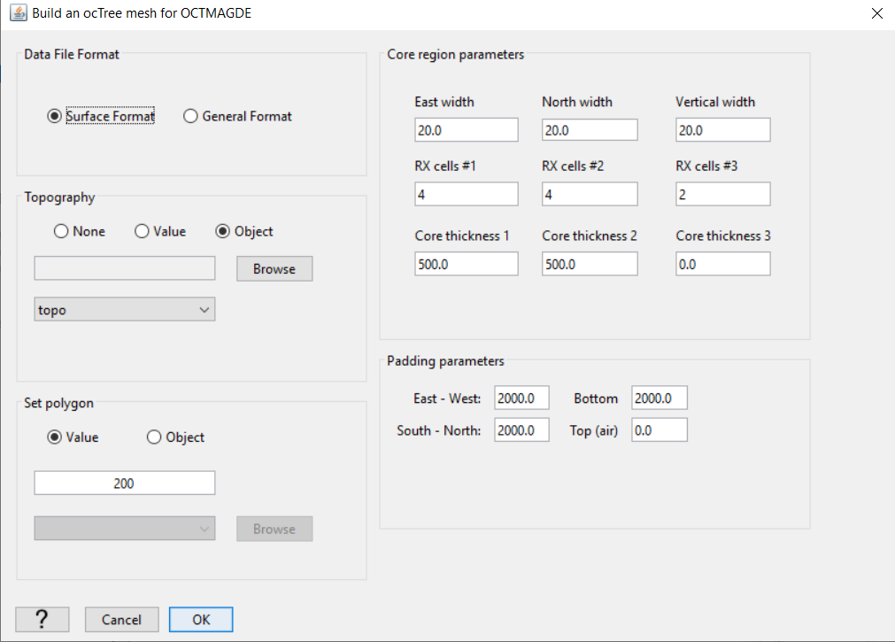

.. _comprehensive_workflow_dcip_7:

.. include:: <isonum.txt>

OcTree Mesh Design
==================

Here we provide a basic approach for mesh design when inverting DC/IP data. Mesh design for DC/IP problems depend on both the maximum and minimum electrode spacing. We explain how to create an OcTree mesh based on DC/IP survey geometry. We also explain the reasoning for the parameter values entered for the tutorial data. We can create OcTree meshes from DC/IP surveys with the following utility:

	- :ref:`create OcTree mesh with DC/IP utilities <createDCIPoctreeMesh>`

Once you have created the object, complete the following steps:

	1) Set the data object corresponding to the survey
	2) Define the mesh using *Edit Options*
	3) Run the utility
	4) Load results. The files loaded will include a data file *data_Z.txt* wherein the surface electrodes have been projected to the discrete surface topograpy.

**For the tutorial data**, the parameters set in *Edit Options* are shown below. For definitions of the parameters, consult the `DCIP octree manual <https://dcipoctree.readthedocs.io/en/latest/content/inputfiles/createOcTree.html>`__ .

    Parameters used to define the mesh for the field dataset using DCIP OcTree mesh utility.

Comments on Choosing Parameters
-------------------------------

**File format:** Since all electrodes are located on the Earth's surface (i.e. no borehole), we use the *surface* option to project all electrodes to the disrete surface topograpy. If we had borehole data, we would use the general file format option.

**Minimum cell size:** The minimum cell size is determined by the minimum electrode spacing. To have sufficient accuracy, you must have at least 2.5 to 4 cells between each electrode.

**Core region discretization:** *Thickness 1* should be used to discretize the region with the largest currents. For dipole-dipole data, this should be 30\% to 50\% the size of the largest electrode spacing. For pole-dipole or dipole-pole data, this should 75\% to 100\% the size of the largest electrode spacing. If you let *Thickness 1* be on the smaller side, make sure *Thickness 2* is equal or greater than *Thickness 1*.

**Padding cell expansion:** The extent of the mesh depends on the largest electrode spacing. The thickness of the padding should be about 2-3 times the length of the largest electrode spacing.

**Number of cells around Rx:** The number of fine mesh cells near receivers must be sufficiently large to model the electric potentials near electrodes accurately. It is important to set *RX cells #1* to be between 4 and 8.

**Make polygon:** This parameter controls the horizontal extent of the core mesh region. In practice, the distance between any electrode and the horizontal edges of the core mesh region should be 2-3 times larger than the smallest electrode spacing.

