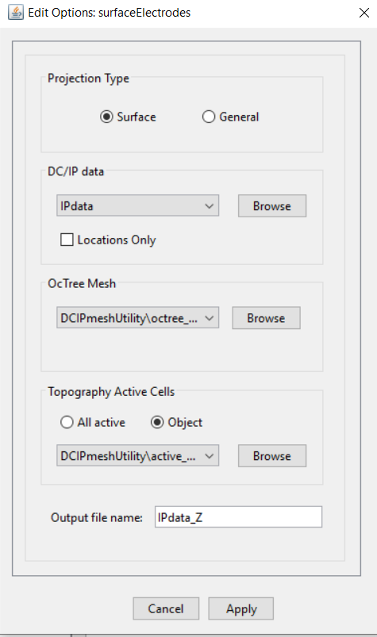

.. _comprehensive_workflow_dcip_7b:

.. include:: <isonum.txt>

Project Electrodes to Discrete Surface
======================================

When :ref:`creating an OcTree mesh <comprehensive_workflow_dcip_7>`, the output included at data file **data_Z.txt** wherein all surface electrodes have already been projected to the discrete surface topography. So if you are only working with DC data, and you used the DC data (with data and uncertainties) to create the mesh, simply use **data_Z.txt** as the observations file in your DC inversion.

**However** if you have DC and IP data, you still need to project the IP electrodes to the discrete surface topography. Here we provide the standard approach for creating a new DC/IP data object where the surface electrodes have been projected to the discrete surface topograpy. For the tutorial, we apply the utility to the IP data. To create the utility:

    - :ref:`create surface electrodes utilities <createElectrodes>`

Once you have created the object, complete the following steps:

    1) Define the data and other parameters using *Edit Options*
    2) Run the utility
    3) Load results

**For the tutorial data**, the parameters set in *Edit Options* are shown below. Since we do not have borehole data, we used the **surface** format. For definitions of the parameters, consult the `DCIP octree manual <https://dcipoctree.readthedocs.io/en/latest/content/inputfiles/surfaceElectrodes.html>`__ .

    Parameters used when running the utility.

