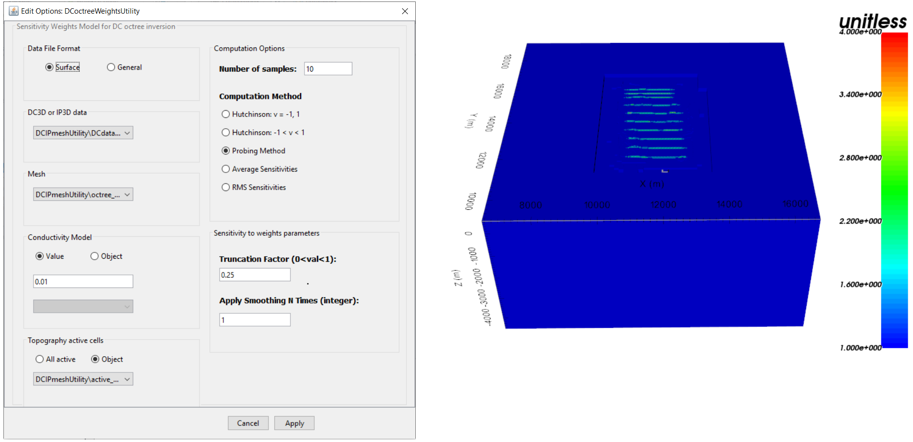
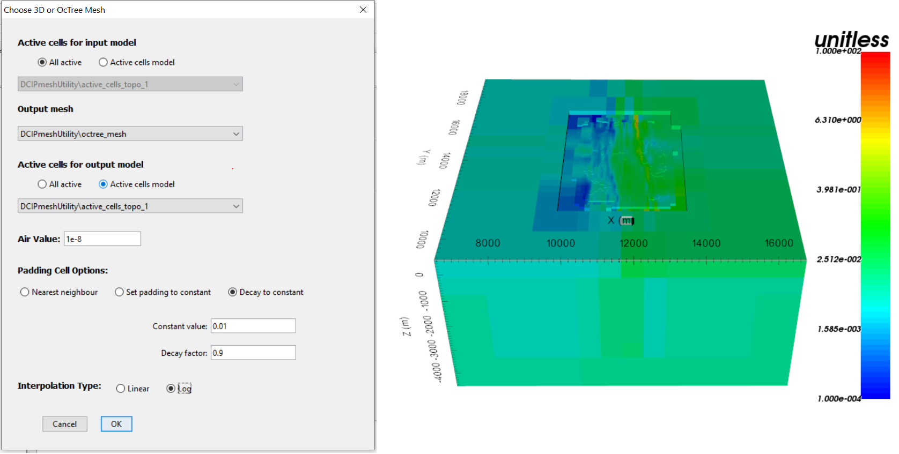

.. _comprehensive_workflow_dcip_8:

.. include:: <isonum.txt>

DC OcTree Inversion: Weights and Reference Models
=================================================

Weights are used to reduce artifacts causes by the sensitivity of the data to cell near electrodes. Starting and reference models can be used to constrain the data with a-priori information. In this section we demonstrate how to:

    - Create near-surface interface weights
    - Create sensitivity weights for the DC inversion
    - Create a starting/reference model from the batch 2D inversion result

.. important:: The ideal weights for DC inversion is very problem-dependent. And as of yet, there isn't fool-proof recipe for constructing these weights. We will, however, describe a reasonable set of starting parameters for these utilities. We generally encourage the user to implement interface weights OR sensitivity weights but NOT both; unless they are very confident in how it will impact their inversion result.

.. _comprehensive_workflow_dcip_8_interface:

Near-Surface Interface Weighting
--------------------------------

When inverting DC data, the code has a tendency to place conductive structures near electrode locations due to the sensitivity of the data to those locations. One way to counteract this problem is to generate interface weights. By forcing lateral smoothness within the top few layers of cells, we can limit near-surface artifacts and force the inversion to place conductive structures at the appropriate depths. The rule of thumb is to define 2-4 layers. From the top layer down, the weighting value should decrease exponentially by a factor of 2-3; e.g. [20, 10, 5].

Near-surface interface weights are simple to implement and fairly intuitive to understand. However this approach for reducing the aforementioned artifacts has its pros and cons. When the lateral variation in near-surface electrical conductivity is smooth, this approach is ideal. Essentially, the near-surface geology matches the regularization you are imposing. Therefore you can reduce the artifacts without compromising the inversion's ability to fit the data. When the lateral variation in near-surface electrical conductivity is highly variable, you are imposing a regularization that fights against your inversion's ability to fit the data. When excessive near-surface interface weighting is applied, the inversion will have a very difficult time reaching target misfit.
Limited testing also suggests near-surface interface weighting is less effective when the topography is very rough.

To create interface weights:

    - :ref:`Create and interface weights utility <createinterfWeights>`
    - Use :ref:`edit options <utilEditOptions>` and set the following parameters:

        - set the OcTree mesh
        - set the model
        - set as *log model* for DC inversion
        - set topography as the active cells model
        - set number of layers and corresponding weights
        - for inhomogeous background models, set the *face value* and *face tolerance*

    - :ref:`Run the utility <utilRun>`
    - :ref:`Load results <utilLoadResults>`

**For the tutorial data**, we set 2 layers of interface weights with values of 10 and 4. Earlier attempts to invert the data used larger interfaces weights and more layers, however the inversion struggled to reach target misfit in this case. It was thought that by applying very large interface weights, we were not able to recover near-surface inhomogeneities that exist in the true conductivity model.

.. _comprehensive_workflow_dcip_8_sens:

Sensitivity Weighting for DC Inversion
--------------------------------------

.. important:: Since the initial creation of the sensitivity weights utility, analytic methods for computing the *average sensitivities* and *RMS sensitivities* have been added. In practice, we suggest using these methods over the approximate methods.

Sensitivity weighting is another approach for reducing near-surface artifacts at the location of electrodes. For this approach, we approximate the root mean squared sensitivities for a given conductivity model and use them to construct cell weights. The cell weights counteract the inversion's natural inclination to place conductive structures at the locations of highest sensitivity; i.e. at the electrode locations.

This approach is better suited when the topography is rough; compared to interface weighting. The user should keep several things in mind when using sensitivity weights. 1) For the DC octree code, the sensitivities are approximated with Hutchinson's method because it is too time-consuming to compute the true sensitivities. The user will need to apply a smoothing factor to reduce 'pixelation' in the cell weights model. If the sensitivity weighting is too large, the inversion may place artifacts in the space between surface lines. Generally, we suggest setting the *number of samples* to be 5-20, using a *truncation factor* of 0.05-0.2 and to *smooth* 1-4 times.

To create a cell weights model for the DC inversion using the sensitivities, do the following:

    - :ref:`Create a DCIP sensitivity weights utility <createDCsensitivities>`
    - Use :ref:`edit options <utilEditOptions_DCsensitivity>` to set the parameters and click *Apply*
    - Write the input files
    - Run *sensitivities*
    - Run *sens2weights*
    - :ref:`Load results <utilLoadResults>`

**For the tutorial data**, the input parameters and sensitivity weights are shown below. In this case, we set the *truncation factor* to 0.25. In earier inversion attempts, we found that large sensitivity weights forced near-surface conductive structures to collect in the space between surface lines instead of pushing them to an appropriate depth.

.. _comprehensive_workflow_dcip_8_mref:

Starting/Reference Model from Batch 2D Inversion
------------------------------------------------

In the :ref:`2D batch inversion <comprehensive_workflow_dcip_6>` section, we generated a 3D conductivity model by interpolating the set of 2D slices. If we have confidence in the structures recovered from the batch 2D inversion, we may want to use it as a starting and/or reference model. To do this, we must interpolate the 3D tensor model onto the :ref:`OcTree mesh we generated in the previous section <comprehensive_workflow_dcip_7>` . To accomplish this, we use:

    - :ref:`Interpolate with nearest neighbour <objectFunctionalityNearest3D>`

**For the tutorial data**, the parameters used and the resulting OcTree model are shown below. When *nearest neighbour* was used for the *padding cell options*, the padding in the reference model contained large anomalous structures that impacted the predicted data and created obvious artifacts in the inversion result. When using *set padding to constant* , the large discontinuity created at the edge of the core mesh region greatly impacted the regularization. The inversion tried to smooth this out at the expense of evenly fitting the data. It was only by using the *decay to constant* option that artifacts were minimized and acceptable convergence was observed.

    Interpolation parameters and reference/starting conductivity model on OcTree mesh for tutorial data.
