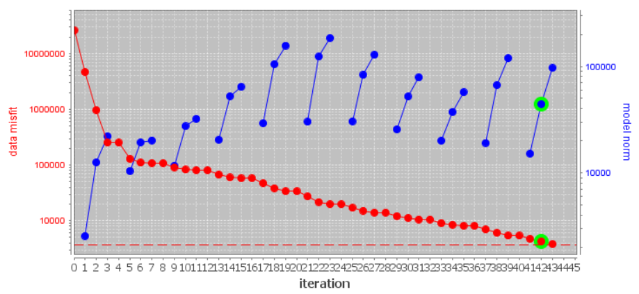
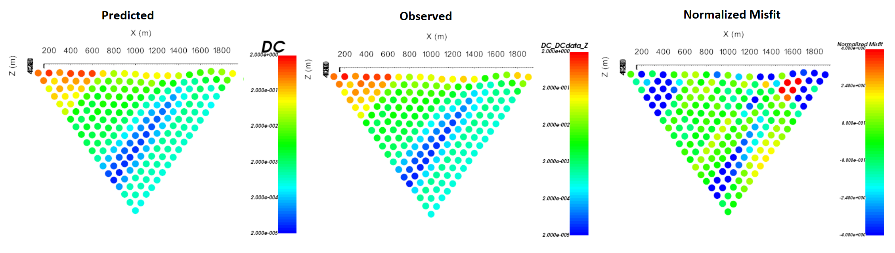
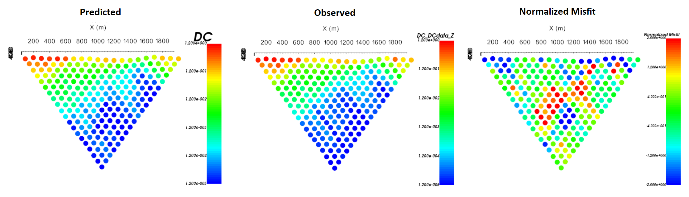
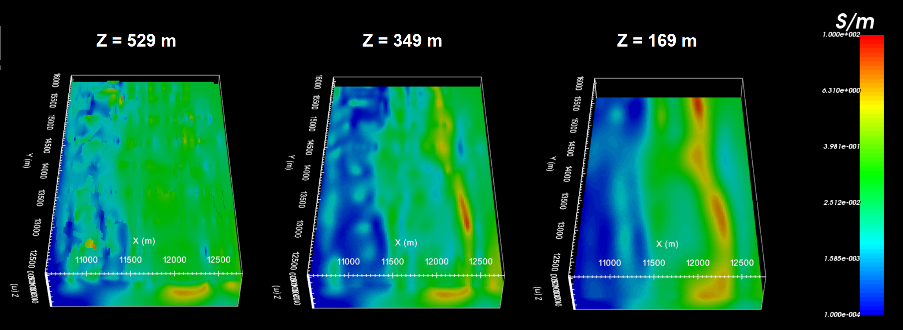

.. _comprehensive_workflow_dcip_9:

.. include:: <isonum.txt>

General DC OcTree Inversion
===========================

Here we present the standard steps for completing a DC OcTree inversion and performing a general analysis of results. The steps are organized as follows:

    1. Set up, run and load inversion results
    2. Examine the convergence
    3. Examine the data misfit
    4. Examine the recovered model

.. important::
    The inversion parameters chosen for this exercise work well for the tutorial data. However, the optimum choice in inversion parameters is problem-dependent. The parameters chosen here should not be blindly chosen to invert other datasets. 

Create, Run and Load Inversion
------------------------------

We can now invert DC data using the DCIP OcTree package. To do this:

    - :ref:`Create a DC OcTree inversion object <createDCIPInv>`
    - Use :ref:`edit options <invEditOptions_dcipoctree>` to set the inversion parameters
    - Click *Apply and write files*
    - :ref:`Run the inversion <invRun>`
    - :ref:`Load results <invLoadResults>`

**For the tutorial data**, the following parameters were used in the inversion. A thorough discussion of the input parameters and their impact on the final inversion result is discussed in the :ref:`DC OcTree Inversion using Weights and Reference Models <comprehensive_workflow_dcip_10>` section. For now, we invert to recover the smoothest model with modest near-surface interface weights.

.. figure:: images/edit_options_dcinv_smoothest.png
    :align: center
    :width: 700

    Parameters used to invert the tutorial dataset.

Convergence
-----------

Once the inversion has completed:

    - :ref:`View convergence <convergence_curve>`

**For the tutorial data**, the Tikhonov curve is shown below on a semilog-y plot. According to the figure and the *log* file:

    - the inversion reaches target misfit (chi-factor = 1 in this case) between beta iteration 9 and 10; recall that there are several Gauss-Newton iteration for each beta. And the algorithm is converging over the course of the beta cooling schedule.
    - There isn't an obvious place in which the curve 'flattens out', indicating the choice in optimum model is a little subjective.
    - We will need to examine the data misfits and recovered models to determine the quality of our result.

Data Misfit
-----------

According the Tikhonov curve, the recovered model at iteration 9 has a good chance of explaining the data without fitting the noise. To be sure however, we must examine the observed data, predicted data and data misfit for the corresponding model. Here are some good questions to ask during this step:

    - Are the prominent anomaly features identified in the observed data also found in the predicted data?
    - Are there obvious coherent features in the normalized misfit maps? If so, this indicates you are over-fitting certain regions at the expense of others and that you must assign new uncertainties and re-run the inversion.
    - Are the ranges of normalized misfits for each for each survey line balanced? If not, you may need to adjust the uncertainties and re-run the inversion.

**For the tutorial data**, we have both pole-dipole and dipole-pole data along each survey line. To examine the misfit maps, we needed to:

    1. :ref:`Assign line IDs <comprehensive_workflow_dcip_2_lineid>` to the DC3D predicted data object
    2. :ref:`Create 2D survey lines from line ID <comprehensive_workflow_dcip_2_2Dlines>` and split the pole-dipole and dipole-pole data based on electrode geometry.
    3. :ref:`Plot with VTK <viewData>` to examine observed data, predicted data and normalized misfit.

For line 5, the predicted data reproduces the field observations quite well. Normalized misfits lie within [-2, 2]. The misfit map for the pole-dipole data shows relatively uncorrelated errors but the dipole-pole misfit map shows some small coherent features. We will not do it here, but the user is encouraged to examine the misfit maps for other survey lines.

    Predicted data, observed data and normalized data misfit (dipole-pole) for the 5th survey line. Predicted data are plotted on the same scale. Normalized misfits are plotted on a color scale from -2 to 2.

    Predicted data, observed data and normalized data misfit (pole-dipole) for the 5th survey line. Predicted data are plotted on the same scale. Normalized misfits are plotted on a color scale from -2 to 2.

Recovered Model
---------------

**For the tutorial data**, the conductivity model recovered at the 9th iteration is shown below at 3 depths. According to the recovered model:

    - We can see some near-surface inhomogeneity but it is not highly pixelated. Since the inversion would not converge when large interface weights were applied, we have likely applies reasonable interface weighting for this problem
    - There is a large NS conductor between X = 12,000 m and 12,500
    - There is a large resistive unit West of X = 11,500 m
    - The electrical resistivities lie within the range of apparent resistivities observed and lie within the known range of electrical resistivities for these units
    

    Recovered model at iteration 9.

