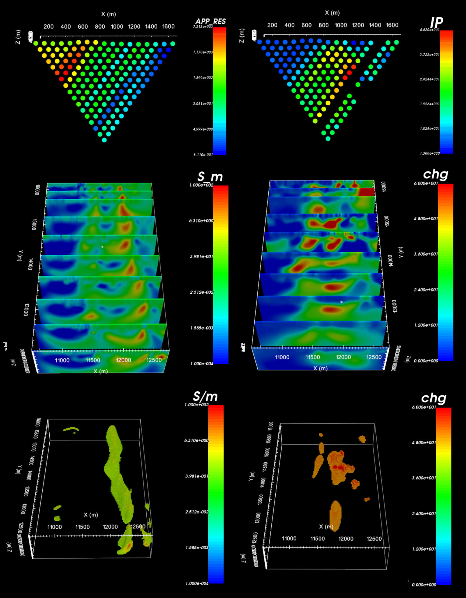

.. _comprehensive_workflow_dcip_index:

Comprehensive Workflows: DC and IP
==================================

**Author: Devin C. Cowan**

**Published: August, 2020**

Here, we present a general workflow for loading, interpreting and inverting directed current resistivity (DC) and induced polarization (IP) data. We begin with UBC-GIF formatted data files for the DC and IP data. However, instruction is given in the case the data are in XYZ format. Our goal is to invert the data to recover both a 3D conductivity model and a 3D chargeability model. You may work with your own data or the tutorial dataset provided here:

    - `Download the tutorial data <https://github.com/ubcgif/GIFtoolsCookbook/raw/master/assets/comprehensive_tutorial_dcip.zip>`_

The tutorial data were collected in order to delineate ore-bearing rock units at Mt. Isa, Queensland, Australia. The data were originally inverted as part of the paper *2-d and 3-d ip/resistivity inversion for the interpretation of isa-style targets* (Rutley et al., 2001)

**Tutorial Sections**

.. toctree::
    :maxdepth: 1

    - Understanding DC and IP anomalies <1_basic_anomalies>
    - Loading 3D DC/IP data and cursory interpretation <2_load_data>
    - Assigning uncertainties <3_uncertainties>
    - Create, run and load 2D DC and IP inversion <4_local_2D>
    - Analyze 2D DC and IP inversion results <5_local_2D_results>
    - Batch 2D DC and IP inversion <6_batch_2D>
    - OcTree mesh design <7_octree>
    - Project electrodes to discrete surface <7b_projection>
    - DC OcTree inversion: creating weights and reference models <8_dc_prep>
    - DC OcTree inversion: setting up, running and examining results <9_dc_inv_basic>
    - DC OcTree inversion using sensitivity weights and reference models <10_dc_inv_compare>
    - IP Octree inversion: creating weights and reference model <11_ip_prep>
    - IP OcTree inversion: setting up, running and examining results <12_ip_inv_basic>
    - IP OcTree inversion using sensitivity weights and reference models <13_ip_inv_compare>

 