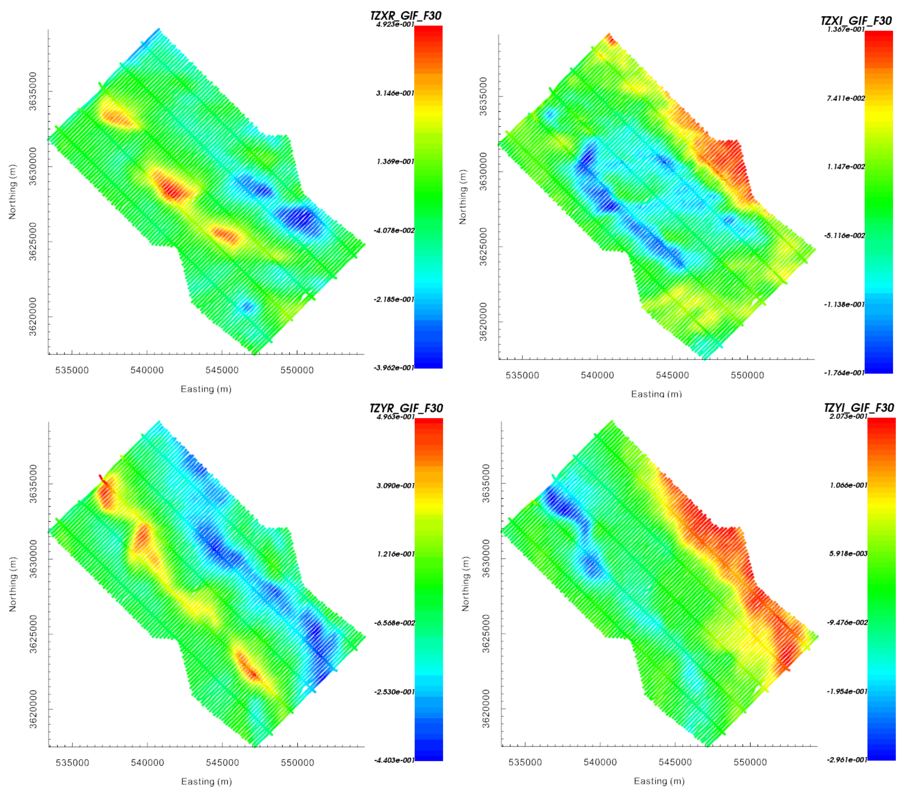
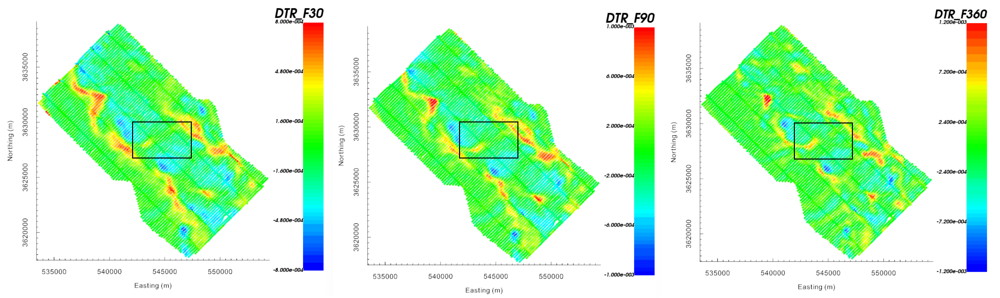
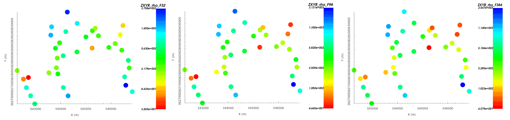
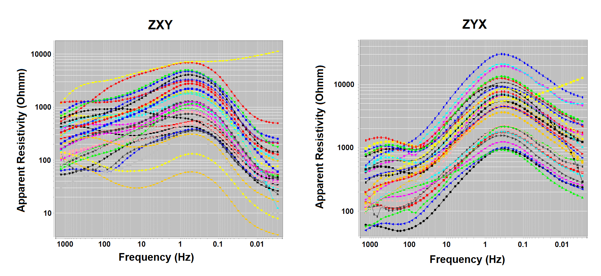

.. _comprehensive_workflow_mt_ztem_2:

**Add note for where data came from**

Loading and Transforming Field Data into GIF Convention
=======================================================

The first step in any project is to load field collected data and visualize it. MT and ZTEM datasets are challenging to work with for several reasons. First, they are computed by applying a non-trivial operations to the Cartesian components of measured electric/magnetic fields. Second, MT and ZTEM data values are frequently represented in a survey-dependent coordinate system.

.. important:: Requires GIFtools v3.2 or later.

Starting Your Project and Importing Files
-----------------------------------------

    - Open GIFtools
    - :ref:`Set the working directory <projSetWorkDir>`

Workflow Using Tutorial Data
^^^^^^^^^^^^^^^^^^^^^^^^^^^^

The steps for loading, visualizing and converting MT and ZTEM data to UBC-GIF convention has already been covered in previous comprehensive workflows. To avoid duplicating content, the tutorial data are provided in UBC-GIF files with data already in the UBC-GIF convention.

**To import the tutorial data:**

    - `download tutorial data <Download the tutorial data <https://owncloud.eoas.ubc.ca/s/ozWD7wDBDRTpZAE/download>`_ . It is from these data that we will demonstrate the workflow.

    - :ref:`Import topography data (XYZ format) <importTopo>`. The data file is named *topo.xyz* and is in the *assets* folder.

    - :ref:`Import MT data <importNSEMData_e3dmt1>` from E3DMT v1 formatted file. The data file is named *mt_data.dat* and is in the *assets* folder. Data were collected at 36 stations at 57 frequencies from 0.0029297 Hz to 1,280 Hz.

    - :ref:`Import ZTEM data <importNSEMData_e3dmt1>` from E3DMT v1 formatted file. The data file is named *ztem_data.dat* and is in the *assets* folder. The dataset consists of 1269 line-kilometres of ZTEM data collected at 6 frequencies (30 Hz, 60 Hz, 90 Hz, 180 Hz, 360 Hz and 720 Hz).

**Remove dummy uncertainty columns:**

To save the data files in UBC-GIF format, we set dummy uncertainties of 0 for all data components. Assigning appropriate uncertainties is covered later in the workflow. At this time, please:

    - :ref:`Use set IO headers <objectSetioHeaders>` to unset the uncertainty columns for the MT and ZTEM datasets

    - :ref:`Delete the uncertainty columns <objectDataDeleteDataColumns>` from the MT and ZTEM datasets

Workflow Using Your Own Data
^^^^^^^^^^^^^^^^^^^^^^^^^^^^

If you are not using the tutorial data, please see the following pages describing the steps for loading, visualizing and transforming natural source EM data to UBC-GIF convention:

    - :ref:`Loading and Transforming Magnetotelluric Data <comprehensive_workflow_mt_2>`

    - :ref:`Loading and Transforming ZTEM Data <comprehensive_workflow_ztem_2>`

Apparent Resistivities and Total Divergence
-------------------------------------------

Now is a convenient time to compute the apparent resistivities from your MT impedance-tensor data and to compute the total divergence from you ZTEM data. Apparent resistivities are discussed on the :ref:`data preparation page within the MT comprehensive workflow <comprehensive_workflow_mt_3>`.
The total divergence representation of ZTEM data :ref:`is discussed here <comprehensive_workflow_ztem_2_dt>`.

If you have :ref:`set the IO headers <objectSetioHeaders>` properly for the MT and ZTEM data within GIFtools:

    - :ref:`Compute apparent resistivities from impedances <objectDataManipulationMT_IMP2APP>`

    - :ref:`Compute total divergence (DT) from ZTEM data <objectDataManipulationZTEM_total_divergence>`

Interpretation of ZTEM Data
---------------------------

The ZTEM data indicates a large-scale structure trending from Northwest to Southeast that is more resistive than its neighbouring geology. This is especially visible in the 30 Hz data (shown below). At higher frequencies, smaller scale features become more visible.

    ZTEM data (TZXR, TZXI, TZYR and TZYI) at 90 Hz represented in UBC-GIF coordinates.

The total divergence parameter computed for real data at 30 Hz, 90 Hz and 360 Hz is shown below. The total divergence maps support the initial interpretation from the Tipper components. However, the aforementioned feature may not be overly resistive. Instead, it may just be a region flanked by structures more conductive than the background. The region of MT data coverage has been indicated for purposes of later comparison. 

    Total divergence parameter for the real component at 30 Hz (left), 90 Hz (middle) and 360 Hz (right). Region of MT data coverage shown.

.. _comprehensive_workflow_mt_ztem_2_mt_interp:

Interpretation of MT Data
-------------------------

Below, apparent resitivities computed from the ZXY component are plotted at 32 Hz, 96 Hz and 384 Hz. The colorscale has been defined such that blue denotes larger apparent resistivities. Data locations denoting higher and lower resistivities seem to correlate fairly well to the total divergence maps computed from ZTEM data at similar frequencies. 

    Apparent resistivities at 32 Hz (left), 96 Hz (middle) and 384 Hz (right) computed from ZXY. 

Below, we plot the apparent resistivity sounding curves derived from the ZXY and ZYX components for all MT stations at all frequencies (0.0029297 Hz to 1,280 Hz). The highest frequency denotes a significant variation in apparent resistivities (50 :math:`\Omega m` to 2000 :math:`\Omega m` ), indicating some nearer surface regions at more conductive than others. All of the curves indicate an increase in resistivity with respect to depth for frequencies between (1 Hz and 100 Hz). Apparent resistivity curves computed from ZXY and ZYX components of the impedance tensor show significant differences. This tells us that a 1D interpretation of the MT data is insufficient in characterizing the region and that 3D interpretation in necessary.

    Log-log sounding curves for apparent resistivities computed from ZXY (left) and ZYX (right).

