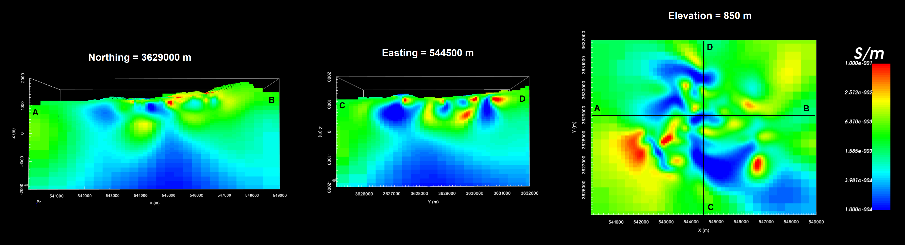

.. _comprehensive_workflow_mt_ztem_5:

Independent MT Inversion
========================

For independent MT inversion, a standard approach for mesh design, creating interface weights, setting up and running the inversion, and analyzing the results was covered in the Cloncurry MT comprehensive workflow. We strongly urge the reader to be familiar with this material, as we will take the same approach here. For reference, visit:

    - :ref:`Designing an OcTree mesh <comprehensive_workflow_mt_5>`

    - :ref:`Interface weights, setting up and running the inversion <comprehensive_workflow_mt_6>`

    - :ref:`Analyzing inversion results <comprehensive_workflow_mt_7>`

Mesh Design
-----------

According to the apparent resistivity maps and sounding curves, the Earth is more conductive near the surface and more resistive at depth. Over the range of frequencies we are inverting (8 - 756 Hz), the apparent resistivities are generally between 100 - 1000 :math:`\Omega m`. From the skin depth formula:

    - :math:`\delta_{min}` = 182 m
    - :math:`\delta_{max}` = 5590 m

Here, we create an OcTree mesh using the E3DMT v2 utility. The steps are as follows:

    - :ref:`create OcTree mesh with E3DMT v2 utilities <createE3DMTv2octreeMesh>`

Once you have created the object, complete the following steps:

    1) Set the data object corresponding to the survey
    2) Define the mesh using *Edit Options*
    3) Run the utility
    4) Load results
    5) Rename the MT data object that is loaded from the outputs to something like *mt_data_shifted*. The utility has shifted all MT stations to the discretized surface in order to model the fields properly.

**For the tutorial data**, we selected the MT data object created by extracting a subset of the total frequencies (i.e. *mt_data_5freq*). The following parameters we set in *Edit Options*.

.. figure:: images/mesh_parameters_mt.png
    :align: center
    :width: 500

|

**Discussion of Parameters:**

    - The minimum MT station spacing was ~200 m. To have 2.5 cells per station, a minimum horizontal cell width of 80 m was chosen.
    - Given the minimum skin depth was ~200 m, we chose a minimum vertical cell width that was at most 1/4 this value (40 m in our case).
    - The width of the padding was set to 2 times the largest skin depth
    - Over the frequencies we are inverting, we are likely only sensitive to the first few thousand meters. The sum of thickness 1, 2 and 3 were partitioned to sum to 4000 m.
    - Unlike controlled source EM, natural source EM fields are very smooth and the discretization near the receivers can be less refined.
    - The 'Shift data' button is selected in order to create a receivers file whose receivers are located on the discretized surface.

Interface Weights
-----------------

Interface weights were generated to enforce lateral smoothness within the top few layers. For the tutorial MT data, we did the following:

    - :ref:`Create and interface weights utility <createinterfWeights>`
    - Use :ref:`edit options <utilEditOptions>` and set the following parameters:

        - set the OcTree mesh
        - set as *log model*
        - set topography as the active cells model
        - set number of layers and corresponding weights. Choose something exponentially decreasing. We chose 50, 20 and 5
        - Face value = 0.01
        - Face tolerance = 0.01

    - :ref:`Run the utility <utilRun>`
    - :ref:`Load results <utilLoadResults>`

**Discussion of Parameters:**

    - Since MT stations are on the Earth's surface, sensitivities to the top layer are much larger than for airborne measurements. Therefore, we chose a fairly large value for the top layer. We then decreased the horizontal weighting exponentially for 2 more layers.

Setup and Run Inversion
-----------------------

The MT inversion was carried out using E3DMT v2. There steps were as follows: 

    - :ref:`Create E3DMT v2 inversion object <createMTZTEMInv>`
    - Use edit options for :ref:`v2 <invEditOptions_e3dmt_ver2>` to set the inversion parameters
    - Click *Apply and write files*
    - :ref:`Run the inversion <invRun>`

For the tutorial dataset provided, the parameters used to invert the data are shown below.

.. figure:: images/inv_parameters_mt.png
    :align: center
    :width: 700

    Parameters used to invert the field dataset using E3DMT v2.

**Discussion of Parameters:**

    - Background, starting and reference models of 0.002 S/m were set. This corresponds to a rough average value of the apparent resistivity sounding curves over the frequencies we are inverting.
    - The starting beta was chosen as a result of preliminary inversion attempts.
    - The inversion code will terminate when the total misfit (not data misfit) reaches the target chi-factor. We chose 0.4 to guarantee we will have iteration that fit the data well, even if we globally over-estimate our uncertainties. You wouldn't need to set such a low chi-factor if you had a much larger confidence in your uncertainties.
    - We chose to invert for the smoothest model, which recovers a data driven result that does not depend on the reference model. We do this by setting *alpha S* to a very small value.

.. _comprehensive_workflow_mt_ztem_5_results:

Analysis of Results
-------------------

Convergence
^^^^^^^^^^^

Once the inversion has finished:

    - :ref:`View convergence <convergence_curve>`

The Tikhonov curve for our tutorial inversion is shown below. According to the figure:

    - the inversion code reached target misfit at the 9th iteration.
    - the Tikhonov curve starts to flatten out after the 7th iteration, indicating the point on the Tikhonov curve after which recovered models start to over-fit the data.
    - At the 7th iteration, the data misfit corresponds to a chi factor of 0.26. Therefore, we have likely over-estimated the global level of uncertainty on our data. If estimated correctly, we would expect the convergence curve to flatten out when the data misfit corresponds to a chi-factor of 1 (i.e. :math:`\phi_d` = number of data).

Data Misfit
^^^^^^^^^^^

Now that we have selected an iteration (or range of iterations) that we feel explains the data without overfitting:

    - :ref:`Load inversion results for these iterations <invLoadResults>`

According the Tikhonov curve, the recovered model at iteration 7 has a good chance of explaining the data without fitting the noise.

**Off-Diagonal Components:**

The observed data, predicted data and normalized misfits for off-diagonal impedance data are shown below at 80 Hz. From these plots, and plots at other frequencies, we found that:

    - The range of normalized misfits is more or less the same for all off-diagonal components and for all frequencies.
    - There were a few higher misfits at several locations, but they were not observed over all frequencies. So no coherent artifacts.

.. figure:: images/misfit_mt_off_diag.png
    :align: center
    :width: 700

    Observed data, predicted data and normalized misfit for all off-diagonal impedance components at 80 Hz. For each component, predicted and observe data are plotted on the same scale. All normalized misfit maps are plotted on a range from -1 to 1.

**Diagonal Components:**

The observed data, predicted data and normalized misfits for diagonal impedance data are shown below at 80 Hz. From these plots, and plots at other frequencies, we found that:

    - The range of normalized misfits is more or less the same for all diagonal components and for all frequencies.
    - No notable coherent artifacts in the misfit maps
    - The range of normalized misfits is the same as the off-diagonal components, indicating we are fitting diagonal and off-diagonal components evenly.

    Observed data, predicted data and normalized misfit for all diagonal impedance components at 80 Hz. For each component, predicted and observe data are plotted on the same scale. All normalized misfit maps are plotted on a range from -1 to 1.

Recovered Model
^^^^^^^^^^^^^^^

The conductivity model recovered at the 7th iteration is shown below. The colormap was scaled to 1e-4 S/m to 0.1 S/m. According to the recovered model:

    - The regional conductivity is higher in the Northeast and Southwest, with a larger-scale resistive feature trending from Northwest to Southeast. This is consistent with our original interpretation of the ZTEM data using total divergence maps.
    - Within the resistive feature are a more localized cluster of conductors. Some of these conductors appear to be constrained by multiple MT stations. However, some of these conductors lie within regions that are outside the sparse coverage of the MT data; indicating these structures may not be real.

    Recovered model at iteration 7.

