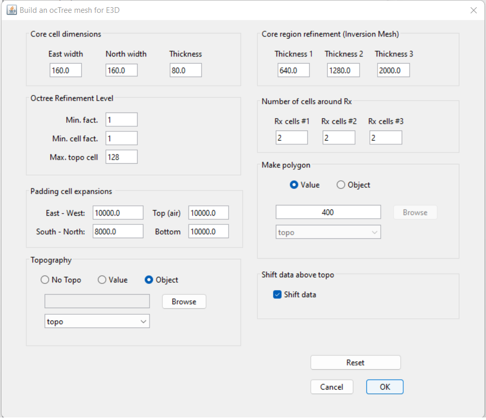
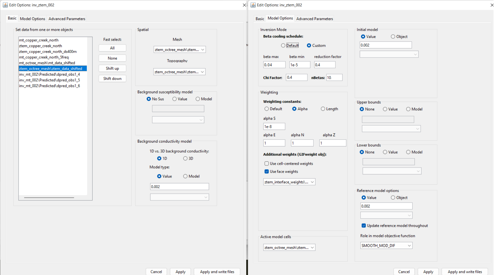
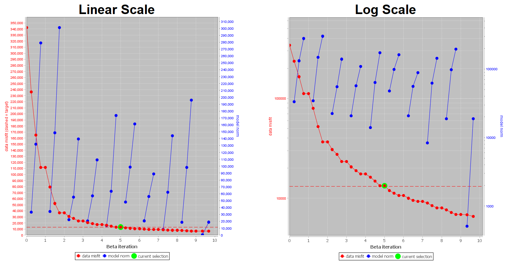
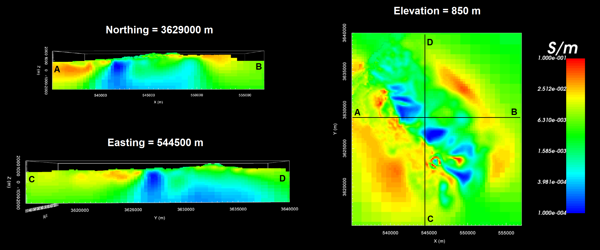
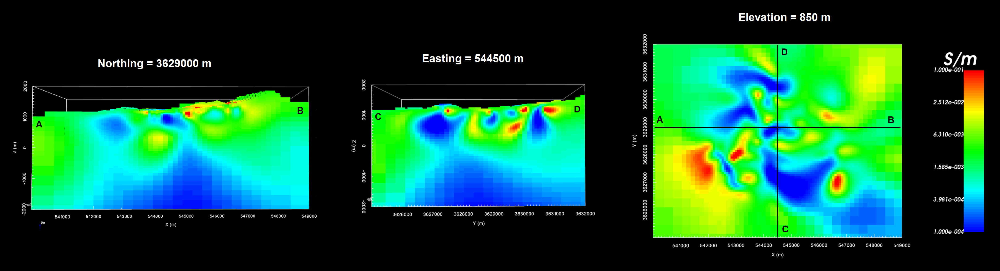
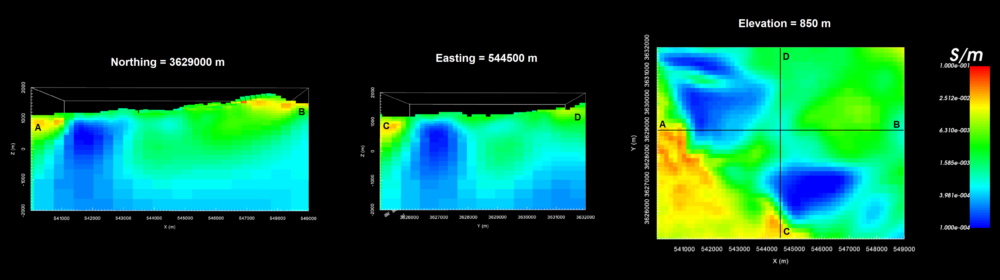

.. _comprehensive_workflow_mt_ztem_6:

Independent ZTEM Inversion
==========================

For independent ZTEM inversion, a standard approach for mesh design, creating interface weights, setting up and running the inversion, and analyzing the results was covered in the Dufferin Lake comprehensive workflow. We strongly urge the reader to be familiar with this material, as we will take the same approach here. For reference, visit:

    - :ref:`Designing an OcTree mesh <comprehensive_workflow_ztem_5>`

    - :ref:`Interface weights, setting up and running the inversion <comprehensive_workflow_ztem_6>`

    - :ref:`Analyzing inversion results <comprehensive_workflow_ztem_7>`

Mesh Design
-----------

According to the apparent resistivity maps and sounding curves, the Earth is more conductive near the surface and more resistive at depth. Over the range of frequencies at which we are inverting ZTEM data (30 - 720 Hz), the apparent resistivities are generally between 100 - 1000 :math:`\Omega m`. For a background resisitivity of 500 :math:`\Omega m`:

    - :math:`\delta_{min}` = 186 m
    - :math:`\delta_{max}` = 2887 m

Here, we create an OcTree mesh using the E3DMT v2 utility. The steps are as follows:

    - :ref:`create OcTree mesh with E3DMT v2 utilities <createE3DMTv2octreeMesh>`

Once you have created the object, complete the following steps:

    1) Set the data object corresponding to the survey
    2) Define the mesh using *Edit Options*
    3) Run the utility
    4) Load results
    5) Rename the ZTEM data object that is loaded from the outputs to something like *ztem_data_shifted*. The utility has shifted all ZTEM receivers to preserve flight height relative to the discretized topography.

For the field data provided, the following parameters we set in *Edit Options*.

|

**Discussion of Parameters:**

    - We wanted to run this inversion on a single 64 GB node. As a result, we downsampled the original ZTEM data to a minimum spacing of 400 m. And to have 2.5 cells per station, a minimum horizontal cell width of 160 m was chosen.
    - A minimum vertical cell width of 80 m was used so that the horizontal to vertical widths of cells did not exceed a factor of 2. When we consider skin depth however, this may not be fine enough to model the highest frequency accurately.
    - The topography was also coarsened very quickly just outside the data coverage to reduce the size of the mesh. We may not be modeling the ZTEM data as accurately near the edges of our survey region. In *Make Polygon* you may want to use a value at least at least as large as *Thickness 1*.  
    - The width of the padding was set to roughly 2 times the largest skin depth
    - Over the frequencies we are inverting, we are likely only sensitive to the first few thousand meters. The sum of thickness 1, 2 and 3 were partitioned to sum to 4000 m.
    - Unlike controlled source EM, natural source EM fields are very smooth and the discretization near the receivers can be less refined.
    - The 'Shift data' button is selected in order to create a receivers file whose receivers preserve the original flight height.

Interface Weights
-----------------

Interface weights were generated to enforce lateral smoothness within the top few layers. For the tutorial ZTEM data, we did the following:

    - :ref:`Create and interface weights utility <createinterfWeights>`
    - Use :ref:`edit options <utilEditOptions>` and set the following parameters:

        - set the OcTree mesh
        - set as *log model*
        - set topography as the active cells model
        - set number of layers and corresponding weights (choose something exponentially decreasing. We chose 10 and 5)
        - Face value = 0.01
        - Face tolerance = 0.01

    - :ref:`Run the utility <utilRun>`
    - :ref:`Load results <utilLoadResults>`

**Discussion of Parameters:**

    - Since ZTEM are collected in the air, sensitivity to the top few layers is not as problematic as it is in MT. Compared to our MT inversion, we applied smaller interface weights.

Setup and Run Inversion
-----------------------

The ZTEM inversion was carried out using E3DMT v2. There steps were as follows: 

    - :ref:`Create E3DMT v2 inversion object <createMTZTEMInv>`
    - Use edit options for :ref:`v2 <invEditOptions_e3dmt_ver2>` to set the inversion parameters
    - Click *Apply and write files*
    - :ref:`Run the inversion <invRun>`

For the tutorial dataset provided, the parameters used to invert the data are shown below.

    Parameters used to invert the field dataset using E3DMT v2.

**Discussion of Parameters:**

    - Background, starting and reference models of 0.002 S/m were set. This corresponds to a rough average value of the apparent resistivity sounding curves over the frequencies we are inverting. It also seemed to work well for the inversion of more localized MT data.
    - The starting beta was chosen as a result of preliminary inversion attempts.
    - The inversion code will terminate when the total misfit (not data misfit) reaches the target chi-factor. We chose 0.4 to guarantee we will have some over-fitting iterations, even if we globally over-estimate our uncertainties.
    - The inversion code will terminate when the total misfit (not data misfit) reaches the target chi-factor. We chose 0.4 to guarantee we will have iteration that fit the data well, even if we globally over-estimate our uncertainties. You wouldn't need to set such a low chi-factor if you had a much larger confidence in your uncertainties.
    - We chose to invert for the smoothest model, which recovers a data driven result that does not depend on the reference model. We do this by setting *alpha S* to a very small value.

.. _comprehensive_workflow_mt_ztem_6_results:

Analysis of Results
-------------------

Convergence
^^^^^^^^^^^

Once the inversion has finished:

    - :ref:`View convergence <convergence_curve>`

The Tikhonov curve for our tutorial inversion is shown below. According to the figure:

    - the inversion code did not reach target misfit before the maximum number of allowable iterations (i.e. 10).
    - the Tikhonov curve starts to become less steep after the 5th iteration, but does not flatten out. At each subsequent iteration, the misfit appears to be steadily decreasing. At this point, any iteration greater than or equal to 5 is candidate for further analysis.
    - we looked at the largest conductivity values for the recovered models after iteration 5. We noticed that after iteration 7, the maximum conductivity in the recovered models became excessively large and kept increasing with each iteration.
    - as a result, our model is likely within iterations 5-7. 
    - the **data misfit** at 5th iteration corresponds to a chi factor of 0.56. Therefore, we have likely over-estimated the global level of uncertainty on our data. If estimated correctly, we would expect the convergence curve to flatten our near a chi-factor of 1.

Data Misfit
^^^^^^^^^^^

Now that we have selected an iteration (or range of iterations) that we feel explains the data without overfitting:

    - :ref:`Load inversion results for these iterations <invLoadResults>`

According the Tikhonov curve, a recovered model within iterations 5-7 has a good change of explaining the data without fitting the noise. Here, we will examine **iteration 5**. For the example inversion, here are some things we noticed:

    - the range of normalized misfits are generally consistent over all frequencies and over all components. This indicates that we are not drastically over-fitting certain components/frequencies at the expense of others.
    - however higher normalized misfits were observed at the lowest (30 Hz) and highest (720) frequencies. For the 720 Hz data this makes sense, as the uncertainties applied were larger relative to the maximum amplitude. This was a deliberate choice given that 720 Hz data are usually poorer in quality.
    - the general shape of the main geophysical signatures are well reproduced by the predicted data at all frequencies and for all components. However, the amplitude for some features are underestimated. This indicates we are overfitting the background at the expense of fitting the anomalies. Although the amplitude was better reproduced at iterations 6 and 7, correlated features in the misfit maps remained and artifacts in the recovered models showed overfitting.

.. figure:: images/misfit_ztem.png
    :align: center
    :width: 700

    Predicted data, observed data and normalized misfit for all data components at 180 Hz. For each component, predicted and observe data are plotted on the same scale. All normalized misfit maps are plotted on a range from -2 to 2.

For our example, better results could be obtained by considering the following:

    1. to ensure we fit ZTEM anomalies and not the background, we can spatially selected data at each frequency and for each component, assign a reduced uncertainty to those data, then re-run the inversion. The steps for modifying the uncertainties this way were explained in the :ref:`magnetics comprehensive workflow <comprehensive_workflow_magnetics_3_better_fit>`.

    2. in order to run the inversion on a single 64 GB node, the smallest cell size was only 0.4 times the minimum skin depth. This is likely too coarse to model the highest frequencies with sufficient accuracy and would explain why the convergence became slower after iteration 5 but did not flatten.

Recovered Model
^^^^^^^^^^^^^^^

The conductivity model recovered at the 5th iteration is shown below. The colormap was scaled to 1e-4 S/m to 0.1 S/m. According to the recovered model:

    - a large-scale resistive feature is located between two more conductive regional features which trend from Northwest to Southeast. This is consistent with our original interpretation of the ZTEM data using total divergence maps.
    - Within the resistive feature are localized regions of higher conductivity. However, these conductive features are not as strongly visible as in the MT inversion results.

    Recovered model from ZTEM data at iteration 5.

Comparing MT and ZTEM Inversions
^^^^^^^^^^^^^^^^^^^^^^^^^^^^^^^^

Below, we compare MT and ZTEM inversion results on the scale of the MT survey. We see that large-scale features are recovered consistently by inverting both datasets. However, only the MT data appears to recover the localized highly conductive structures. This may be due, in part, to the fact that our ZTEM inversion underfit the ZTEM anomalies. The ZTEM inversion may also not be particularly sensitive to those structures.

    Recovered model from MT data at iteration 7.

    Recovered model from ZTEM data at iteration 5 (within MT survey coverage).

