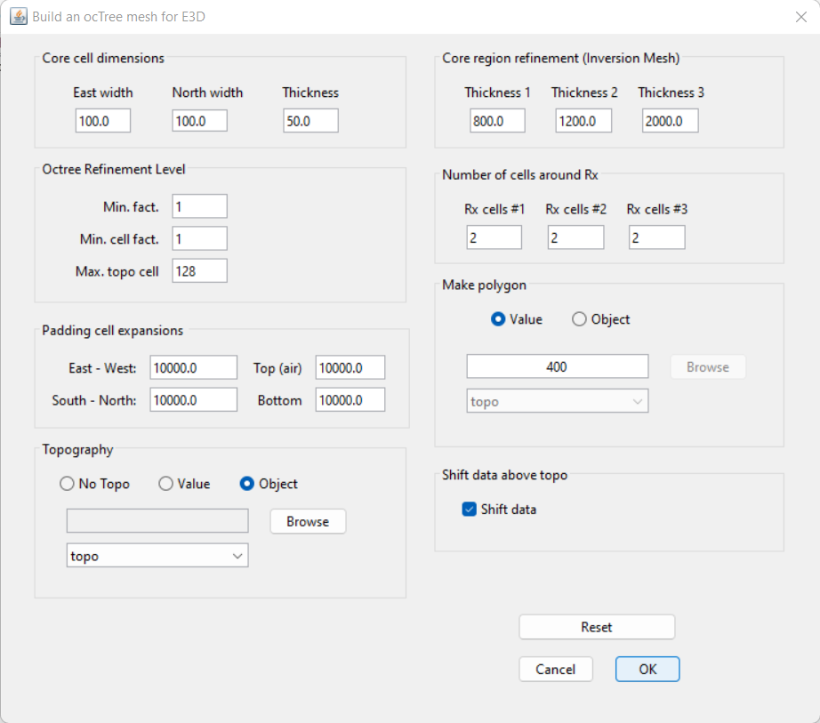

.. _comprehensive_workflow_mt_ztem_7:

Preparation for the Joint Inversion
===================================

Here, we present the steps for preparing the data objects, mesh and interface weights that are to be used in the joint inversion. In general, we must:

    - consider whether to jointly invert MT and ZTEM data over the entire region or on a more localized scale
    - designing a mesh whose discretization is appropriate for both the MT and ZTEM data being inverted
    - re-balance the uncertainties applied to the MT and ZTEM datasets

.. important:: Prior to performing joint inversion, you must obtain satisfactory inversion results for each dataset separately!

Extracting Local-Scale Data (Optional)
--------------------------------------

In the introduction of the :ref:`MT data preparation and uncertainties section <comprehensive_workflow_mt_ztem_3>`, we discussed the potential roles the MT data may have in a project. If the spatial coverage of the MT and ZTEM datasets are similar, you may choose to invert the data for the entire region. However if the MT data are clustered within a more localized area, we may extract a portion of the original ZTEM data and perform the joint invert on a finer scale.

**Our approach:**

The :ref:`results of the regional scale ZTEM inversion <comprehensive_workflow_mt_ztem_6_results>` indicated our mesh may have been too coarse to accurately model the data at higher frequencies and that we may have padded too quickly. Furthermore, the MT data are within a local cluster and it is likely they are being used to constrain more localized geological target(s). For the tutorial dataset, we:

    - Selectd a subset of the original ZTEM dataset and create a new data object. This was done by:

        - :ref:`Plotting the data with VTK <viewData>`
        - Clicking the 'Edit' tab and selecting the points we want changed. We chose a rectangle within Easting = (540000, 549000) and Northing = (3625000, 3632000).
        - Clicking the 'Simple edit' tab. Then push the *Data not highlighted* button, push the *Delete locations* button, provide a new object name and *Apply*

We then used the same :ref:`ZTEM data preparation <comprehensive_workflow_mt_ztem_4_preparation>` steps to:

    - Downsample the data to a minimum distance of 250 m. Call this *ztem_data_ds250m*
    - Define the base station
    - Define the ZTEM data type
    - Define the receivers

Mesh Design
-----------

When designing a mesh for joint inversion, we must consider the frequencies and data spacings for all datasets. Some things to keep in mind:

    - The minimum horizontal cell width will depend on the smallest station spacing amongst all datasets
    - The minimum vertical cell width will depend on the high frequency amongst all datasets
    - The padding distance will depend on the lowest frequency amongst all datasets
    - And even if the range of frequencies for each individual dataset is fairly small, **collectively** they shouldn't span more than 2-3 orders of magnitude

Here, we create an OcTree mesh using the E3DMT v2 utility. The steps are as follows:

    - :ref:`create OcTree mesh with E3DMT v2 utilities <createE3DMTv2octreeMesh>`

Once you have created the object, complete the following steps:

	1) Set the MT and ZTEM data objects being used to create the mesh. In our case *mt_data_5freq* and *ztem_data_ds250m*.
	2) Define the mesh using *Edit Options*
	3) Run the utility
	4) Load results
	5) Rename the MT and ZTEM data objects that are loaded from the outputs to something like *mt_joint_shifted* and *ztem_joint_shifted*. The utility has shifted all e-field receivers to the discrete surface and preserved the elevation of all h-field receivers.

For the field data provided, the following parameters we set in *Edit Options*.

|

**Discussion of Parameters:**

    - The highest and lowest frequencies were are found in the MT data (8 Hz and 756 Hz). We chose a minimum vertical cell width of 50 m (~30 % the skin depth), which is perhaps slightly too large to achieve optimum inversion results. 
    - The ZTEM data was downsampled to a spacing of 250 m. Practically all of the MT stations are at least 250 m away from one another. So for the purposes of this tutorial, the horizontal cell width was set to 100 m.
    - Preliminary inversion results supported out initial assumption that we are only sensitive to the first few thousand meters depth. As a result, we used the same thickness 1, 2 and 3 that were used in the MT inversion.
    - Unlike controlled source EM, natural source EM fields are very smooth and the discretization near the receivers can be less refined.

Interface Weights
-----------------

Interface weights were generated to enforce lateral smoothness within the top few layers. For the tutorial data, we did the following:

    - :ref:`Create and interface weights utility <createinterfWeights>`
    - Use :ref:`edit options <utilEditOptions>` and set the following parameters:

        - set the OcTree mesh
        - set as *log model*
        - set topography as the active cells model
        - set number of layers and corresponding weights (choose something exponentially decreasing. We chose 45, 15 and 5).
        - Face value = 0.01
        - Face tolerance = 0.01

    - :ref:`Run the utility <utilRun>`
    - :ref:`Load results <utilLoadResults>`

**Discussion of Parameters:**

    - Our choice in interface weights felt like a balance between those used in the MT and ZTEM inversions.

.. _comprehensive_workflow_mt_ztem_7_rebalancing:

Balancing Uncertainties
-----------------------

Joint inversion is more challenging, as the uncertainties assigned to each dataset must also be balanced so that one dataset is not overfit at the expense of any others. For each data object, we implement a simple approach for balancing the uncertainties. For reference, see the balancing uncertainties for joint inversion section of our :ref:`joint inversion and data weighting page <Fundamentals_Joint>`.

**Implementation:**

For each dataset, the uncertainties are balanced by:

    1) :ref:`examining the convergence curve <convergence_curve>` and obtaining the chi-factor for the model you chose from the independent inversion result, then
    2) using the :ref:`column calculator <objectCalculator>` to multiply all uncertainty columns in the dataset by the square root of this value to obtain new uncertainty columns. We suggest creating new columns and giving them names like *ZXYR_UNCERT_NEW* so that you can keep your original uncertainty columns.
    3) set the uncertainties using :ref:`set IO headers <objectSetioHeaders>` to the new uncertainty columns.

**For the tutorial data:**

From the :ref:`MT inversion results <comprehensive_workflow_mt_ztem_5_results>`, we chose the 7th iteration (chi-factor 0.26). As a result, all uncertainty columns were multiplied by :math:`\sqrt{0.26} \approx 0.51` and used to create a new set of uncertainty columns. From the :ref:`ZTEM inversion results <comprehensive_workflow_mt_ztem_6_results>`, we chose the 5th iteration (chi-factor 0.56). As a result, all uncertainty columns were multiplied by :math:`\sqrt{0.56} \approx 0.75` and used to create a new set of uncertainty columns.

