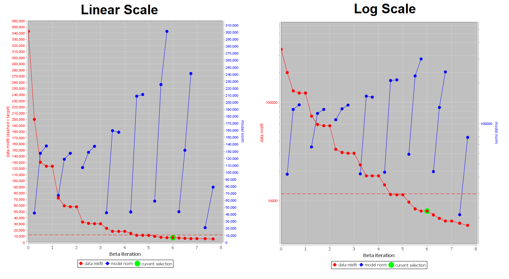

.. _comprehensive_workflow_mt_ztem_8:

Performing Joint Inversion
==========================

Here, we provide the steps for setting up and running a joint MT-ZTEM inversion with E3DMT v2. By now, we assume the process of setting up and choosing reasonable inversion parameters is well-understood; see the :ref:`Cloncurry MT comprehensive workflow <comprehensive_workflow_mt_6>` and :ref:`Dufferin lake ZTEM comprehensive workflow <comprehensive_workflow_mt_6>`.

Inversion With No Data Weighting
--------------------------------

At the end of the last section, we :ref:`balanced the uncertainties <comprehensive_workflow_mt_ztem_7_rebalancing>` by using the chi-factor for the recovered model for each independent inversion. Assuming this balance will carry over to the joint inversion and assuming we want to fit each dataset equally, there is no need to apply additional data weighting.

Setup and Run Inversion
^^^^^^^^^^^^^^^^^^^^^^^

The joint MT-ZTEM inversion was carried out using E3DMT v2. There steps were as follows: 

    - :ref:`Create E3DMT v2 inversion object <createMTZTEMInv>`
    - Use edit options for :ref:`v2 <invEditOptions_e3dmt_ver2>` to set the inversion parameters
    - Click *Apply and write files*
    - :ref:`Run the inversion <invRun>`

For the tutorial dataset provided, the parameters used to invert the data are shown below.

    Parameters used to invert the field dataset using E3DMT v2.

**Discussion of Parameters:**

    - Background, starting and reference models of 0.002 S/m were set. This corresponds to a rough average value of the apparent resistivity sounding curves over the frequencies we are inverting. It also seemed to work well for previous MT and ZTEM inversions.
    - The starting beta was chosen as a result of preliminary inversion attempts.
    - The inversion code will terminate when the total misfit (not data misfit) reaches the target chi-factor. We chose 0.9 given we expect the recovered model to occur closer to a chi-factor of 1. However, we would like to see some later iterations if the uncertainties for the joint inversion are too large.
    - We chose to invert for the smoothest model, which is the same approach taken for the independent MT and ZTEM inversions.
    - We chose 'No data weighting' for the time-being

.. important:: The chi-factors used to balance the MT and ZTEM uncertainties for joint inversion were obtained through independent inversions with a particular regularization. In our case, inverting for the smoothest model, including the reference model in the derivative, and updating the reference model at every beta iteration. If you change the regularization when performing the joint inversion, there is no guarantee you have balance between your datasets; as one dataset might be easier to fit than another with a particular regularization.

Convergence
^^^^^^^^^^^

Once the inversion has finished:

    - :ref:`View convergence <convergence_curve>`

The Tikhonov curve for our tutorial inversion is shown below. According to the figure:

    - the inversion reached target misfit at iteration 9.
    - the uncertainties were balanced such that independent inversion of all datasets would yield recovered models corresponding to chi-factors of 1. We expected something similar for the joint inversion but the Tikhonov curve doesn't start to flatten out until iteration 6 or 7.
    - ultimately, we chose to further examine iteration 6 (:math:`\chi=0.65`). 

Data Misfit
^^^^^^^^^^^

Now that we have selected an iteration (or range of iterations) that we feel explains the data without overfitting:

    - :ref:`Load inversion results for these iterations <invLoadResults>`

For the example inversion, here are some things we noticed about **iteration 6**:

    - just like in the independent inversion of the ZTEM data, the normalized misfits in the joint inversion also showed that we were underfitting the amplitudes of ZTEM anomalies. In addition, the largest data misfits were observed most prominently at the lowest (30 Hz) and highest (720 Hz) frequencies. 
    - locations/frequencies showing the highest data misfits in the independent MT inversion were not identical to those in the joint inversion. This indicates the MT and ZTEM data could be working together to constrain structures. 
    - compared to the normalized misfits for the ZTEM data, the normalized misfits for the MT data were a little higher. Not excessively higher, but noticeable. In this case, we may be over-fitting the background in the ZTEM data at the expense of fitting the MT data.
    - for the purposes of this tutorial, we assigned simple uncertainties to the ZTEM data. However, by not correcting the assigned ZTEM uncertainties after our first ZTEM inversion, the quality of our joint inversion may be decreased.

.. figure:: images/misfit_joint.png
    :align: center
    :width: 700

    Normalized misfits for MT and ZTEM data at a single frequency. All normalized misfit maps are plotted on a range from -2.5 to 2.5.

Recovered Model
^^^^^^^^^^^^^^^

The conductivity model recovered at the 6th iteration is shown below. The colormap was scaled to 1e-4 S/m to 0.1 S/m. According to the recovered model:

    - the overall characteristics of the recovered model is a blend between the independent MT and ZTEM recovered models.
    - the independent MT inversion recovered a number of significant localized conductors. We surmized that only some of these conductors were sufficiently constrained by the MT data to exist. The remaining structures were likely artifacts. The same artifacts were not recovered after jointly inverting the MT and ZTEM data. 
    - whereas the maximum conductivity values recovered from independent MT and ZTEM inversions would increase significantly with each successive decrease in the trade-off parameter (beta), the maximum conductivity value obtained from joint inversion was fairly robust. 

.. figure:: images/model_joint_iter6.png
    :align: center
    :width: 700

    Recovered model from ZTEM data at iteration 6.

Inversion With Data Weighting
-----------------------------

Data weighting weighting is generally considered when:

    - datasets are not fit evenly after joint inversion using balanced uncertainties (previous joint inversion)
    - you want to prioritize fitting one dataset more than another due to the quality of the information it provided
    - the number of data in each dataset differs drastically and you would like the data misfit between all datasets to be equal

For reference, see inversion with data weighting section of our :ref:`joint inversion and data weighting page <Fundamentals_Joint>`.

**For the tutorial data,** we felt that the MT data were being underfit in the previous joint inversion. To fit the MT data better, we apply a larger weighting to the MT data than to the ZTEM data. Although the ZTEM data object has almost 10 times the amount of data as the MT data object, we did not want to accomplish our task by applying weights based on the number of data. This was because the MT data coverage was sparse and we wanted to constrain our survey region more evenly.

Setup and Run Inversion
^^^^^^^^^^^^^^^^^^^^^^^

The joint MT-ZTEM inversion was carried out using E3DMT v2. There steps were as follows: 

    - :ref:`Create E3DMT v2 inversion object <createMTZTEMInv>`
    - Use edit options for :ref:`v2 <invEditOptions_e3dmt_ver2>` to set the inversion parameters
    - Click *Apply and write files*
    - :ref:`Run the inversion <invRun>`

For the tutorial dataset provided, the parameters used to invert the data are shown below.

    Parameters used to invert the field dataset using E3DMT v2.

**Discussion of Parameters:**

    - Background, starting and reference models of 0.002 S/m were set. This corresponds to a rough average value of the apparent resistivity sounding curves over the frequencies we are inverting. It also seemed to work well for previous MT and ZTEM inversions.
    - The starting beta was chosen as a result of preliminary inversion attempts.
    - The inversion code will terminate when the total misfit (not data misfit) reaches the target chi-factor. We chose 0.9 given we expect the recovered model to occur closer to a chi-factor of 1. However, we would like to see some later iterations if the uncertainties for the joint inversion are too large.
    - We chose to invert for the smoothest model, which is the same approach taken for the independent MT and ZTEM inversions.
    - To fit the MT data better without underfitting regions outside the MT data coverage, the weights applied to the data for this inversion were 4.0 (MT data) and 1.0 (ZTEM data).

Convergence
^^^^^^^^^^^

Once the inversion has finished:

    - :ref:`View convergence <convergence_curve>`

The Tikhonov curve for our tutorial inversion is shown below. According to the figure:

    - the inversion reached target misfit at iteration 7.
    - Once again, the Tikhonov curve doesn't start to flatten out until iteration 6 or 7 so our recovered model likely won't correspond to a chi-factor of 1.
    - ultimately, we chose to further examine iteration 6 (:math:`\chi=0.60`). 

Data Misfit
^^^^^^^^^^^

Now that we have selected an iteration (or range of iterations) that we feel explains the data without overfitting:

    - :ref:`Load inversion results for these iterations <invLoadResults>`

For the example inversion, here are some things we noticed about **iteration 6**:

    - by applying a weighting to the data misfits, we did a much better job of fitting the MT data.
    - the predicted ZTEM data also doesn't seem to overfit the background as the expense of the anomalies as much.
    - and the global balance in normalize data misfits for the MT and ZTEM data seems much better.

.. figure:: images/misfit_joint_dweighted.png
    :align: center
    :width: 700

    Normalized misfits for MT and ZTEM data at a single frequency. All normalized misfit maps are plotted on a range from -2.5 to 2.5.

Recovered Model
^^^^^^^^^^^^^^^

The conductivity model recovered at the 6th iteration is shown below. The colormap was scaled to 1e-4 S/m to 0.1 S/m. According to the recovered model:

    - Because we are more heavily fitting the MT data, we noticed the largest conductivity values in the recovered model were slightly larger than in the previous joint inversion.
    - However the existence, locations and dimensions of recovered structures were very consistent across both joint inversions.

.. figure:: images/model_joint_iter6_dweighted.png
    :align: center
    :width: 700

    Recovered model from ZTEM data at iteration 5.

Comparison of All Inversions
----------------------------

Below, we show our final recovered models within our area of interest from 1) independent MT inversion, 2) independent ZTEM inversion, 3) joint MT-ZTEM inversion without data weighting, and 4) joint MT-ZTEM inversion with data weighting. For this study, we see that ZTEM data were need to determine which targets inferred from the MT data were real. And MT data were needed to recover local-scale conductive structures.

.. figure:: images/model_comparison.png
    :align: center
    :width: 700

