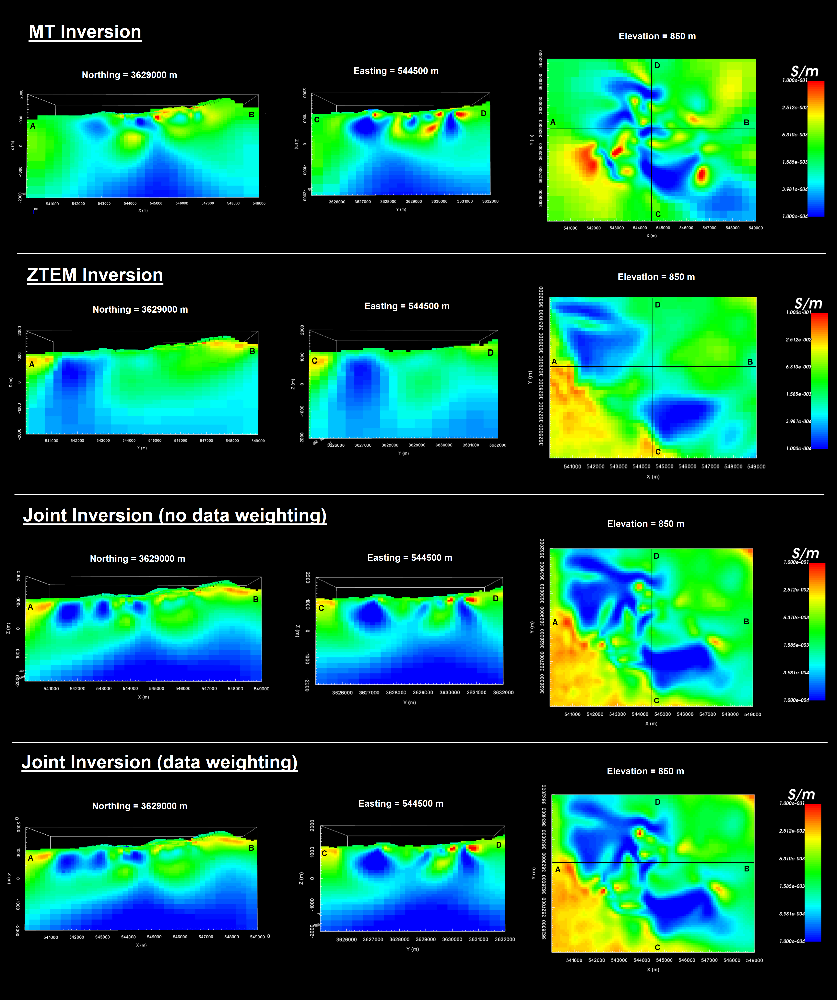

.. _comprehensive_workflow_mtztem_index:

Comprehensive Workflows: Joint MT/ZTEM
======================================

**Author: Devin C. Cowan**

**Published: October, 2022**

Here, we present a general workflow for loading, interpreting, and jointly inverting Magnetotelluric (MT) and Z-axis Tipper electromagnetic (ZTEM) data. Our goal is to recover a single 3D conductivity model which explains both datasets. **We assume the reader is already familiar with comprehensive workflows for processing and inverting MT and ZTEM data separately so that more attention can be paid to joint inversion** ; see :ref:`MT comprehensive workflow <comprehensive_workflow_mt_index>` and :ref:`ZTEM comprehensive workflow <comprehensive_workflow_ztem_index>` . However, links to the content in previous comprehensive workflows will be provided when necessary. You may work with the tutorial dataset provided or your own data:

    - `Download the tutorial data <https://owncloud.eoas.ubc.ca/s/ozWD7wDBDRTpZAE/download>`_

The data used for this tutorial were collected as part of the Copper Creek Project LLC near San Manuel, Arizona, USA. We greatly appreciate `Anglo American <http://www.angloamerican.ca/>`__ and `Faraday Copper <https://faradaycopper.com/>`__ for providing the MT and ZTEM data used to create this comprehensive workflow. For expediency, the original MT and ZTEM data files have been pre-processed and output to UBC-GIF format.

.. important:: Requires GIFtools v3.1 or later.

|

**Tutorial Sections**

.. toctree::
    :maxdepth: 1

    - Understanding MT and ZTEM anomalies <1_basic_anomalies>
    - Loading geophysical data and transforming to GIF convention <2_load_data>
    - MT data preparation and uncertainties <3_mt_data_preparation>
    - ZTEM data preparation and uncertainties <4_ztem_data_preparation>
    - MT inversion and results <5_mt_inversion>
    - ZTEM inversion and results <6_ztem_inversion>
    - Joint inversion preparation <7_joint_inversion_preparation>
    - Joint inversion and results <8_joint_inversion_results>

 