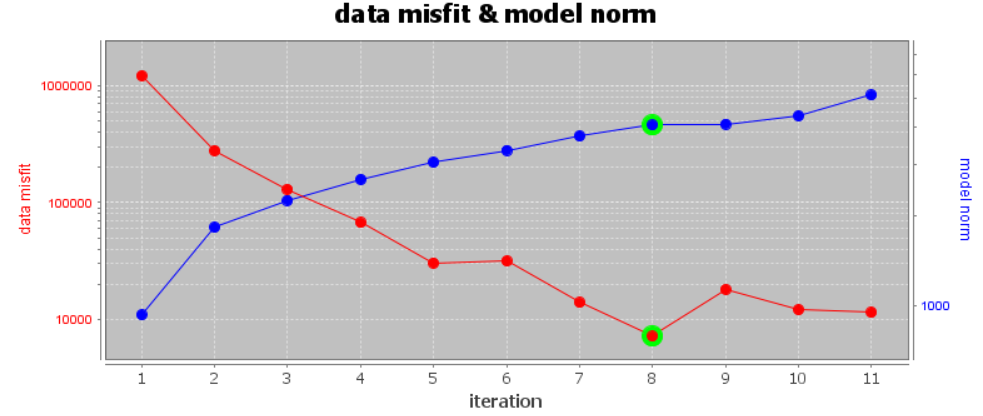
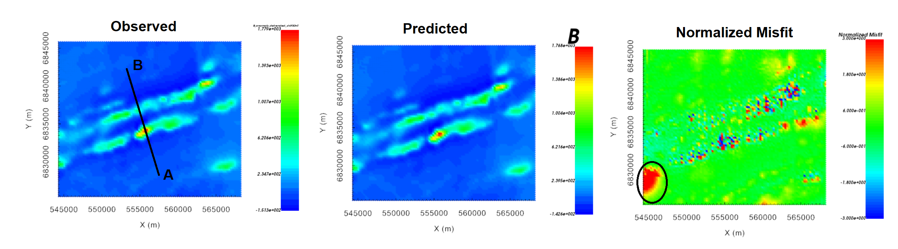
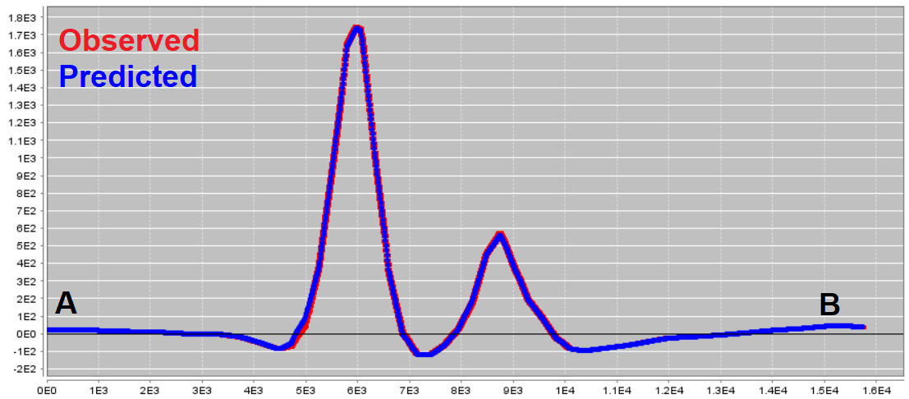
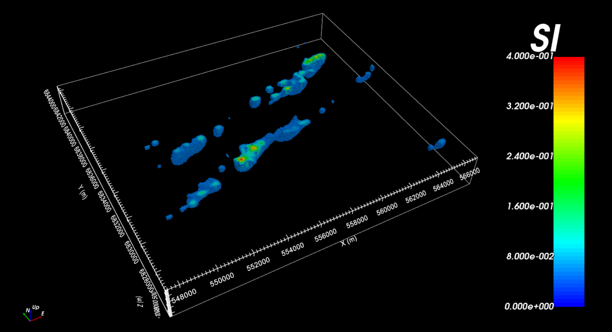
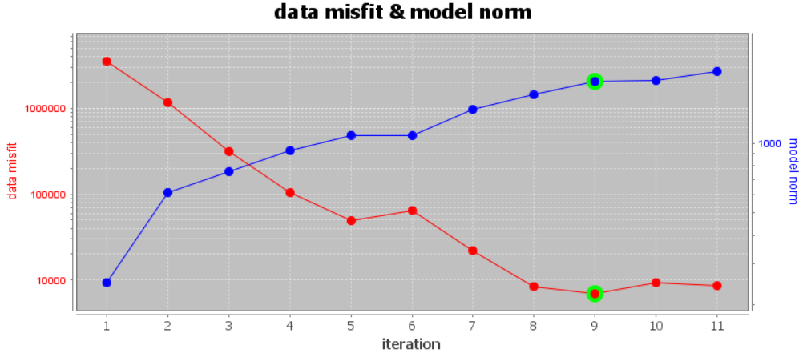
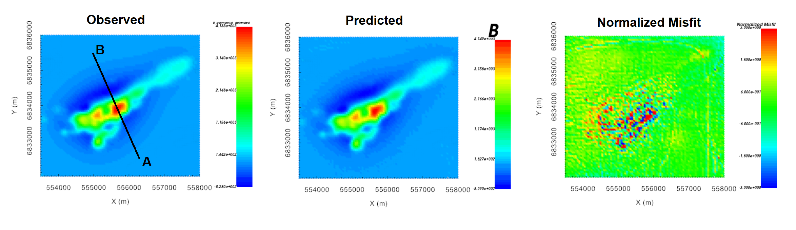
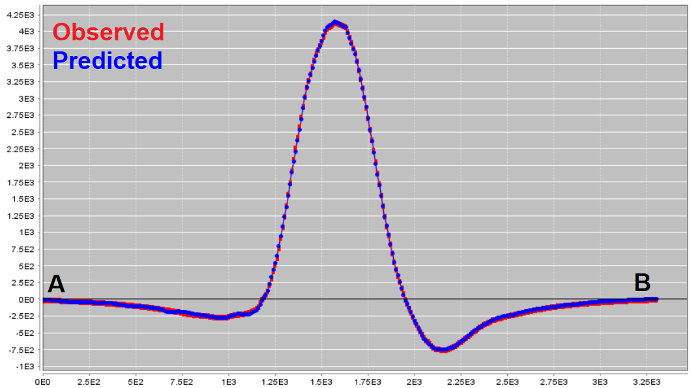
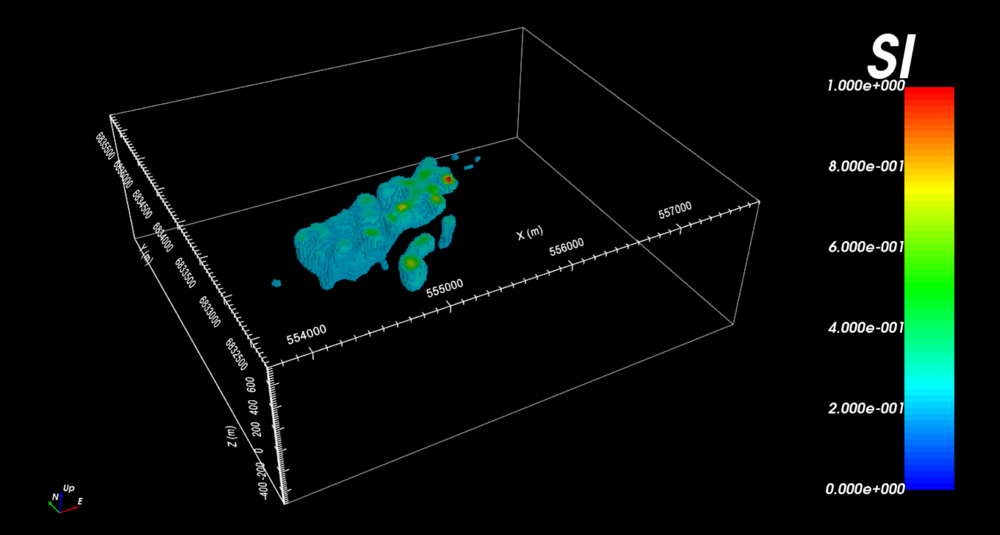
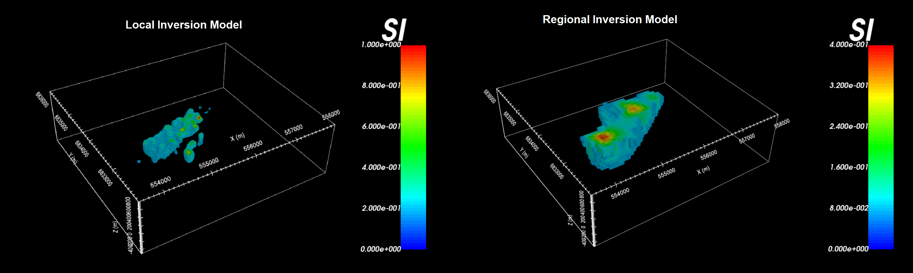

.. _comprehensive_workflow_magnetics_10:

.. include:: <isonum.txt>

Examining Inversion Outputs
===========================

Here, we demonstrate a common practice for examining the output of the inversion code. This includes examining the convergence, the data misfit and the recovered model. Before looking at recovered models, the user is strongly urged to examine the convergence of the algorithm first. By examining the convergence, we can:

    - see if the inversion is able to reach target misfit
    - infer whether the target misfit is reasonable; i.e. did we globally over or under-estimate the uncertainties on our data

We then assess how well a given recovered model explains the data by looking at the predicted data, observed data and normalized data misfit maps. From this we can determine whether:

    - the predicted data fits the amplitude, shape and character of observed TMI anomalies
    - the assigned uncertainties were reasonable
    - the inversion must be re-run with a new set of uncertainties

Only when the convergence and data misfit are acceptable can we infer geological structures from recovered models.

Regional Inversion
------------------

Here, we discuss the results of the regional-scale inversion. Recall that we inverted polynomial detrended regional data (*B_anomaly_detrended*).

Convergence
^^^^^^^^^^^

Once the inversion has completed (or during the inversion), we can examine the convergence with:

    - :ref:`View convergence <convergence_curve>`

The convergence curve for our example inversion is shown below. Note that we inverted 7,872 data points. Thus a chi factor of 1 corresponds to a data misfit of 7,872. According to the figure:

    - Although the inversion did not reach target misfit (chi-factor of 0.5), it did converge roughly to a chi-factor of 1 (after 8 iterations). Misfit maps will need to be examined before we can confirm the global level of uncertainty on the data was correct.
    - For larger trade-off parameters, it is possible for the next iteration to produce a recovered model that minimizes the total objective function but does not result in a decrease in data misfit. This is likely what happened between iteration 5 and 6.
    - The background TMI anomaly for the original TMI anomaly data column was clearly negative, and was removed using polynomial detrending and a DC shift of 30 nT. However if negative background signals are not propertly removed, the inversion may not be able to fit the observed data with a strictly positive and/or geologically reasonable susceptibility model. We will need to examine the misfit maps and recovered models to validate whether polynomial detrending and a 30 nT shift worked effectively.

Data Misfit
^^^^^^^^^^^

According the convergence curve, the recovered model at iteration 8 has a good change of explaining the data without fitting the noise. To be sure however, we must examine the observed data, predicted data and data misfit for the corresponding model. Here are some good questions to ask during this step:

    - Does the recovered model reproduce the observed TMI anomalies accurately?
    - Are there obvious coherent features in your misfit map? If so, this indicates you may be over-fitting certain regions at the expense of others and you must assign new uncertainties and re-run the inversion.

For the regional inversion, here are some things we noticed:

    - The recovered model appears to reproduce the observed anomalies very well. This was made possible, in part, by assigning smaller uncertainties to regions containing large TMI anomalies.
    - Larger normalized misfits are observed in proximity to larger observed anomalies (seen below). However, the data misfit map (observed minus predicted) will show the background is not drastically overfit relative to the observed anoalies.
    - There is a region in the Southwest where negative anomaly values were a little underfit (circle in the normalized misfit below). You may choose to reduce the uncertainties in this region and run the inversion again, or shift the observed data up if you feel the data cannot be fit with a positive susceptibility model as is. For this tutorial, we are not overly concerned about the region in the Southwest and we will assume the recovered model adequately reproduces the observed data.

Recovered Model
^^^^^^^^^^^^^^^

The recovered model at the 8th iteration is shown below. A cut-off of 0.05 SI has been applied and the padding cells have been remove to view only the structures constrained by the data. The recovered model contains a set of WSW to ENE trending features; similar to what was observed in the data.

Local Inversion (Polynomial Detrended)
--------------------------------------

Here, we discuss the results of the local data inversion; where polynomial detrending was used to remove regional features (*B_anomaly_detrended*).

Convergence
^^^^^^^^^^^

Once the inversion has completed (or during the inversion), we can examine the convergence with:

    - :ref:`View convergence <convergence_curve>`

The convergence curve for our example inversion is shown below. Note that we inverted 7,371 data points. Thus a chi factor of 1 corresponds to a data misfit of 7,371. According to the figure:

    - Although the inversion did not reach target misfit (chi-factor of 0.5), it did converge roughly to a chi-factor of 1 (after 8 or 9 iterations). Misfit maps will need to be examined before we can confirm the global level of uncertainty on the data was correct.
    - Similar to the regional inversion, the data misfit increased between iteration 5 and 6 before continuing to reduce.
    - The background TMI anomaly for the regional data was clearly negative and removed using polynomial detrending. However if negative background signal is not propertly removed, the inversion may not be able to fit the observed data with a strictly positive and/or geologically reasonable susceptibility model. We will need to examine the misfit maps and recovered models to validate whether polynomial detrending worked effectively.

Data Misfit
^^^^^^^^^^^

According the convergence curve, the recovered model at iteration 9 has a good change of explaining the data without fitting the noise. For the local inversion, here are some things we noticed:

    - The recovered model appears to reproduce the observed TMI anomalies very well. This was made possible, in part, by assigning smaller uncertainties to regions containing TMI anomalies.
    - Larger normalized misfits are observed in proximity to larger observed anomalies (seen below). However, the data misfit map (observed minus predicted) will show the background is not drastically overfit relative to the observed anoalies.

Recovered Model
^^^^^^^^^^^^^^^

The recovered model at the 9th iteration is shown below. A cut-off of 0.2 SI has been applied and the padding cells have been remove to view only the structures constrained by the data.

.. _comprehensive_workflow_magnetics_10_compare_L2:

Comparing Local and Regional Inversion
--------------------------------------

Here, we examine regional and local inversion results within the local survey area. The general shape and orientation of the recovered structure using each dataset is similar. However, the structure recovered from regional data is larger, smoother and significantly lower in amplitude. This is because the regional data are defined at an elevation of 305 m and at a spacing of 200 m; whereas local data were defined at an elevation of 100 m and at a spacing of 50 m. The regional scale data do not contain some of the higher spatial frequencies contained in the local survey data. And as a result, the regional data cannot be used to characterize the recovered structure to the same degree.

