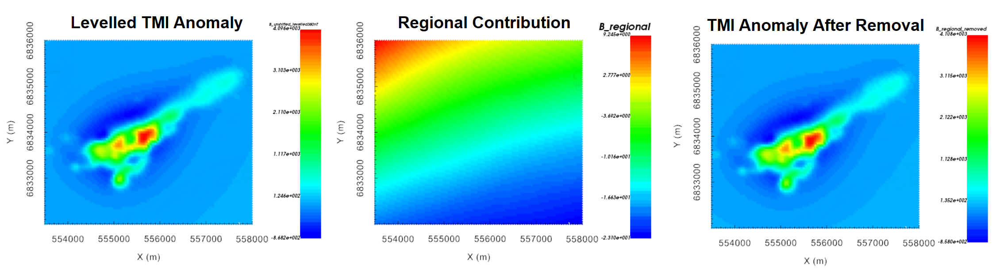

.. _comprehensive_workflow_magnetics_11:

.. include:: <isonum.txt>

Scooped Regional Removal and Local Inversion (Optional)
=======================================================

.. note:: If you have not acquired and inverted regional data, this technique will not be be possible.

Here, our goal is to use a regional susceptibility model recovered from regional TMI anomaly data to constrain our local scale magnetic inversion.
In :ref:`detrending and levelling tutorial data <comprehensive_workflow_magnetics_5_levelled>`, we defined a data column in the local upward continued data object that was levelled with the regional data; which we called *B_anomaly_levelled*. And in :ref:`mesh design <comprehensive_workflow_magnetics_8>` we defined the meshes on which our local and regional models would live.  Using the 'scooping' technique, we remove the contribution from all material within the regional model that lies outside the bounds of the local mesh. If done correctly, all magnetized material that is unaccounted for should lie within the local mesh.

Scooped Regional Removal
------------------------

The first step is to create a 'scooped' regional model. To do this:

    - :ref:`Make a copy of your recovered regional model <editcopy>`
    - Determine the Easting, Northing and Elevations defining the boundaries of your local mesh
    - With :ref:`add rectangular block <objectFunctionalityAddPolyhedra>`, add a 0 SI block to the copy of the regional model using the margins of the local mesh

**For the tutorial,** we illustrate the active cells for the regional model and the active cells for the resulting 'scooped' regional model below.

    Active cells for the regional model (left). Active cells for the scooped regional model (right). 

Next, we forward model the contribution from the scooped regional model at local survey locations. **For the local tutorial data,** we are forward modeling at a set of upward continued data locations for an elevation of 100 m. To do this we:

    - :ref:`Downsample the data <objectDataDownsample>` if necessary. Like in our original local tutorial inversion, we must downsample the data to a minimum spacing of 50 m.
    - :ref:`Create forward modeling object <createMag3D>`
    - Use :ref:`edit options <fwdEditOptions_Mag3D>` to define the following properties:

        - Use the regional mesh and scooped regional model
        - Use the local magnetic data object to define the survey locations
        - The lower bound is left blank!!!

    - Write the files
    - Run the forward model
    - Load the results when complete. Let's refer to the predicted data column as *B_scooped*

Finally, we remove the scooped regional contribution from the local data. To do this:

    - Use :ref:`import data from another MAGdata object <objectCombineData>` to import the scooped data column to the other data object. The size and locations defined in both data object must match!!!
    - Use :ref:`column calculator <objectCalculator>` to subtract scooped data column (*B_scooped*) from levelled TMI anomaly data (*B_anomaly_levelled*). We refer to this column as *B_regional_detrended*.

Reference Model for Local Inversion
-----------------------------------

To constrain the local inversion with the regional model, we create a reference model by interpolating the regional model to the local mesh. By first creating active cells models, we ensure that we do not interpolate air/inactive cells to the local mesh. This is done by:

    - :ref:`create active cells from topo <createActiveCellsModel>` for the regional mesh using regional topography
    - :ref:`create active cells from topo <createActiveCellsModel>` for the local mesh using local topography
    - Interpolating regional model to local mesh:

        - :ref:`Create interpolate tensor mesh to tensor mesh utility <interpolateMesh3DToMesh3D>`
        - Edit options. We chose 'linear' model and 'smooth' interpolation
        - Run
        - Load the output model. This is your local reference model.

**For the tutorial,** the regional model interpolated to the local mesh is shown below.

Running Local Inversion
-----------------------

Prior to setting up and running the local inversion, set the observed data to the correct column using :ref:`set IO headers <objectSetioHeaders>` (*B_regional_detrended*). The steps for setting up and running an inversion are the same as before, except different parameters are used. The input parameters for the local inversion after regional removal are as follows:

The steps for setting up and running the magnetic inversion are as follows:

    - :ref:`Create a MAG3D v6.0 inversion object <createMagInv>`
    - Use :ref:`edit options <invEditOptions_Mag3D>` to set the inversion parameters
    - Click *Apply and write files*
    - Run weights
    - Run sensitivities
    - Run inversion
    - :ref:`Load results for desired iterations <invLoadResults>`

**Starting and reference model:**

Here, the reference model interpolated from our regional model is set as both the starting and reference models in the inversion. This is common practice for a non-zero reference model. And by setting reference model as the starting model, we can examine the data misfit that corresponding to the reference model; i.e. at iteration 0.

**Alpha parameters:**

We want to constrain the local inversion with the reference model. As a result, the value for :math:`\alpha_s` must be significant; i.e. not the smoothest model. For a minimum cell size of 20 m, :math:`\alpha_s = 1/20^2 = 0.0025` would place equal emphasis on the smallness and smoothness terms. As discussed in :ref:`comparing local and regional inversion results <comprehensive_workflow_magnetics_10_compare_L2>`, the regional data do not contain some of the higher spatial frequencies contained in the local survey data. And as a result, the regional inversion produces broader, smoother and lower amplitude structures. Since our confidence in the structures obtained from the regional inversion is not overly high, we chose to set :math:`\alpha_s = 0.0001`; thus constraining the inversion with the reference model, but only moderately.

**Role of reference model:**

When defining the role of the reference model in constraining the recovered model, we have two choices:

    - *SMOOTH_MOD*: the reference model is in the smallness term only. This options preserves the structures in the reference model but does not preserve sharp boundaries.
    - *SMOOTH_MOD_DIF*: the reference model is in the smallness and smoothness terms. This option preserves structures in the reference model including their boundaries. 

Because we do not have as much confidence in the boundaries inferred from the regional inversion, we chose the *SMOOTH_MOD* option. In combination with our choice in alpha parameters, we are moderately constraining the inversion with the reference model without assuming anything about the boundaries of recovered structures.

Comparing Polynomial Detrended and Regional Removed Models
----------------------------------------------------------

The inversion reaches a chi-factor of 1 after 8 iterations. Below, we show the local recovered model when polynomial detrending is used and when regional scooping is used to account for the regional signal. For the tutorial data, the recovered models are effectively the same. It is likely that polynomial detrending was sufficient in removing the regional signal, and any localized magnetized bodies lying outside the local survey region have minimal impact on the target anomaly.

