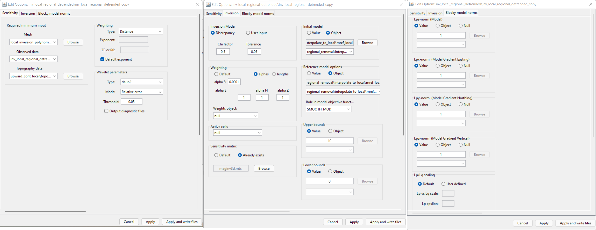
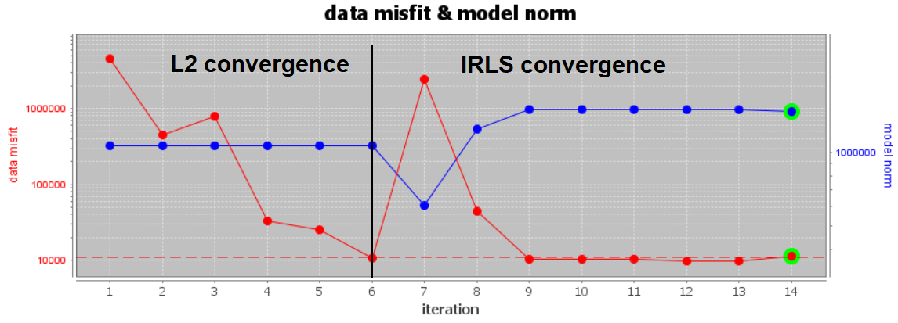
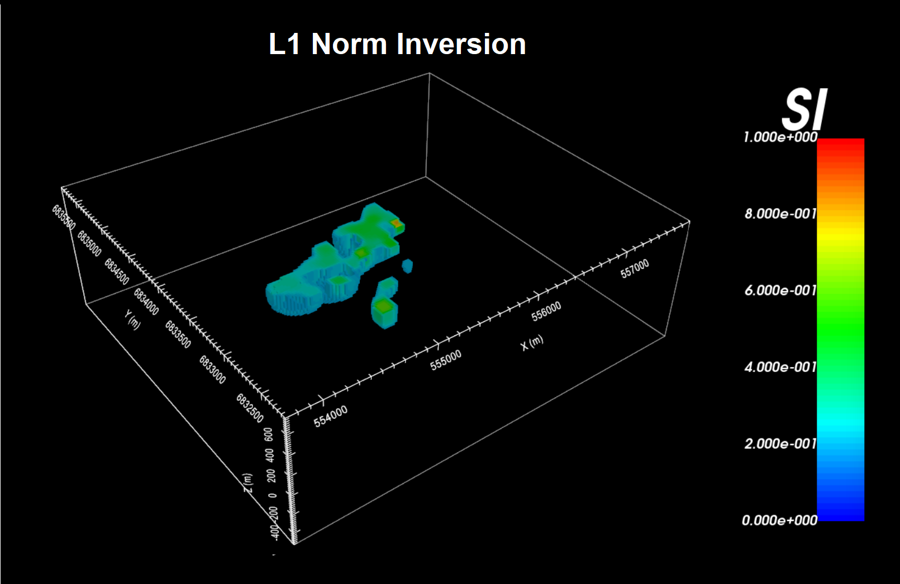
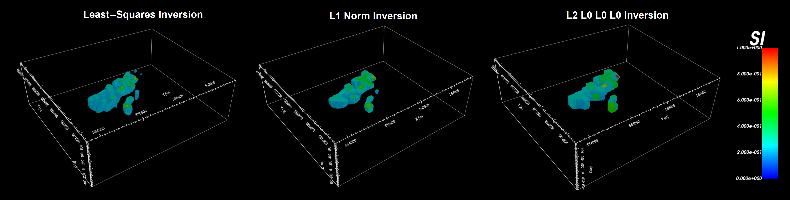

.. _comprehensive_workflow_magnetics_12:

.. include:: <isonum.txt>

Sparse-Norm Inversion
=====================

For magnetic inversion using UBC-GIF codes, sparse norm inversion can be used to recover compact and/or blocky structures. The ability to recovered structures with sharper boundaries marks a major improvement over classic least-squares inversion; which recoveres smooth structures with smeared boundaries. The :ref:`fundamentals of inversion section <Fundamentals_Norms>` provides useful background information.

Here, we demonstrate how to setup and run sparse-norm inversions using the GIFtools framework. We also provide several inversion examples for our local tutorial data. We will invert the same data as in :ref:`the previous section <comprehensive_workflow_magnetics_11>`; i.e. the *B_regional_detrended* data column.

L1-Norm Inversion
-----------------

Here, we use the L1 norm to define the smallness and smoothness terms in the model objective function. The inversion parameters used for the local tutorial inversion are shown below. In the 'Sensitivity' and 'Inversion' panels, the inversion parameters have not been changed. The 'Blocky model norms' panel is used to set the parameters for sparse-norm inversion.

Below, we see the convergence when sparse norms are used. The first part of the convergence curve shows the code performing a standard least-squares inversion until target misfit is reached. During the second portion of the curve, we introduce the sparse-norms and the code applies an iteratively-reweighted least-squares (IRLS) algorithm until final convergence is reached. Note that for the first few IRLS iterations, you will observe an increase in data misfit.

The final recovered model using the L1-norm is shown below.

Models for Different Norms
--------------------------

As a third example, we invert using an L2-norm on the smallness term and L0-norms on the smoothness terms. This represents a case where recovered susceptibilities should all be similar to the reference model. However, we can have very sharp boundaries. A comparison between the L2-inversion, L1-inversion, and this L2-L0-L0-L0 inversion are shown below.

