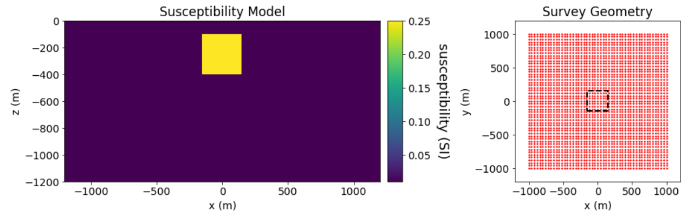
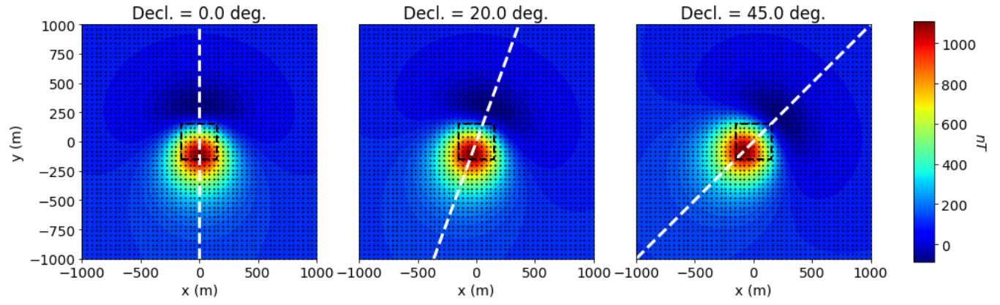
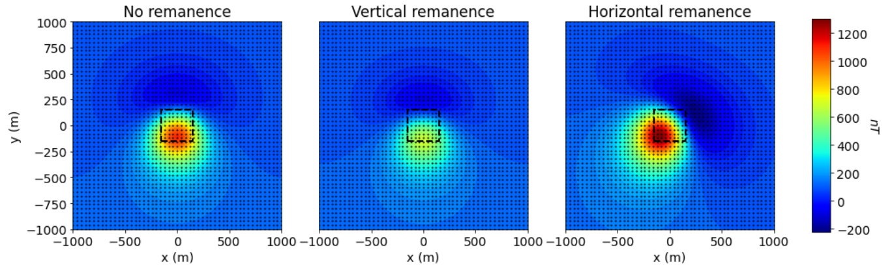
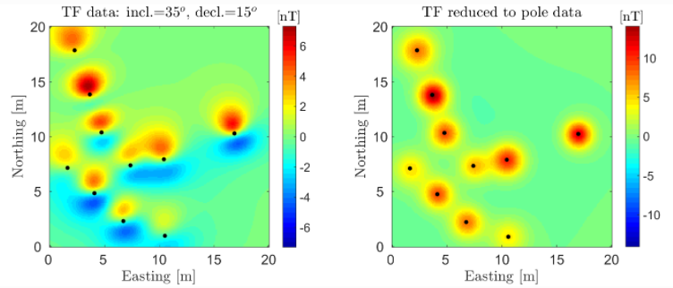
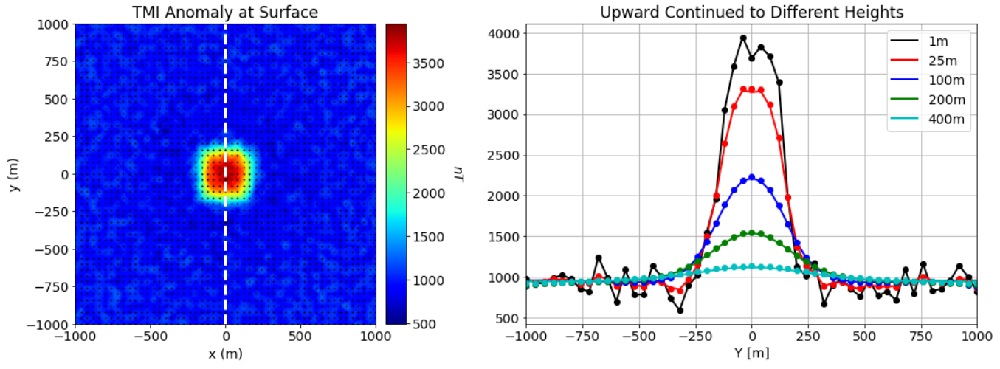
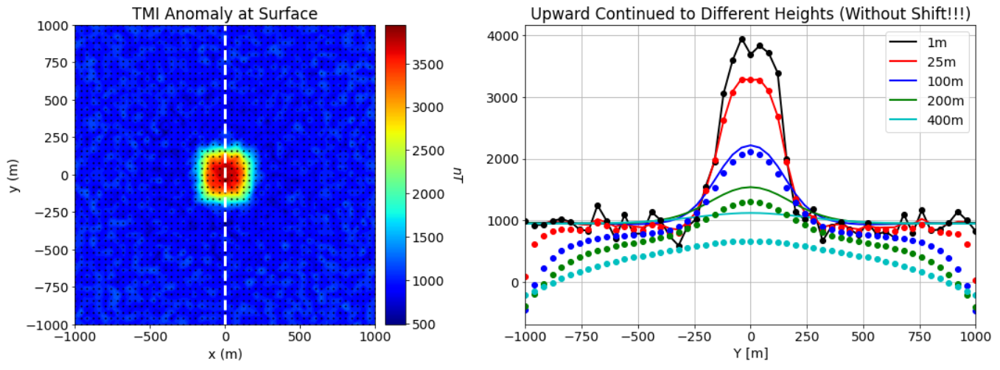

.. _comprehensive_workflow_magnetics_1:

Understanding TMI Anomalies
===========================

TMI stands for total magnetic intensity. In order to properly interpret and invert TMI data, it is important to first understand what is being measured by the sensor and the characteristic anomalies produced by basic magnetized structures. Here, we define TMI data and describe the magnetic anomalies produced by a compact magnetized block within a homogeneously magnetized host.

Defining TMI Anomaly Data
-------------------------

Let :math:`\mathbf{B}` represent the total magnetic field at some point in space. We can decompose this quantity into two parts:

.. math::
    \mathbf{B} = \mathbf{B_0} + \mathbf{B_a}

where :math:`\mathbf{B_0}` represents the background field and :math:`\mathbf{B_a}` represents the anomalous field.
The background field is generally defined according to the `international geomagnetic reference field <//en.wikipedia.org/wiki/International_Geomagnetic_Reference_Field>`__ or a set of time-dependent base station measurements. The anomalous field represents the fields produced by local magnetized structures of interest.

During a TMI survey, a sensor is used to measure the amplitude of the total magnetic field at each survey location. I.e.:

.. math::
    | \mathbf{B} | =  |\mathbf{B_0} + \mathbf{B_a} |

We do not know the exact direction of the anomalous contribution :math:`\mathbf{B_a}`. However, we assume that anomalous fields are much smaller than and mostly aligned with the Earth's field; i.e. we assume components of the anomalous field perpendicular to the Earth's field are negligible. Under these assumptions,  the TMI anomaly data can be obtained by subtracting the amplitude of the background field from the total field measurements as follows:

.. math::
    d_{tmi} = \mathbf{B_a} \cdot \mathbf{\hat{B}_0} \approx  |\mathbf{B}| - |\mathbf{B_0} |

**Therefore TMI anomaly data represent the projection of the anomalous field along the direction of the Earth's magnetic field.**

TMI Anomalies over a Susceptible Block
--------------------------------------

Here, we discuss the impact of the orientation of the Earth's inducing field as well as
remanent magnetization on TMI anomalies. For this example, a block (0.25 SI) is located within
a homogeneous background (0.01 SI). The horizontal and vertical dimensions of the block are all
300 m, and the top of the block is at a depth of 100 m. The receivers are at a constant height
of 100 m and a horizontal spacing of 40 m is used.

    Susceptibility model in units SI (left). Observation locations and horizontal extent of target (right).

Anomalies for Different Inclination Angles
^^^^^^^^^^^^^^^^^^^^^^^^^^^^^^^^^^^^^^^^^^

The GIF below demonstrates that different inclination angles for the Earth's inducing field produce different
TMI anomalies. For this example, the declination was fixed at 0 degrees and the intensity was fixed at 55,000 nT.
On the leftmore figure, we see the shape of the TMI for the current inducing field orientation. And on the rightmost figure,
we see the TMI anomaly from South to North; the bold black line indicates the anomaly for the current inducing field orientation,
the dashes gray lines denote the anomalies for all other orientations.

From the GIF, we see that:

    - the peak anomaly amplitude isn't necessarily located directly over the target. This is only true for near-vertical inducing fields (high latitudes)
    - despite removing the IGRF (background field), the anomaly does not go to 0 away from the target. This is because the host rock contributes to the anomaly; i.e. we have not removed regional effects.
    - the peak amplitude is larger for more vertical inducing fields.
    - the peak amplitude is negative for near-horizontal inducing fields (low latitudes)

.. figure:: images/anomalies_inclination.gif
    :align: center
    :width: 700

Anomalies for Different Declination Angles
^^^^^^^^^^^^^^^^^^^^^^^^^^^^^^^^^^^^^^^^^^

As shown below, different declination angles for the Earth's inducing field produce different
TMI anomalies. The inclination was fixed at 60 degrees and the intensity was fixed at 55,000 nT.
From the figures below we see that in the case of purely induced magnetization, the TMI anomaly
will align with the declination angle of the Earth's inducing field.

.. _comprehensive_workflow_magnetics_1_remanence:

Anomalies Including Remanent Magnetization
^^^^^^^^^^^^^^^^^^^^^^^^^^^^^^^^^^^^^^^^^^

Here, we discuss the impact of remanent magnetization on the shape and amplitude of TMI anomalies.
For all the figures below, the Earth's field had an inclination of 60 degrees, a declination of 0 degrees
and a field intensity of 55,000 nT.

    - The leftmost figure illustrates the TMI anomaly for purely induced magnetization (no remanence).
    - In the middle figure, vertical remanent magnetization has been added to the block such that its magnitude is equal that of the induced magnetization.
    - In right-most figure, remanent magnetization in the x-direction has been added to the block such that its magnitude is equal that of the induced magnetization.

These figures show that significant remanent magnetization can impact the magnitude and location of the peak anomaly as well the shape of the anomaly itself.
When examining TMI anomaly data to infer the presence of remanent magnetization, there are some basic questions one can ask:

    - Does the TMI anomaly produced by this structure line up with the declination angle of the Earth's field?
    - Plot the TMI profile over the target along the direction of the Earth's declination angle. Does this plot have the general shape you would expect if the magnetization were purely induced?

Please note that in practice, it can be very difficult to infer the presence of remanent magnetization directly by examining observed TMI data; especially in complex geological environments. Remanent magnetization is commonly identified by performing a :ref:`reduction to pole <comprehensive_workflow_magnetics_1_rtp>` or by examining the output of an inversion that assumes purely induced magnetization.

Equivalent Source Methods
-------------------------

In the absence of strong demagnetizing fields, the anomalous magnetic field is defined
as the solution to a Green's function. From Blakely (1995):

.. math::
    \mathbf{B_a}(\mathbf{r}) = \frac{\mu_0}{4 \pi} \int_V \nabla \nabla \frac{1}{| \mathbf{r} - \mathbf{r_s} |} \cdot \mathbf{M}(\mathbf{r_s}) \, dv

Equivalent source methods are a result of Green's third identity, which states: the potential field at any point within region can be obtained from fields defined on a surface enclosing that region. No knowledge of the source is required. To obtain the field at a particular location, we simply need a sufficient
number of field measurements on a surface enclosing that location.

In practice, we assume that our field collected data provides a sufficient characterization of the fields on our theoretical enclosing surface.
We then use geophysical inversion to recover a susceptibility model that fits our observed data exactly; i.e. an 'equivalent source' model.
With the equivalent source model, we can predict the data at different locations and for different inducing field orientations.

.. _comprehensive_workflow_magnetics_1_rtp:

Reduction to Pole
^^^^^^^^^^^^^^^^^

Reduction to pole is a method for using magnetic data collected at lower latitudes to compute the data if were collected in the presence of a vertical inducing field. At high latitudes, the Earth's inducing field is nearly vertical and TMI anomalies are much easier to interpret. The locations of the targets are clear and dipolar anomalies can be used to infer the presence of magnetic remanence.

Reduction to pole is carried out by first inverting to recover an equivalent source model.
Next, the data are forward modeled using the equivalent source model for an inducing field with an inclication of 90 degress.
For TMI magnetic data collected over a set of UXOs at low latitude, the results of a reduction to pole are shown below.

.. _comprehensive_workflow_magnetics_1_upcont:

Upward Continuation
^^^^^^^^^^^^^^^^^^^

Field collected data (especially at the surface) may have short wavelength (high spatial frequency) signals or noise that are not produced by targets of interest; making interpretation difficult. Furthermore, finer mesh cells are required for geophysical inversion to accurately characterize
these higher frequency signals. Upward continuation is a method for removing erroneous short wavelength signals from the data by computing the
data as if it were collected at a higher elevation.

Equivalent source models can be used to upward continue field collected data. The steps are as follows:

    1) Estimate the background signal; i.e. the very long wavelength signals attributed to regional or larger scale structures that cannot be fully captured in the observed data. The background signal is generally estimated by a constant value or by fitting the background TMI data with a low order polynomial.
    2) Subtract the background signal from the observed data.
    3) Invert the background removed data to obtain an equivalent source model
    4) Use the equivalent source model to predict the data at a higher elevation (using the same inducing field)
    5) (Optional) Add the background signal back to the data. This is only required independently collected datasets (e.g. local and regional) must be levelled.

For data collect at a height of 1 m, we demonstrate upward continuation for a block within a halfspace that also contains an unknown broad regional structure. The data map indicates this regional feature produces a roughly 1000 nT anomaly within our survey area. 1000 nT is subtracted from the data before upward continuing, then re-added as a final step. For a profile along the Northing direction, we plot the true TMI data (lines) that would be measured at different heights as well as data that were upward continued (dots).

**Why the removal of the background signal is crucial:**

    - The equivalent source model tends to place larger amplitude structures in the padding cells if the background signal is not first removed from the data. The effect of these structures increases the more the data are upward continued.
    - The signal produced by a large deep regional structure and a thin horizontal layer do not decay identically as a function of elevation. If one does not remove the background signal prior to upward continuing, the amplitude of the upward continued regional signal will be underestimated (see below.) 

