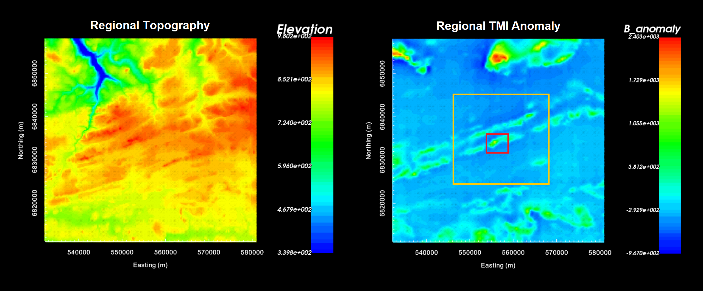
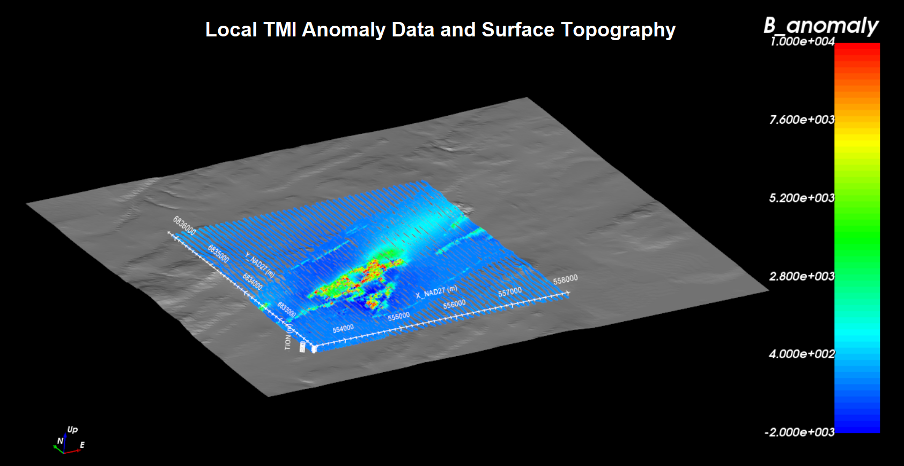

.. _comprehensive_workflow_magnetics_2:

.. include:: <isonum.txt>

Loading TMI Data and Cursory Interpretation
===========================================

The first step in any project is to load field collected data and visualize it. Here, we load TMI data, assign and remove the background magnetic field, and visualize the TMI anomaly data.

**The regional tutorial data** acquired from the Natural Resources Canada database have been significantly processed to create a composite dataset. These are TMI anomaly data with a uniform spacing of 200 m in the Easting and Northing direction, and a constant flight height of 305 m. The TMI anomaly data are also defined for a uniform inducing field for a given date. Regional data are not required to complete this exercise. However, they can be used to better understand regional-scale magnetic anomalies and constrain local inversion results.

**The local tutorial data** were collected on the Earth's surface on the back of a Skidoo. The original TMI data were collected along many North-South lines with an average line spacing was 50 m; although this spacing is not uniform throughout the local survey area. To view the TMI anomaly, we will need to remove the Earth's inducing field from the original TMI data.

.. important:: Requires GIFtools v3.0 or later.

Starting Your Project
---------------------

    - Open GIFtools
    - :ref:`Set the working directory <projSetWorkDir>`

Import Files
------------

.. important:: If you are working with your own dataset and you do cannot acquire regional scale data, you can still complete this tutorial; although you will not be able to implement certain techniques.

Here, we import the TMI and topography datasets. **Local and regional tutorial data are in a general XYZ format but the same functionality is available for CSV or UBC-GIF formatted data**. To import the TMI data and topography:

    - :ref:`Import local and regional topography data (XYZ format) <importTopo>`. These files are called *topo_local.xyz* and *topo_regional.xyz*.
    - :ref:`Import local and regional TMI magnetic data (XYZ format) <importMagData>`. These files are called *mag_local.xyz* and *mag_regional.xyz*.

Defining Earth's Inducing Field
-------------------------------

.. note:: If the data file is UBC-GIF format, the file contains the properties for defining the Earth's field. And these properties are automatically assigned upon loading the data file.

In this step, we define the inclination, declination and intensity of the Earth's magnetic field for any magnetic data object. There are several ways to obtain this information:

    - From the field report or commented lines in a data file
    - From data columns in the survey file defining the inclination, declination and field intensity for each survey point.
    - From the historical `international geomagnetic reference field <//en.wikipedia.org/wiki/International_Geomagnetic_Reference_Field>`__ .

For UBC-GIF codes, we generally assume the Earth's inducing field does not vary significantly within the survey region. That is, the induced magnetization computed in every cell are all parallel to one another. To assign the inclination, declination and intensity:

    - If inclination, declination and intensity columns are provided, use :ref:`view statistics <viewData_statistics>` and determine their average values.
    - :ref:`Assign the field parameters <objectEditFieldParam>`

**The regional tutorial data** provided by NRCan were processed such that they corresponded to a survey carried out June 5th, 2020. The dataset also assumes a constant flight height of 305 m (elevation ~900 m based on local topography of ~600 m). Using historical IGRF data from the `National Centers for Environmental Information <https://www.ngdc.noaa.gov/geomag/calculators/magcalc.shtml#igrfwmm>`__ , we obtained the following properties for the Earth's field at the regional scale:

    - *intensity* = 57363 nT
    - *inclination* = 80.24 deg
    - *declination* = -22.35 deg

**For the local tutorial data**, we were provided with inclination, declination and field intensity columns. Using *view statistics* and taking the mean values, we obtained:

    - *intensity* = 58266 nT
    - *inclination* = 81.26 deg
    - *declination* = -28.44 deg

.. note:: During the time between the collection of the local and regional datasets, the Earth's field may have change significantly. The impact this has on necessary processing steps is discussed later in the tutorial. 

Removing the Background Field
-----------------------------

The background field may be defined using base station measurements (which contain regional signals) or as the Earth's inducing field (which does not). We must remove the background field from the total field measurements in order to obtain the TMI anomaly data. There are two ways in which this can be done using GIFtools:

    - If the background field (base station or IGRF) is provided in a column, the :ref:`column calculator <objectCalculator>` can be used to subtract the background field from the total field.
    - Or use :ref:`remove IGRF <objectRemoveIGRF>` to subtract the inducing field defined in the previous step of the tutorial.

**For the regional tutorial data**, this step was not necessary since the data are already TMI anomaly. However you may choose to rename the data column *B_anomaly* to be consistent.

**For the local tutorial data**, we subtracted the Earth's field from the total field using the column calculator. You maybe choose to call the new data column *B_anomaly*. Note that regional and local information are contained within the resulting data column because only the Earth's field was removed. 

Cursory Interpretation
----------------------

- To view the data, you may select any data object and :ref:`plot with VTK <viewData>`

**Regional tutorial data:**

The topography, TMI anomaly data and spatial coverage of the regional-scale data are plotted below. The background values for the regional data are clearly negative, indicating we are in the 'low' produced by an extremely large-scale feature. Using a red outline, we have marked the data coverage of the local survey area. The local TMI anomaly data are part of a set of WSW to ENE trending features.

Regional data are used to characterize regional features that impact the TMI anomaly data observed within a local survey site. To allow for better characterization of relevant regional anomalies, we have chosen to crop the regional dataset (outlined in yellow). In order words, we are removing regional TMI anomalies we feel do not impact the TMI anomalies observed within the local survey area.

To crop the regionall data:

    - :ref:`Plot with VTK data viewer<viewData>`
    - Click the 'Edit' tab, click a selection method and select the set of data you wish to keep
    - Click the 'Simple Edit' tab. Select 'Data not highlighted' and 'Delete locations'. The provide a name for the new data object that is created when you click 'Apply'.

    

    Regional topography (left) and TMI anomaly (right). Red outline denotes the local survey region. Yellow outline denotes cropping of regional data.

**Local tutorial data:**

The local topography and TMI anomaly data are shown below. The topography ranges from an elevation of 540 m to 670 m. The local tutorial data were collected at the surface. Some extremely high amplitude signals were measured and the range of the color scale needed to be fixed between -2000 nT and 10000 nT to outline the anomaly. The main TMI anomaly appears to be trending from WSW to ENE; consistent with regional features.

    

.. _comprehensive_workflow_magnetics_2_downsampling:

Downsampling the Data
---------------------

The along-line sampling rate for both surface and airborne surveys is generally higher than is necessary to accurately characterize target anomalies. Furthermore, 3D potential field inversions cannot fit the data if multiple data points lie above a single cell; implying you may consider some aspects of mesh design during this step. Here, we downsample the local magnetic data based on a desired minimum spacing.

    - :ref:`Downsample by distance <objectDataDownsample>`

**For the local tutorial data**, we downsampled to a minimum spacing of 25 m. This is roughly equal to half the average line spacing for the local magnetic survey. This reduced the total number of data points from 101,679 to 11,192. Downsampling to 25 m was able to greatly reduce the number of data without filtering out coherent higher frequency signals we are attributing to magnetized structures.

**The regional tutorial data** has already been gridded to a spacing of 200 m and does not need to be downsampled.

