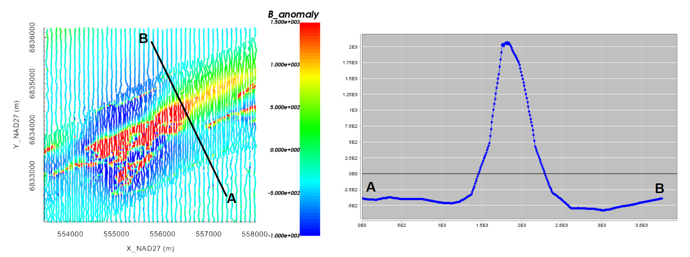
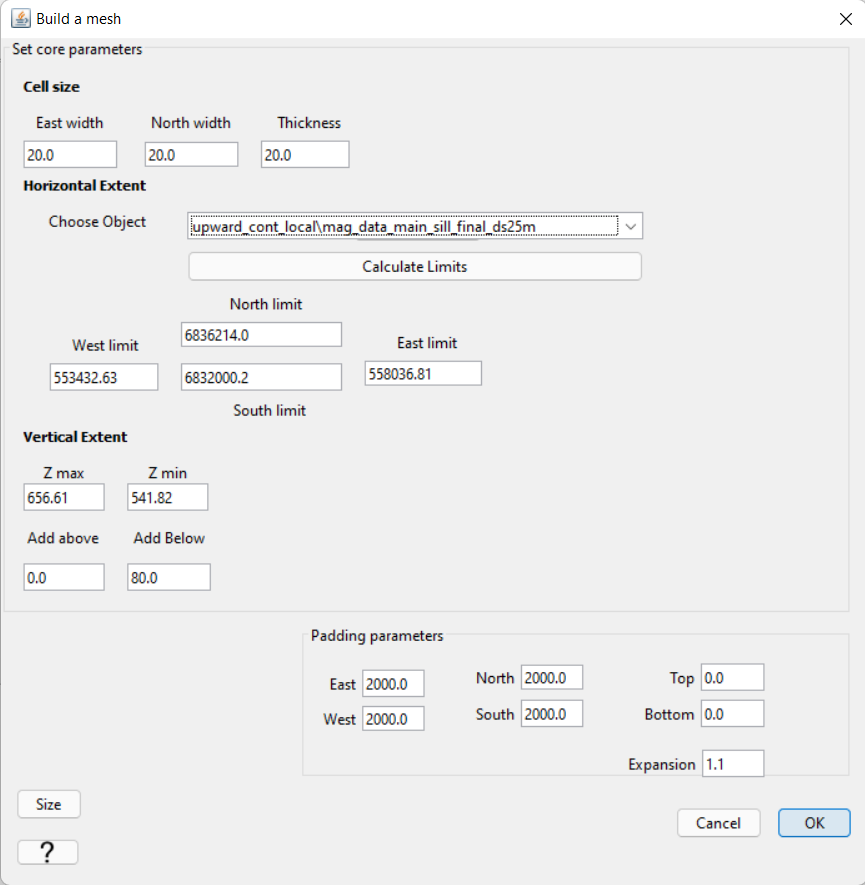
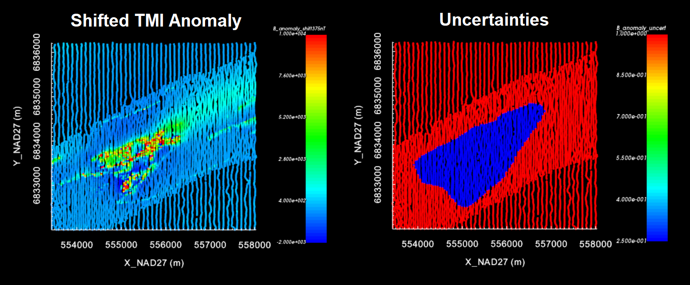
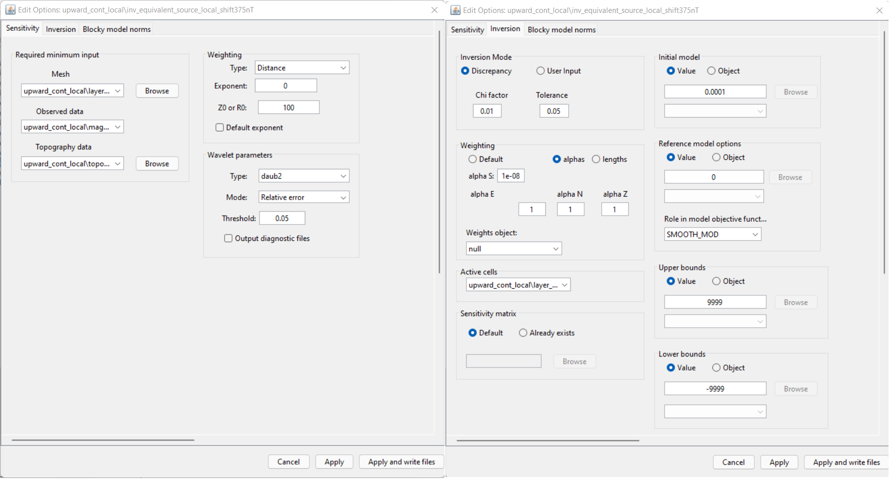
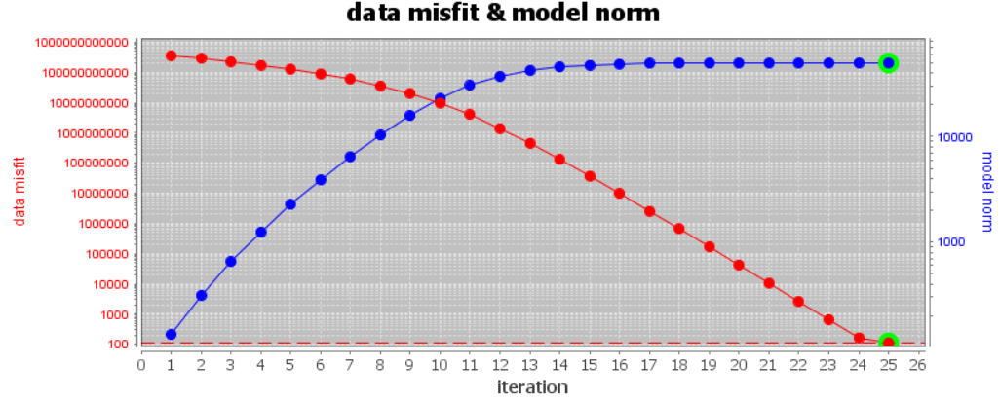
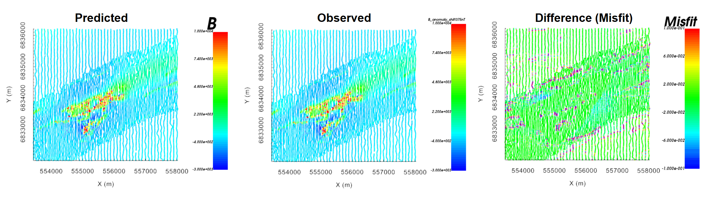
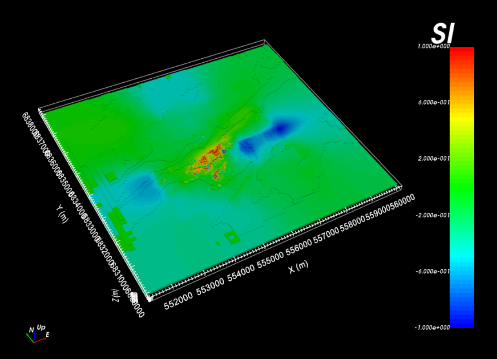

.. _comprehensive_workflow_magnetics_3:

.. include:: <isonum.txt>

Equivalent Source Inversion
===========================

Here, we provide the steps for performing an equivalent source inversion within the GIFtools framework. Equivalent source inversion is a method for recovering an equivalent source model from potential field data. An equivalent source model represents a source distribution that fits the observed data exactly, and can be used to compute the expected potential field(s) for other locations/field orientations.
In magnetics, equivalent source models are used to:

    - compute the TMI anomaly data for a vertical inducing field (reduction to pole)
    - compute the TMI anomaly data at higher elevations (upward continuation)

**Regarding the tutorial data,** we recover an equivalent source model for the local surface-collected TMI anomaly data. In the following tutorial section, this model is used to upward continue the data in order to remove problematic high-frequency signals. For the regional magnetic data, we will not need to carry out an equivalent source inversion. A reduction to pole is also not necessary, as the Earth's inducing field is fairly vertical (~80 degrees inclination).

.. _comprehensive_workflow_magnetics_3_detrend:

Background Signal Removal
-------------------------

As discussed in the :ref:`understanding anomalies <comprehensive_workflow_magnetics_1_upcont>` section, equivalent source models are not able to accurately characterize very long wavelength signals (i.e. the background signal). To recover an equivalent source model that accurately characterizes local-scale anomalies, we must first remove the background signal from the local TMI anomaly data. In the case of upward continuation, this signal can be added back afterwards so long as the inducing field remains roughly the same. We begin by:

    - :ref:`plotting the data with VTK <viewData>`

From here, there are several approaches you can take to determine the background signal from the TMI anomaly data column:

    - **Option 1:** Examine the values away from any obvious anomalies on the standard data map. *Pro tip: Click the 'Plot Contours' tab. Set background colour to black and axes and labels to white. This will allow you to hover the cursor over data points and see the values in the bottom-left corner of the data map*
    - **Option 2:** Click the 'Profiler' tab. Here you can plot the anomaly values along a user-defined path
    - **Option 3:** fit a polynomial to a set of selected points. A detailed description of this can be found in the :ref:`polynomial detrending section <comprehensive_workflow_magnetics_5_approach>` of the tutorial.

Once you have determine the background contribution, subtract it from the original TMI anomaly data and define a new column (*B_anomaly_shifted*) using the :ref:`column calculator <objectCalculator>`.

**For the local tutorial data**, we felt a constant value of -375 nT adequately characterized the background signal. Therefore 375 nT were added to the original data column to create a column we call *B_anomaly_shifted*. These 'shifted' data are inverted to recover the equivalent source model.

    Original local TMI anomaly data scaled between -1000 nT and 1500 nT (left). Profile oriented along the declination angle (right).

Generating a Mesh and Defining Active Cells
-------------------------------------------

Here, we define the mesh and the cells on which our local equivalent source model will live. In this case, our equivalent source model
will consist of several layers of cells which follow the local topography. We are not trying to recover realistic structures from the data.
We are simply recovering a model which fits the data exactly.

**Generate a mesh:**

    - :ref:`Create 3D mesh <create_mesh>` under the 'Create' drop-down menu
    - **Cell size:** set the cell size for the core mesh cells. Cell dimensions CANNOT be larger than the minimum horizontal spacing between data points. A cells size that is 0.5-0.8 times the minimum horizontal spacing generally works.
    - **Horizontal Extent:** under 'Choose Object', select the local magnetic data object then click 'calculate limits'. This defines your core mesh region
    - **Vertical Extent:** Add a thickness equal to 2-4 layers of cells
    - **Padding Parameters:** Do not pad in the vertical direction. Pad out sufficiently in the horizontal. Larger padding thicknesses are required if you are upward continuing significantly.

**Define active cells layer:**

    - Select the newly created mesh and :ref:`create active cells from topography <createActiveCellsModel>`
    - Choose the associate topography object
    - Use the 'tops of cells' option to define the cells lying below the surface
    - Click the 'create active cells layer' box and set the depth below the surface to which you want cells to be active in the equivalent source inversion.

**For the local tutorial data,** the following properties were used to create the mesh. When creating the active cells model, we set the depth to 80 m. Given a vertical cell size of 20 m, we are creating a layer of cells that is 4 cells thick. The final mesh size using local tutorial data was 733,410 cells. However the number of active cells was 293,163.

.. _comprehensive_workflow_magnetics_3_better_fit:

Applying Uncertainties
----------------------

The uncertainties used for equivalent source inversion are not the uncertainties that will be used to recover our final susceptibility model. Here, we apply a set of ad hoc uncertainties. For example, a floor uncertainty of 1 nT can be applied to all data. These uncertainties are almost certainly are not representative of the true level of uncertainty on the data, but this is okay.

We do not want an equivalent source model that overfits the background at the expense of fitting magnetic anomalies. As a result, we do not advise assigning percent uncertainties to the data. Furthermore, we may select certain regions and assign a lowever floor uncertainty; ensuring we fit the data in these regions sufficiently.

**For the local tutorial data,** we defined the uncertainties as follows:

    - We assigned a floor uncertainty of 1 nT to all data using :ref:`assign uncertainties <objectAssignUncert>`
    - At locations in the region of our target anomaly, we replaced the uncertainties with a floor value of 0.25 nT. This was done by:

        - :ref:`Plotting the data with VTK <viewData>`
        - Setting the anomaly data to be our currently viewed data
        - Clicking the 'Edit' tab and selecting the points we want changed
        - Going back to othe 'View' tab and setting the currently viewed data to be the uncertainties (VERY IMPORTANT!!!)
        - Clicking the 'Edit' tab followed by the 'Simple Edit' tab.
        - You can now choose to modify the currently selected data. We chose to replace the selected data with 0.25 nT

.. important:: Whatever data are currently being plotted will be modified. If you do not switch from anomaly data to uncertainties under the 'View' tab before replacing values, you will be replacing data values in the wrong column!!!

.. important:: If you have not already done this, use :ref:`set i/o headers <objectSetioHeaders>` to set the X, Y, Z, data and uncertainty columns. Recall that you want to invert the SHIFTED anomaly data.

Setting Up and Running the Inversion
------------------------------------

We can now perform the local equivalent source inversion on the shifted TMI anomaly data. 

    - :ref:`Create a MAG3D v6.0 inversion object <createMagInv>`
    - Use :ref:`edit options <invEditOptions_Mag3D>` to set the inversion parameters
    - Click *Apply and write files*
    - Run weights
    - Run sensitivities
    - Run inversion
    - :ref:`Load final result <invLoadResults>`

**For the local tutorial data,** the following inversion parameters were used.

Discussion of Inversion Parameters
----------------------------------

.. note:: The parameters chosen for inversion of the tutorial data were experimentally derived. The numbers used here worked well for inverting this dataset but should not necessary be used as general default values!

**Regarding sensitivity weighting:**

For equivalent source inversion, there is no need to apply the sensitivity weighting typically used in potential field inversion. In fact, it is easier for the inversion to fit the data with a layer if sensitivity weighting is NOT applied. To accomplish this, we do not use the default weighting. We set the *Exponent* to equal 0 and the contant *R0* to be some positive contant. By doing this, all of the weights in our weights model will be equal to 1.

**Regarding chi factor:**

The goal of the of the equivalent source inversion is to recover a model that fits the data as well as possible. To accomplish this, we set the target chi factor to something much smaller than 1 (e.g. 0.01 in this case).

**Regarding the alpha parameters:**

As we learned in the :ref:`upward continuation <comprehensive_workflow_magnetics_1_upcont>` section of understanding anomalies, structures recovered in the padding cells impact upward continued data at greater elevations. Our approach was not to enforce any assumptions on the values in the padding cells by setting :math:`\alpha_s` = 1e-8 (something very small). This is known as recovering the 'smoothest model'; a model which does not depend on the reference model. Ideally, any very-long period signals that weren't completely removed prior to inversion will be accounted for by smooth features that continue into the padding.

**Regarding the starting model:**

A starting model of 0.0001 SI was chosen. This is done because a starting model of 0 SI will not produce a step direction for updating the model at the first iteration. Thus in practice, we assign something small whenever our reference model is equal to 0.

**Regarding active cells:**

Don't forget to use your active layer cells model to set the active cells in the inversion.

**Regarding the bounds:**

For equivalent source inversion, we simply need a model that fits the data as well as possible. No constraints are required for the positivity or magnitude of the recovered 'susceptibilities'. By setting the bounds to [-9999, 9999] we are essentially solving an unbounded inverse problem.

Analyzing Outputs
-----------------

Convergence
^^^^^^^^^^^

As a first step, examine the convergence curve. We want to be sure that our equivalent source model globally fits the data to the desired chi factor. If the inversion does not reach the target data misfit:

    - Your cell size is too large
    - You set extremely small uncertainties or an extremely small chi factor for the target misfit.

**For the local tutorial data,** we set a chi factor of 0.01. Given that we inverted 11,192 data, the corresponding target data misfit is ~112. The figure below shows the convergence of the equivalent source inversion for the local tutorial data. Our inversion reaches the target data misfit for the chi factor assigned.

    - :ref:`View convergence <convergence_curve>`

Data Misfit
^^^^^^^^^^^

Here, we ensure that predicted data from the equivalent source model accurately reproduces the observed anomaly. The predicted data object can be used to examine the observed data, predicted data, misfit and normalized misfit.

**For the tutorial data,** the anomaly is fit to the same degree as the background; i.e. we are not overfitting the background. Some locations appear to have much higher frequency signals that weren't quite fit with the equivalent source model. But the misfit is still very small and this is not concerning.

Recovered Model
^^^^^^^^^^^^^^^

**For the local tutorial data,** the equivalent source model is shown below. The values have been scaled between -1 and 1. We can see the features of the observed anomaly in the recovered model. And smooth background features continue into the padding.

    Local equivalent source model