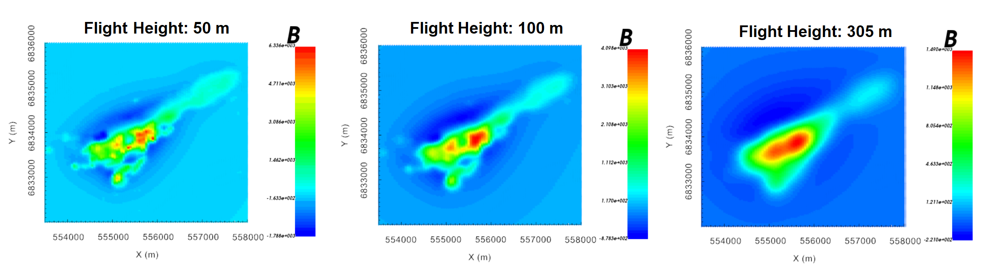

.. _comprehensive_workflow_magnetics_4:

.. include:: <isonum.txt>

Upward Continuation and Reduction to Pole
=========================================

Here, we show how equivalent source models can be used to compute the expected TMI anomalies for other locations/field orientations. Some examples include:

    - computing the TMI anomaly data for a vertical inducing field (reduction to pole)
    - computing the TMI anomaly data at a higher elevation (upward continuation). Also, at the elevation corresponding to a regional dataset.
    - computing amplitude data from TMI anomaly data

**For the local tutorial data**, an :ref:`equivalent source model recovered in the previous section <comprehensive_workflow_magnetics_3>`. Here, we upward continue the local data to in order to remove problematic high-frequency signals. For the regional data, we will not need to carry out an equivalent source inversion.

Gridding (Optional)
-------------------

Survey lines are not perfectly straight and station spacings not necessarily uniform. If desired, the user can upward continue or perform the reduction to pole such that the result is defined on a set of uniformly gridded points. Some things to keep in mind are:

    - you **cannot** use this gridding technique to interpolate to a finer horizontal spacing. The smallest wavelength signal contained in the data is limited by the station and line spacing of the survey. So when creating the set of gridded points, the same line spacing and station spacing must be used.
    - you **cannot** use this gridding technique to 'fill in' regions where you do not have data coverage.
    - in general, we do not invert gridded data, unless they have been sufficiently upward continued. When in doubt, preserve the original horizontal locations when upward continuing.

To create a gridded survey object for upward continuation or reduction to pole:

    - Use the :ref:`create magnetic survey <createSurveySimple>` utility to define a gridded survey at the desired height above the surface topography
    - Use :ref:`assign the field parameters <objectEditFieldParam>` to define the desired inducing field (e.g. vertical for reduction to pole)

**For the local tutorial data:** the minimum line spacing for the original TMI anomaly data was 50 m. And prior to equivalent source inversion, the local TMI anomaly data were downsampled to have a minimum spacing of 25 m. As a result, a uniform grid with a line spacing of 50 m and a station spacing of 25 m was created. The bearing for the survey lines was 0 degrees (Northing). The origin, line length and number of survey lines were determined by the orignal magnetic data object. We aren't sure what the ideal height for upward continuation was, so we created gridded data objects at several heights (50 m, 100 m and 305 m above surface topography).

.. important:: In order to compare and level the local and regional TMI anomaly data, we are upward continuing the local data using the regional data's inducing field. We are also upward continuing to the same height (305 m).

Upward Continuation/Reduction to Pole
-------------------------------------

.. note:: If you want to preserve the horizontal locations (no gridding), simply make a copy of the original data object and alter the elevation column and/or inducing field.

To carry out the upward continuation or reduction to pole:

    - :ref:`Create forward modeling object <createMag3D>`
    - Use :ref:`edit options <fwdEditOptions_Mag3D>` to define the following properties

        - The mesh and equivalent source model
        - The survey 
        - The lower bound is left blank!!!

    - Write the files
    - Run the forward model
    - Load the results when complete
    - **For upward continuation,** remember to remove the DC shift from any predicted data. We call this column *B_anomaly_unshifted*.

.. note:: If you have regional data, you will need to upward continue the local data to 1) a desired flight height for local-scale inversion, and 2) the height at which the regional data were collected.

**For the local tutorial data,** upward continued TMI anomaly data at flight heights of 50 m, 100 m and 305 m are shown below BEFORE the removal of the 375 nT shift. As expected the TMI anomaly is broader, smoother and has lower peak amplitude at higher elevations. Upward continued data to an elevation of 50 m may still contain some higher frequency signals that aren't fully characterized with the current line/station spacing. **So moving forward, we plan to use data upward continued to 100 m in our local scale inversion.**

    Local TMI anomaly data upward continued to gridded locations at 50 m, 100 m and 305 m above the Earth's surface. Note that the data in these plots have NOT been unshifted.