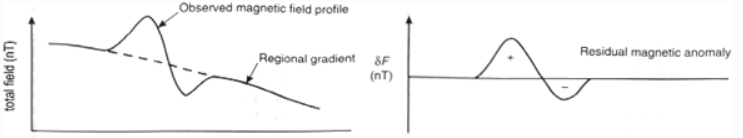
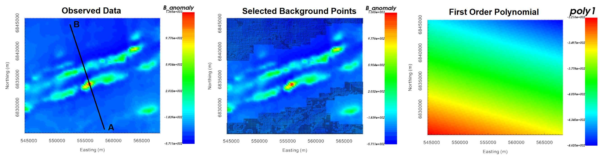
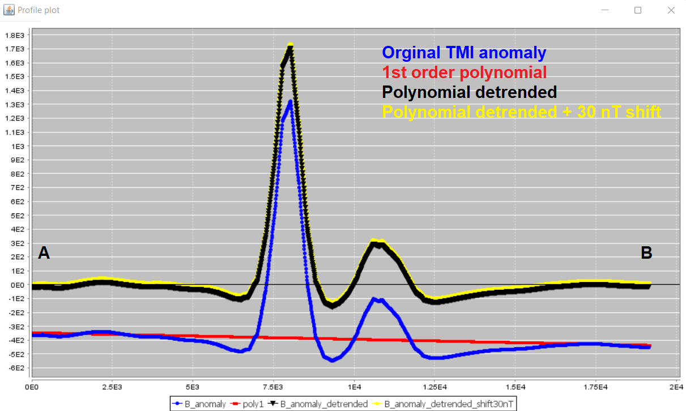
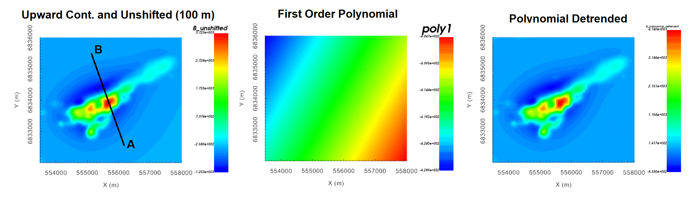
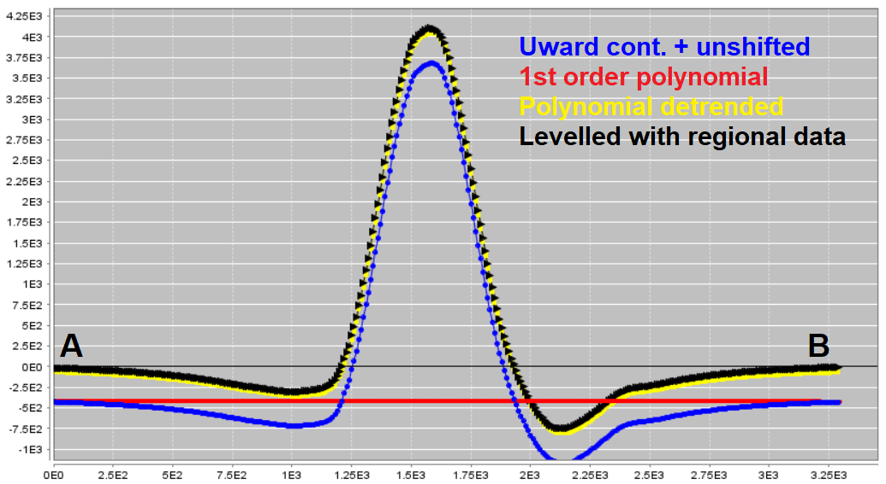

.. _comprehensive_workflow_magnetics_5:

.. include:: <isonum.txt>

Polynomial Detrending and Levelling
===================================

**Polynomial detrending** is used to remove the background signal (i.e. very long wavelength signals) from the data in order to more accurately characterize local magnetic anomalies; see the image below. Failure to remove the background signal from magnetic data prior to inversion can result in artifacts and structures which mischaracterize local anomalies.

**Levelling** is sometimes required when you have both local and regional scale data collected during different surveys. Here, the levelling is a DC shift that is added to one of the datasets, so that the background values for both datasets are comparable in the same region.

Depending on the data you have available, there are two cases:

    - **Case 1:** You only have local data (no regional data). In this case, polynomial detrending is applied directly to the local data prior to inversion. Here, we assume that contributions from regional and/or nearby structures can be approximated by a low-order polynomial and removed.
    - **Case 2:** You have both local and regional scale data. Polynomial detrending is applied to the regional data only. Levelling between local and region datasets is applied if needed. And the detrended regional data is used later to remove regional trends (the background signal) from the local dataset prior to inversion.

.. _comprehensive_workflow_magnetics_5_approach:

Detrending: General Approach
----------------------------

The general approach for polynomial detrending is to select the set of data points which are part of the 'background'; i.e. away from any local-scale anomalies. Then to fit these data with a low-order polynomial. Within the GIFtools framework, the steps are as follows:

    1. :ref:`Plot the data with VTK <viewData>`. Under 'current data', select the data column you wish to detrend.
    2. Click the 'Edit' tab. Under 'Data selection', click one of the selection options and start to select data on the data map. *For the rectangular option, you can hold Ctrl and append multiple selections*
    3. Click the 'Regional fit'. Here you can

        - Fit the highlighted or not highlighted data
        - Choose the order to the polynomial used to fit these points (usually 0th or 1st or polynomial)
        - Provide the name for the output data column
    
    4. Then click 'OK' to create the resulting data column with the polynomial defined at all survey locations.
    5. Close the VTK plotting
    6. Use :ref:`column calculator <objectCalculator>` to subtract the polynomial from the data
    7. Reopen the VTK plotting to examine result. Results can be examined with data maps, or by examining individual profiles ('Profiler' tab)

.. important::

    - Classifying data points as being part of the background or as being part of the anomalous signal is a subjective process.
    - Magnetic anomalies produce anomalous lows as well. These locations should not be classified as background!
    - Even after polynomial detrending is applied, there may be background regions with negative data values that cannot easily be fit with a strictly positive susceptibility model. In this case, you may detrend with a different polynomial fit OR apply a small DC shift.

.. _comprehensive_workflow_magnetics_5_tutorial_data:

Detrending and Levelling Tutorial Data
--------------------------------------

Regional Tutorial Data
^^^^^^^^^^^^^^^^^^^^^^

For the regional magnetic data, a 1st order polynomial was used to fit the set of selected background points; creating a column we call *poly1*. We were careful not to include any small scale anomalies or obvious lows. The polynomial indicates a significant linear trend along the NNE direction. The 1st order polynomial was subtracted from the TMI anomaly data to create a column called *B_anomaly_detrended*. A profile roughly along the same direction as the Earth's declination is shown below. The 1st order polynomial generally does a good job of detrending the data. However, we noticed some background regions had coherent negative values. During a preliminary regional magnetic inversion, we found it difficult for the data to be fit by a strictly positive susceptibility model. As a result, we applied a DC shift of **+30 nT** to the regional data after detrending to create a column *B_anomaly_detrended_shift30nT*.

    Polynomial detrending applied to regional tutorial data.

.. _comprehensive_workflow_magnetics_5_levelled:

Local Tutorial Data
^^^^^^^^^^^^^^^^^^^

Consider the local TMI anomaly data that were upward continued to 100 m and then unshifted (background signal added back); whose column we call *B_anomaly_unshifted*. For this exercise we are interested in comparing final inversion results when regional data are available, and when they are not. To accomplish this we:

    - used a 1st order polynomial to fit the background, then subtracted the polynomial data column to obtain a data column we are calling *B_anomaly_detrended*. This data column will be inverted to recover a local susceptibility model in the case where regional data are not available.
    - applied a levelling constant of +380 nT to all upward continued and unshifted TMI anomaly data (i.e. *B_anomaly_unshifted*) to produce a column we call *B_anomaly_levelled*. We will remove regional trends from this data with the help of regional data prior to inverting.

We can see that locally, the change in the 'background response' is much smaller than the amplitude of the TMI anomaly. Along the profile, *B_anomaly_detrended* and *B_anomaly_levelled* are more or less the same. Also note that the regional 1st order polynomial trend and the local 1st order polynomial trend are not aligned along the same gradient; implying the coarse regional background is not a good characterization of the background locally. 

    Polynomial detrending applied to local tutorial data.

