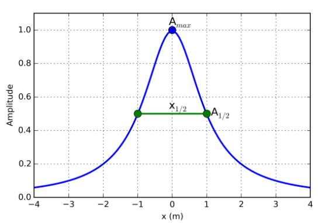
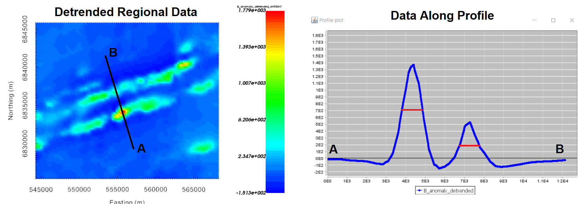
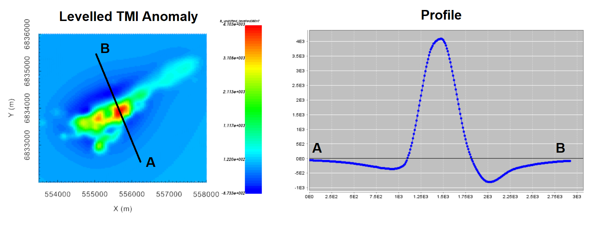

.. _comprehensive_workflow_magnetics_6:

.. include:: <isonum.txt>

Data Interpretation (including remanence)
=========================================

At this point, upward continuation, reduction to pole and/or polynomial detrending methods have been applied in order to better characterize target anomalies; both local and regional (if available). Prior to inversion, data maps and profiles can be used to:

    - roughly estimate the depth to structures based on anomaly half-width
    - infer the presence of significant magnetic remanence
    - estimate the minimum station spacing required to constrain target anomalies
    - estimate data uncertainties from closely spaced along-line data

**For the regional tutorial data,** the detrended TMI anomaly column (*B_anomaly_detrended*) is most relevant for interpretation. And **for the local tutorial data,** we may examine polynomial detrended (*B_anomaly_detrended*) or levelled (*B_anomaly_levelled*) TMI anomaly data.

.. _comprehensive_workflow_magnetics_6_halfwidth:

Anomaly Half-Width
------------------

More deply buried targets produce broader and smoother magnetic anomalies. As a result, there is a direct correlation between the depth to a magnetized body and the anomaly it produces. Where :math:`h` is the flight height and :math:`x_{1/2}` is the width of the anomaly at half its implitude, the depth to a magnetized body is given by:

.. math::
    \textrm{Dipole:} \;\; D \approx x_{1/2} - h \\
    \textrm{Pole:} \;\; D \approx \frac{1}{2} x_{1/2} - h

Obviously the majority of targets are not magnetic poles or dipoles. However magnetic dipoles are useful for approximating the anomalies from compact bodies and magnetic poles are good for approximating the anomalies from vertically buried pipe-like strucutres. Using these simple relationships, one can roughly estimate the lower extent of the core mesh region and better understand the scale of the TMI anomalies observed within the survey region. Beware that you can overestimate the depth of the anomaly if it is caused by a shallower and wider structure.

**For the regional tutorial data,** the :ref:`polynomial detrended TMI anomaly data <comprehensive_workflow_magnetics_5_tutorial_data>` are shown below; whose data column we called *B_anomaly_detrended*. The half-width is crudely labeled for two distinct anomalies. For each anomaly, the half-width is ~900 m. Given the flight height of the regional survey is assumed to be 305 m, the half-width formula for a magnetic dipole suggests a burial depth of ~600 m.

    Regional TMI anomaly data that has been detrended with a 1st order polynomial.

**For the local tutorial data,** the half-width for the polynomial detrended TMI anomaly data was ~600 m for data upward continued to 100 m above the surface. Using this data, the burial depth assuming a magnetic dipole is ~500 m.

Remanence
---------

In the :ref:`remanence portion of the understanding anomalies section <comprehensive_workflow_magnetics_1_remanence>`, we learned that:

    - purely induced magnetization produces TMI anomalies that are oriented along the direction of the Earth's declination angle.
    - observed TMI anomalies that differ significantly from the expected anomalies produced by strictly induced magnetization are likely contaminated with remanent magnetization.

So one way to infer remanence is to compare the observed data to the expected anomaly for purely induced magnetization.

**Regarding the local tutorial data:** the inducing field is practically vertical (inclination of 80.35 degrees), thus we generally don't expect large negative regions on either side of a large positive anomaly; especially for data collected at sufficient height. The data map for levelled TMI anomaly data (*B_anomaly_levelled*) showed a significant 'low' region to the northwest of the target and a smaller 'low' region to the southeast. With complex geologies, it is possible these anomalies are produced strictly by induced magnetization; as the anomaly roughly aligns with the declination angle. At this juncture, we cannot confidently infer magnetic remanence.

    Levelled local TMI anomaly data at 100 m flight height.

