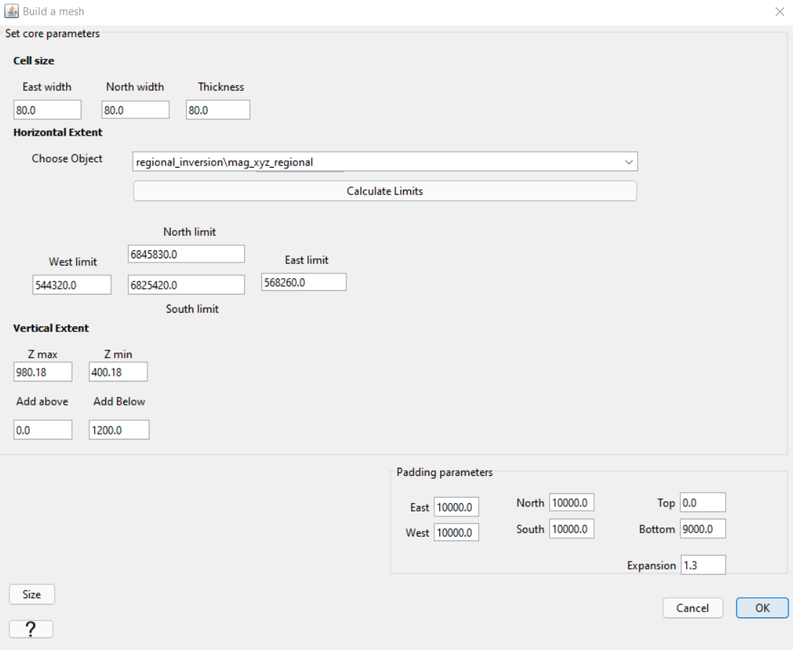
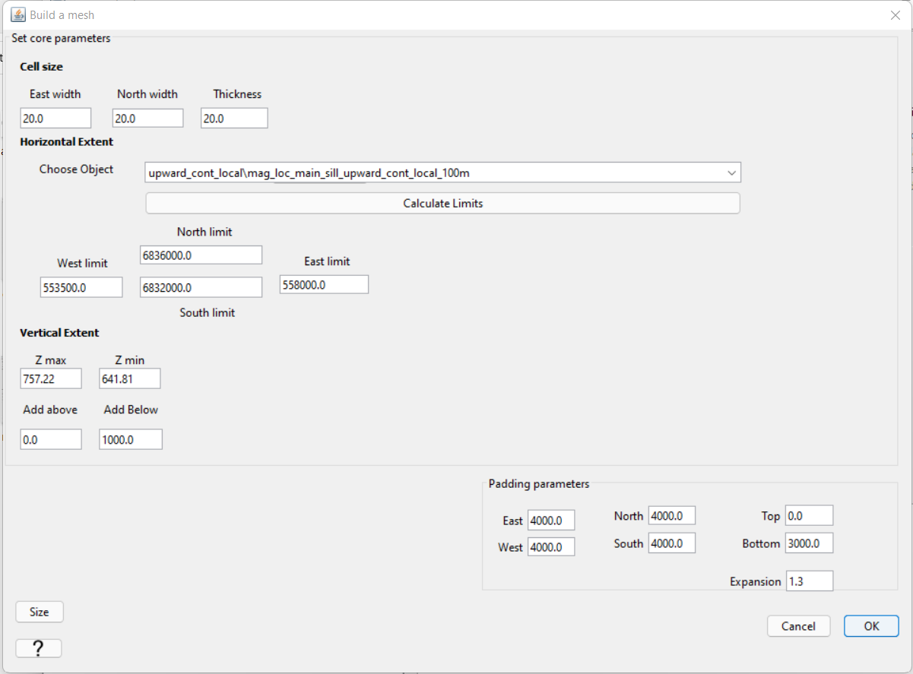

.. _comprehensive_workflow_magnetics_8:

.. include:: <isonum.txt>

Mesh Design
===========

Here, we describe a general approach for designing tensor meshes for TMI inversion.

Downsampling
------------

Downsampling was first introduced in the :ref:`Loading TMI Data and Cursory Interpretation <comprehensive_workflow_magnetics_2_downsampling>` section of the tutorial. Downsampling was applied to the local tutorial data to increase the minimum spacing between data points without filtering out any coherent signals from magnetized structures. This enabled us to perform an equivalent source inversion on a mesh whose cells were reasonably sized.

Here, downsampling is performed for the same reason. Memory requirements for potential field inversion are linearly proportional to mesh size. By downsampling appropriately, we can invert the data on a coarser mesh since we have increased the minimum data spacing.

    - :ref:`Downsample by distance <objectDataDownsample>`

**For the local tutorial data,** we downsampled to a minimum distance of 50 m. This is equal to the average line spacing of the original field-collected skidoo data. For the data being inverted (upward continued to 100 m), this minimum spacing accurately characterizes the observed TMI anomaly.

General Approach
----------------

To create a tensor mesh based on survey geometry:

    - :ref:`Create 3D mesh <create_mesh>` under the 'Create' drop-down menu
    - **Cell size:** set the cell size for the core mesh cells.
    - **Horizontal Extent:** under 'Choose Object', select the magnetic data object then click 'calculate limits'. This defines your core mesh region
    - **Vertical Extent:** Depth of your core mesh region under surface topography
    - **Padding Parameters:** Do not pad in the upward direction, as air cells are not used when modeling potential fields

Here are some rules of thumb for generating tensor meshes for magnetic inversion:

**Depth of core mesh region:** As mentionned in the :ref:`interpretation <comprehensive_workflow_magnetics_6_halfwidth>` section, the depth to a magnetized body is correlated with the width of the anomaly it produces. To estimate the depth of the core mesh region, use the half-width formula on any notable TMI anomalies then determine the corresponding burial depths. The bottom of the core mesh region should be 1-2 times the largest burial depth; ensuring that a significant portion of the target does not end up in the padding.

**Minimum cell dimension:** The dimensions of the cells in the core mesh region depend on the smallest spatial frequency contained within the data. When data are very smooth and contain lower spatial frequencies, coarser meshes can be used and the inversion will demonstrate reasonable convergence. If data contains significant higher frequency signals, more cells are required between each data point in order for the inversion to converge appropriately; i.e. reach target misfit with a geologically reasonable model.

Ideally, the line spacing and flight height will have been chosen with some consideration to the magnetic anomalies produced by local structures. In general, the minimum horizontal cell width should be at AT MOST 75\% the smallest distance between data points. Never have 2 data points lying above the same cell!!! And if possible, 2-3 cells between each data point is ideal.

**Padding:** Padding is required to fit any remaining longer period signals that remain in the data. The longest spatial period signal that can be characterized by the data is equal to the dimensions of the survey area. As a result, the thickness of the padding should be 0.5-2 times the width of the survey region. For tensor meshes, we pad out exponentially to reduce the total number of mesh cells. An expansion factor of *1.1-1.3* is ideal. Do not exceed a padding factor of 1.5!!!

Meshes for Tutorial Data
------------------------

Regional Mesh
^^^^^^^^^^^^^

For regional-scale inversion, the following parameters were used to generate the mesh.

**Depth of core mesh region:** 1200 m was 2x the burial depth using the half-width formula.

**Minimum cell dimensions:** Since the regional data are gridded to 200 m spacing, we chose a minimum cell dimension of 80 m (2.5 cells per station).

**Padding:** We chose to define the mesh boundary 10 km from the survey region in every direction. Based on our best-practices, this could be seen as a bit of an underestimation (survey region is 45 km by 45 km). But assuming we have removed the very-long period signal from the regional data, this was acceptable.

Local Mesh
^^^^^^^^^^

For local-scale inversion, the following parameters were used to generate the mesh.

**Depth of core mesh region:** 1000 m was 2x the burial depth using the half-space formula.

**Minimum cell dimensions:** Since the data were downsampled to a minimum spacing of 50 m, we chose a minimum cell dimension of 20 m (2.5 cells per station).

**Padding:** We chose to define the mesh boundary 4 km from the survey region in every direction. Based on our best-practices, this was reasonable given a survey area of 4.5 km by 4.5 km.