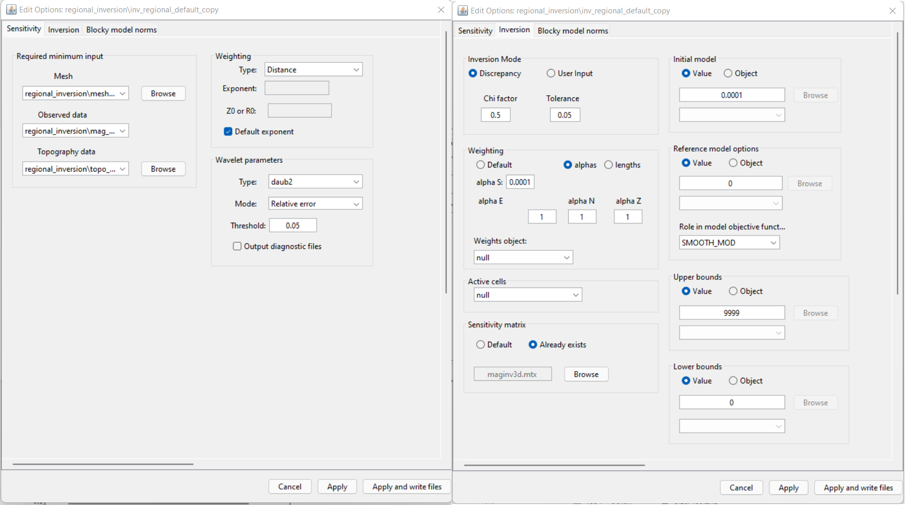
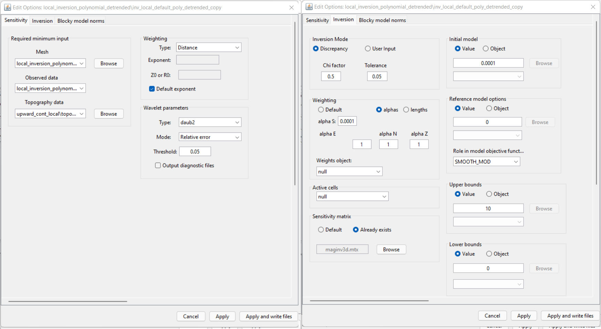

.. _comprehensive_workflow_magnetics_9:

.. include:: <isonum.txt>

Least Squares Inversion
=======================

Here, we provide general instructions for setting up and running magnetic inversions within the GIFtools framework. For both the local and regional (if available) datasets, we will perform a least-squares inversion. The choice in inversion parameters and their impact on the recovered model are discussed.

Running a Least-Squares Inversion
---------------------------------

The steps for setting up and running the magnetic inversion are as follows:

    - :ref:`Create a MAG3D v6.0 inversion object <createMagInv>`
    - Use :ref:`edit options <invEditOptions_Mag3D>` to set the inversion parameters
    - Click *Apply and write files*
    - Run weights
    - Run sensitivities
    - Run inversion
    - :ref:`Load results for desired iterations <invLoadResults>`

Inversion Parameters for Tutorial Data
--------------------------------------

**For the regional tutorial data,** the following inversion parameters were used.

**For the local tutorial data,** the following inversion parameters were used.

Discussion of Tutorial Inversion Parameters
-------------------------------------------

.. note:: The parameters chosen for inversion of the tutorial data set were experimentally derived. The numbers used here worked well for inverting this dataset but should not necessary be used as general default values!

**Regarding sensitivity weighting:**

Default parameters for sensitivity weighting are applied. The role of sensitivity weighting in potential field inversion is discussed in :ref:`fundamentals of inversion <Fundamentals_DepthDistMatrix>`.

**Regarding chi factor:**

By setting a chi factor of 1, you are assuming that you have accurately characterized the global level of uncertainty on the data. If you have over-estimated the uncertainties, the inversion will reach target misfit and terminate before recovering a model that accurately fits the data. By setting the chi factor to 0.5, we are able to view models further along the Tikhonov curve. This can be used to adjust the level of uncertainty on subsequent inversions.

**Regarding the starting model:**

A starting model of 0.0001 SI was chosen. This is done because a starting model of 0 SI will not produce a step direction for updating the model at the first iteration. Thus in practice, we assign something small whenever our reference model is equal to 0.

**Regarding the alpha parameters:**

There are a couple of approaches one can take here. The first is carrying out the 'smoothest model inversion'. For the smoothest model inversion, we set :math:`\alpha_s` to something very small (e.g. 1e-10). By doing so, we recover a model which does not depend on the reference model (smallness term). The inversion is purely driven by the data and does not assume any a-priori information. The second option is to balance the relative emphasis on fitting the smallness and smoothness terms in the :ref:`model objective function <modelObjectiveFunction>`. Equal balance is expected when :math:`\alpha_s \approx 1/h^2`, where :math:`h` is the minimum cell width.

For both the local and regional inversions, we set :math:`\alpha_s` = 1e-4. Since the reference model is 0 SI, the recovered model cannot have very large values and must be sufficiently smooth. Here we assume that polynomial detrending adequately removed any longer period signals from the data. And as such, we do not want smooth large-scale features recovered in the padding cells; something which can happen by inverting for the smoothest model. By setting :math:`\alpha_s` sufficiently large, the padding cells in the recovered model will be essentially equal to the reference model (0 SI) if they are not sensitive to the data.

**Regarding the bounds:**

Here, we set a lower bound of 0 SI to enforce a positivity constraint on the recovered susceptibility model. We replaced the upper bound of 1 SI to something very large in case there is very strong induced magnetization.

