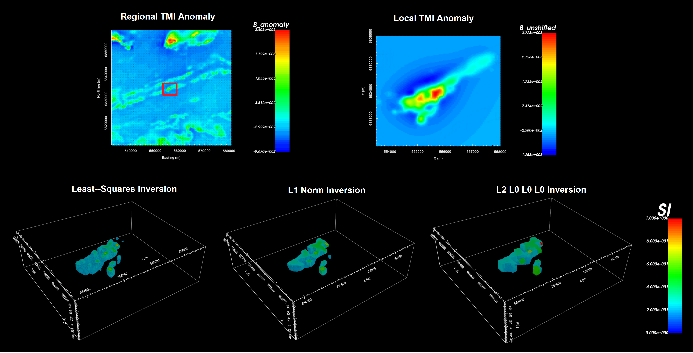

.. _comprehensive_workflow_magnetics_index:

Comprehensive Workflows: TMI Magnetics
======================================

**Author: Devin C. Cowan**

**Published: February, 2022**

**Requires GIFtools v3.0 or later**

Here, we present a general workflow for loading, interpreting, processing and inverting total magnetic intensity (TMI) magnetic data. We begin with TMI data in a basic XYZ format. Our goal is to process and invert the TMI data to recover a 3D magnetic susceptibility model for a local survey area. For this tutorial, we have both local and regional datasets; the later of which can be used to constrain the local-scale inversion if available. You may work with the tutorial datasets provided or use your own data:

    - `Download the tutorial data <https://owncloud.eoas.ubc.ca/s/AKmzeokY9F4Ydqk/download>`_

We would like to thank our program sponsors for providing the local survey data used to create this comprehensive workflow. The regional-scale data were queried from the `Natural Resources Canada Geoscience Data Repository for Geophysical Data <http://gdr.agg.nrcan.gc.ca/gdrdap/dap/search-eng.php>`__ .

    Regional and local TMI anomaly data (above). Local susceptibility models recovered with inversion using various norms (bottom).

**Tutorial Sections**

.. toctree::
    :maxdepth: 1

    - Understanding TMI anomalies <1_basic_anomalies>
    - Loading data and cursory interpretation <2_load_data>
    - Equivalent source inversion <3_equivalent_source>
    - Upward continuation and reduction to pole <4_upward_continuation>
    - Polynomial detrending <5_detrending>
    - Data interpretation (including remanence) <6_data_interpretation>
    - Uncertainties for TMI anomaly data <7_uncertainties>
    - Mesh design <8_mesh_design>
    - Least-squares inversion <9_inversion>
    - Examining inversion outputs <10_inversion_results>
    - Local inversion using regional removal <11_regional_removal>
    - Sparse norm inversion <12_sparse_inversion>

 
