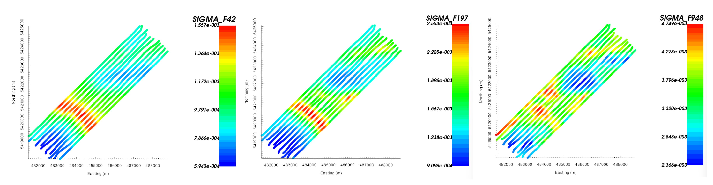

.. _comprehensive_workflow_mmt_2:

.. include:: <isonum.txt>

.. note:: Note about the data. Where it came from, who supplied it, yadda yadda.

Loading and Visualizing MobileMT Data
=====================================

The first step in any project is to load field collected data and visualize it. Here, we will assume that you have some XYZ formatted MobileMT data stored in a CSV file.

.. important:: Requires GIFtools v3.3 or later.

Starting Your Project
---------------------

    - Open GIFtools
    - :ref:`Set the working directory <projSetWorkDir>`

Import Files
------------

.. note:: If you do not have XYZ formatted data from which to work with, you may `download tutorial data <https://github.com/ubcgif/GIFtoolsCookbook/raw/master/assets/comprehensive_tutorial_mmt.zip>`_ . It is from this dataset that we will demonstrate the workflow.

Here, we import the MobileMT data and topography.

    - :ref:`Import topography data (XYZ format) <importTopo>`. The data file is named *mmt_topo.xyz* and is located in the *assets* folder.

    - :ref:`Import MobileMT data from CSV <importXYZemData>`. Use **Import** |rarr| **Data** |rarr| **Natural Source EM** |rarr| **MobileMT general ASCII**. The data file is named *mmt_data.csv* and is located in the *assets* folder. If you are using the tutorial data:

        - We are loading data at 13 frequencies: 42, 54, 70, 91, 118, 152, 197, 256, 332, 432, 561, 730 and 948 Hz.
        - There is only 1 data group. We will give it the name 'SIGMA' because MobileMT data are apparent conductivities.

    - Once loaded, make sure to :ref:`set IO headers <objectSetioHeaders>` for all MobileMT data.

    - **Pro tip:** To avoid confusion, use the :ref:`set data headers <objectDataHeaders>` tool to define location columns as *Easting, Northing* and *Elevation*.

Units
-----

After loading data files into the GIFtools framework, we must always ensure the units of the data are consistent with UBC-GIF convention. For the tutorial dataset, the columns corresponding to locations are in meters, which is consistent with UBC-GIF. However, the apparent conductivities are represented in mS/m, whereas UBC-GIF uses S/m.

To convert the apparent conductivities from mS/m to S/m, we use the:

    - :ref:`calculator <objectCalculator>` and divide the 'SIGMA' column by 1000.

.. _comprehensive_workflow_mmt_2_dt:

Visualization and Interpretation
--------------------------------

To visualize the data:

    - use the :ref:`VTK data viewer <viewData>`

    Observed data at 48 Hz (left), 197 Hz (middle) and 948 Hz (right).

There appears to be 3 prominent large-scale features in the data; see the 48 Hz data. There is a resistive structure at the SW end of the survey,
a NW-SE conductive feature nearer to the middle of the survey region, and resistive structure centered at (486000, 5422500).
As we increase the frequency, and thus are more sensitive to nearer surface structures, we start to see a set of isolated
conductors and some resistors; see the 948 Hz data.

The range of apparent conductivities observed over all frequencies is roughly 5e-4 S/m to 5e-3 S/m.
Recall from the :ref:`understanding MobileMT data <comprehensive_workflow_mmt_1_base_station>` section that the general amplitude of
the observed apparent conductivities is indicative of the conductivity near the base station, and that the relative amplitudes of
anomalous signatures is driven by structures within the survey area. As we examine the data at increasing frequencies,
we see that the background apparent conductivity values increase from roughly 1e-3 S/m to 4e-3 S/m; indicating the
conductivity near the base station likely decreases with respect to depth.