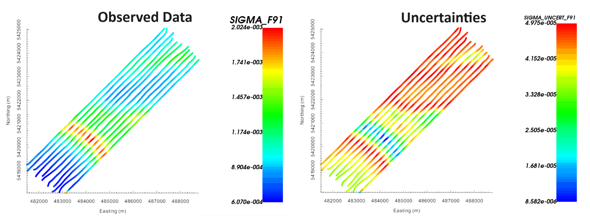

.. _comprehensive_workflow_mmt_3:

Assigning Uncertainties
=======================

Here, we provide a basic approach for assigning uncertainties to MobileMT data. The role of uncertainties in geophysical inversion is presented in the :ref:`fundamentals of inversion <Fundamentals_Uncertainties>`. When assigning uncertainties, we want to ensure we fit the anomaly and not the background. We also want to ensure we fit each component and frequency equally.

Floor Versus Percent Uncertainty
--------------------------------

When examining our MobileMT data, we see that:

    - apparent conductivity values are strictly positive; i.e. no zero crossings
    - the median apparent conductivity value is different at every frequency
    - the amplitudes of anomalies at each frequency are much smaller than the median apparent conductivity value

So at each frequency, do we apply a percent and/or a floor?
Well, there are two reasonable approaches...

**The floor uncertainty approach:**

Since MobileMT anomalies are driven by anomalous magnetic fields much in the same way as ZTEM,
we could apply a similar approach for assigning uncertainties; see :ref:`ZTEM comprehensive workflow <comprehensive_workflow_ztem_3>`.
The only difference is that the background data values for MobileMT are non-zero. For this approach, we would choose a floor uncertainty that is some fraction of the median apparent conductivity at each frequency.

**The percent uncertainty approach:**

Because the amplitudes of anomalies are much smaller than the overall amplitude of the background value,
we would drastically underfit the data if we were to apply percent uncertainties commonly applied to MT apparent resistivities.
However if we apply a small enough percent uncertainty to the data, we won't underfit the data and we should fit
the anomalies from conductors and resistors equally. The goal of the percent uncertainty approach is to
account for the fact that galvanic currents converge to conductors and diverge away from resistors.

If the MobileMT anomalies are much smaller than the amplitude of the background, the floor and percent approaches should yield similar results.

Assigning Frequency-Based Uncertainties
---------------------------------------

To assign the same floor and/or percent uncertainty at all frequencies:

    - :ref:`Assign simple uncertainties <objectAssignUncert>`.

User-specified uncertainties can be applied at every frequency individually using the:

    - :ref:`Uncertainties GUI <objectAssignUncertGUI>`.

**Approach for tutorial data:**

As a first pass, we tried assigning a 2.5\% uncertainty to all data. We found that we were over-fitting the background response and under-fitting the anomalies. This is a problem frequently encountered when inverting potential field data; see :ref:`TMI magnetic comprehensive workflow <comprehensive_workflow_magnetics_7>`. To address this challenge, we assigned uncertainties as follows:

    1. Using the :ref:`view statistics <viewData_statistics>` functionality, we obtained the median value for the apparent conductivity data at each frequency.
    2. Using the :ref:`uncertainties GUI <objectAssignUncertGUI>`, we assign the median value as the uncertainty at each frequency. These are NOT our final uncertainties. We are simply doing this to create a data column that has the median values in it. Let us call this column 'SIGMA_MEDIAN'.
    3. Using the :ref:`calculator <objectCalculator>`, we create a new colum 'SIGMA_DIFF' by subtracting 'SIGMA_MEDIAN' from the observed data 'SIGMA' column; which effectively defines the MobileMT anomaly. And we take the absolute value of this column to create a column 'SIGMA_DIFF_ABS'.
    4. To generate our uncertainties, we subtract 4\% times the 'SIGMA_DIFF_ABS' column from 5\% times the 'SIGMA_MEDIAN' column.
    5. Make sure to set the correct column as the data uncertainties using :ref:`set IO headers <objectSetioHeaders>`.

Where :math:`\bar{\sigma}` represents the median value, our uncertainties :math:`\varepsilon` are equal to:

.. math::
    \varepsilon = 0.05 \bar{\sigma} - 0.04 | \sigma - \bar{\sigma} |

This approach effectively assigns a 5\% uncertainty to background values at each frequency, and applies smaller uncertainties to larger anomalies. This will force the inversion to fit the largest anomalous values, as opposed to over-fitting the background. **Make sure to plot your uncertainties and ensure they are all positive values!!!** The observed data and assigned uncertainties at 91 Hz is shown below.

    Observed data at (left) and uncertainties (right) at 91 Hz.
