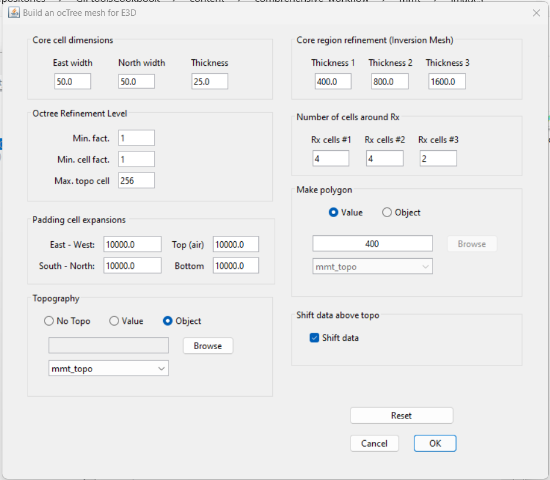

.. _comprehensive_workflow_mmt_5:

Mesh Design
===========

Here we provide a basic approach for mesh design when inverting MobileMT data. The tutorial data set was collected in a region with minimal topography. However, we will complete this step as if the topography is significant and must be modeled.

Skin Depth
^^^^^^^^^^

For frequency-dependent data, an important step is to compute the minimum and maximum skin depths for the data you want to invert. The minimum and maximum skin depths can be used to estimate the depth range your data are sensitive to. Skin depth depends on the operating frequency and subsurface electrical resistivity/conductivity. For a homogeneous medium,

.. math::
    \delta \approx 500 \sqrt{\frac{\rho}{f}} = 500 \sqrt{\frac{1}{\sigma f}}

Unlike classic MT data, you may not be able to estimate the host conductivity within your region of interest directly from MobileMT data; as the apparent conductivities are most sensitive to the conductivity at the base station. Ideally, you be able to infer the host conductivity from physical property measurements or other geophysical data. Here, we provide a simple approach when this type of information is unavailable.

**Our Approach:**

From the :ref:`loading and visualization <comprehensive_workflow_mmt_2>` section of the tutorial, the range of apparent conductivity values within our data was roughly 5e-4 S/m to 5e-3 S/m. Here, we assume the host conductivity within our region of interest lies somewhere within this range. The largest skin depth is computed by taking the smallest apparent conductivity (5e-4 S/m) and smallest operating frequency (42 Hz):

.. math::
    \delta_{max} \approx 500 \sqrt{\frac{1}{\sigma_{min} f_{min}}} = 3,450 m

And the minimum skin depth is computed by taking the largest apparent conductivity (5e-3 S/m) and largest operating frequency (948 Hz):

.. math::
    \delta_{min} \approx 500 \sqrt{\frac{1}{\sigma_{max} f_{max}}} = 230 m

Create Mesh
^^^^^^^^^^^

Here, we explain how to create an OcTree mesh based on MobileMT survey geometry. We also explain the reasoning for the parameter values entered. We can create OcTree meshes from MobileMT surveys with the following utility:

    - :ref:`create OcTree mesh with E3DMT v2 utilities <createE3DMTv2octreeMesh>`

Once you have created the object, complete the following steps:

    1) Set the data object corresponding to the survey
    2) Define the mesh using *Edit Options*
    3) Run the utility
    4) Load results

The parameters set in *Edit Options* are shown below along with reasoning for several important choices. For definitions of the parameters, consult the `E3DMT v2 <https://e3dmt.readthedocs.io/en/e3dmt_v2/content/inputfiles/createOcTree.html>`__ manual.

    Parameters used to define the mesh for the field dataset using E3DMT v2 mesh utility.

**Minimum cell width (horizontal):** A minimum horizontal cell width of 50 m was chosen based on a minimum data separation of 125 m. To be safe, the user should generally have at least 2-3 cells between each data point. In general, the down-sampling and minimum horizontal cell width is dependent on the flight-line separation and smoothness of the observed data.

**Minimum cell width (vertical):** The minimum vertical cell width is determined primarily by the smallest skin depth. If the topography is flat and the geology is relatively simple, the minimum vertical cell width can be roughly 10%-20% the minimum skin depth. Because the source signal for natural source EM data is a vertically propagating plane-wave, it is sometimes more beneficial to discretize in the vertical more than in the horizontal; because lateral variations in the fields are smaller. For the tutorial data, a minimum vertical cell width of 25 m was chosen.

**Max. topo cell:** Even if the topography is significant, we do not want to over-discretize in regions far from the survey, as the fields there do not greatly impact the data. As a result, this parameter was set to a larger number. If you want to more finely discretize the topography, set this to 8, 4, or even 2.

**Padding cell expansions:** The extent of the mesh depends on the largest skin depth. The mesh should extend 2-3 largest skin depths from the survey region in all directions. Because OcTree meshes pad out so effectively, setting this to be very large does not add many additional cells.

**Core region discretization:** *Thickness 1 *should be used to discretize the region sensitive to the highest frequencies (1-2 smallest skin depths). *Thickness 2* and *3* should be used to discretize the additional regions sensitive to he lower frequencies. *Thickness 1 + Thickness 2 + Thickness 3* should be roughly equal to at least 1 largest skin depth.

**Number of cells around Rx:** The number of fine mesh cells near receivers does need to be as large for natural source EM modeling as is does for controlled source EM modeling. Fields associated with natural sources are are much smoother. You can make the mesh a much more reasonable size by taking advantage of this, however sufficient discretization is still required to model the fields accurately.

**Make polygon:** For UBC-GIF v2 codes, this parameter controls the horizontal extent of the core mesh region. In pratice, this should be 1-2 times the smallest skin depth.

**Shift data:** We chose to shift the data locations so that electric field measurements occur on the discretize surface topography and that fleight height is preserved for magnetic field measurements. If you choose to *shift data* for E3DMT v2 utilities, the mesh utility will create a receivers file. When loading the outputs, a new data object is created under the mesh utility. You will notice that the base station is **not** defined and that the *MobileMT data type* is 'MTH'. This is not a problem, as all receivers are organized to measure the fields at the appropriate places. But if you are concerned, you can repeat the steps in the :ref:`data preparation section <comprehensive_workflow_mmt_4>` .
