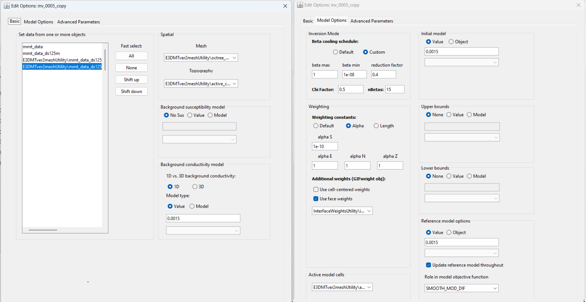

.. _comprehensive_workflow_mmt_6:

Mobile MT Inversion
===================

Here, we provide the steps for setting up and running an inversion with E3DMT v2. We then discuss some important aspects of choosing inversion parameters.

Frequency-Based Extraction
--------------------------

For a cursory inversion, you may choose not to invert data at all frequencies; as each frequency requires the factorization of a separate linear system. Here, we use

    - :ref:`frequency-based extraction <objectTimeFreqExtract>`

to extract data at the frequencies we intend to invert. **For the tutorial data,** we select the *shifted* data object that was loaded after generating the mesh. We then extract the data at 48 Hz, 91 Hz, 197 Hz, 432 Hz and 948 Hz.

Reducing Artifacts through Interface Weighting
----------------------------------------------

When inverting Mobile MT data, the E3DMT v2 code has a tendency to place conductive structures near ground-receiver locations due to the sensitivity of the data to those locations. Here, we generate interface weights to counteract this problem. By forcing lateral smoothness within the top few layers of cells, we can limit the artifacts and force the inversion to place conductive structures at the appropriate depths.

    - :ref:`Create and interface weights utility <createinterfWeights>`
    - Use :ref:`edit options <utilEditOptions>` and set the following parameters:

        - set the OcTree mesh
        - set as *log model*
        - set topography as the active cells model
        - set number of layers and corresponding weights (choose something exponentially decreasing. We chose 40, 10 and 2.5)
        - Face value = 0.001
        - Face tolerance = 0.001

    - :ref:`Run the utility <utilRun>`
    - :ref:`Load results <utilLoadResults>`

Create and Run Inversion
------------------------

We can now invert Mobile MT data using E3DMT v2. 

    - :ref:`Create E3DMT v2 inversion object <createMTZTEMInv>`
    - Use edit options for :ref:`v2 <invEditOptions_e3dmt_ver2>` to set the inversion parameters
    - Click *Apply and write files*
    - :ref:`Run the inversion <invRun>`

The parameters used are shown below.

    Parameters used to invert the field dataset using E3DMT v2.

Discussion of Parameters
------------------------

.. note:: The parameters chosen for inversion of the field dataset were experimentally derived. The numbers used here worked well for inverting this dataset but should not necessary be used as general default values!

**Regarding beta cooling schedule:**

For synthetic modeling, we know the uncertainties on our data. With real data, we cannot be 100% sure that we have correctly estimated the uncertainties. In the case that we have globally under-estimated our uncertainties, we sometime set the *chi factor* to be less than 1. That way, we get to see more of the Tikhonov curve.

When setting the cooling schedule for the tutorial data set, the strategy was pretty straight-forward:

    - **beta max = 1**. The model recovered at the first iteration should clearly underfit the data. However if *beta max* is too large, you will have multiple iterations where the model doesn't budge because no emphasis is being put on fitting the data. We knew a good starting beta for the final inversion from cursory inversions of the data.
    - **beta min = 1e-8**. This can be set quite low. But it is good for the inversion to terminate within a reasonable number of beta iterations if target misfit is not reached.
    - **reduction factor = 0.4:** Generally we choose a value between 0.25 and 0.8. If the reduction factor is too large, the code will run for a long time since the reduction in beta at each iteration is small. If the reduction factor is too small, we do not get much detail regarding the convergence of the inversion. More importantly, portions of the recovered model can get stuck in local minima due to the non-linearity of the problem. It is generally safe to pick a value close to 0.5.
    - **chi factor = 0.5** Just in case we have globally over-estimated the uncertainties on the data, this ensure the inversion does not terminate too early.
    - **nBetas = 15:** Since *beta min* was set so low, we set the inversion to terminate after 15 beta iterations if target misfit is not reached.

**Regarding the background, starting and reference models**

For the background, starting and reference models, we chose 0.0015 S/m. On a log-scale, this is roughly halfway between the minimum and maximum apparent conductivities in our data. Before you choose these values for your project, there are some things you should consider.

If you choose a background conductivity that is lower than the true host conductivity:

    - The overall range of conductivities in the recovered model may be lower than the true range of conductivities.
    - Your inversion will be more sensitive to structures at depth. Recovered structures may be lower conductivity and placed at larger depths.

If you choose a background conductivity that is higher than the true host conductivity:

    - The overall range of conductivities in the recovered model may be higher than the true range of conductivities.
    - Your inversion will not be as sensitive to structures at depth. Recovered conductors may highly conductive and placed at shallower depths.

**Regarding the alpha parameters:**

As a default setting, we frequently let :math:`\alpha_x = \alpha_y = \alpha_z = 1` and we let :math:`\alpha_s = 1/dh^2` ; where :math:`dh` is the width of the smallest cells in the mesh. This effectively balances the emphasis on recovering a model that is similar to a reference model and recovering a model that has sufficient structure; assuming the cell dimensions in x, y and z are the same. When we have lower confidence in our reference model, we may choose to decrease :math:`\alpha_s` relative to :math:`\alpha_x`, :math:`\alpha_y` and :math:`\alpha_z`

For this exercise, we have been provided with zero a-prior information regarding the Earth's structure or its electrical conductivity within the survey region. We have assumed the background conductivity is 0.0015 S/m but at no point have we validated this assumption. As a result, we have set :math:`\alpha_s = 10^{-10}`. This will ideally recover a conductivity model that is more driven by the data and less dependent on the reference model. Although the smallest cell dimensions are 50 m x 50 m by 25 m, we still let :math:`\alpha_x = \alpha_y = \alpha_z = 1`. We could set :math:`\alpha_z = 0.25` to truly balance the smoothness terms but we expect the differences in recovered models to be minimal.

