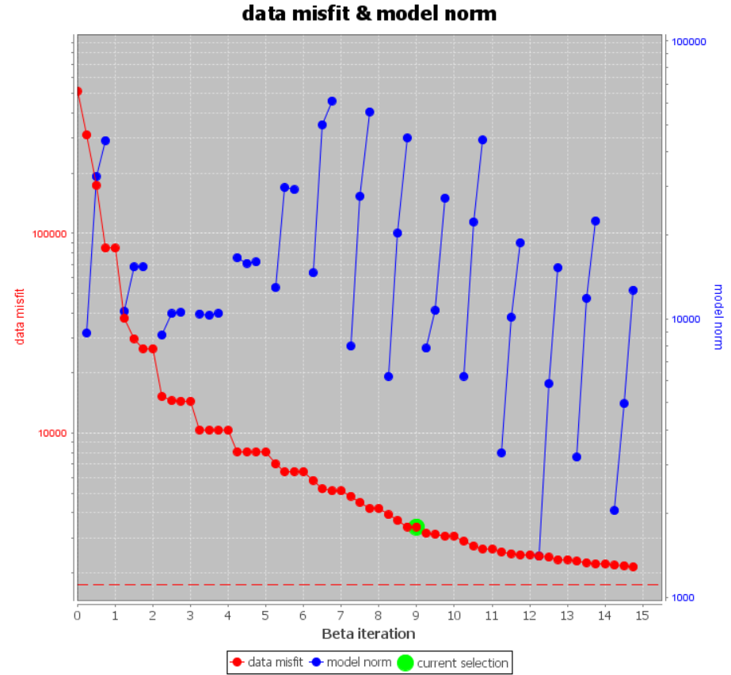
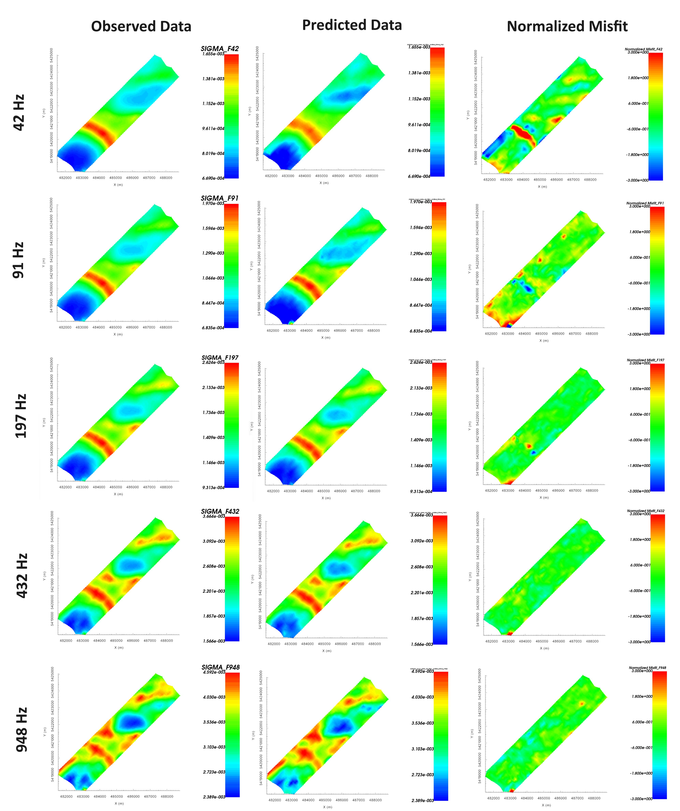
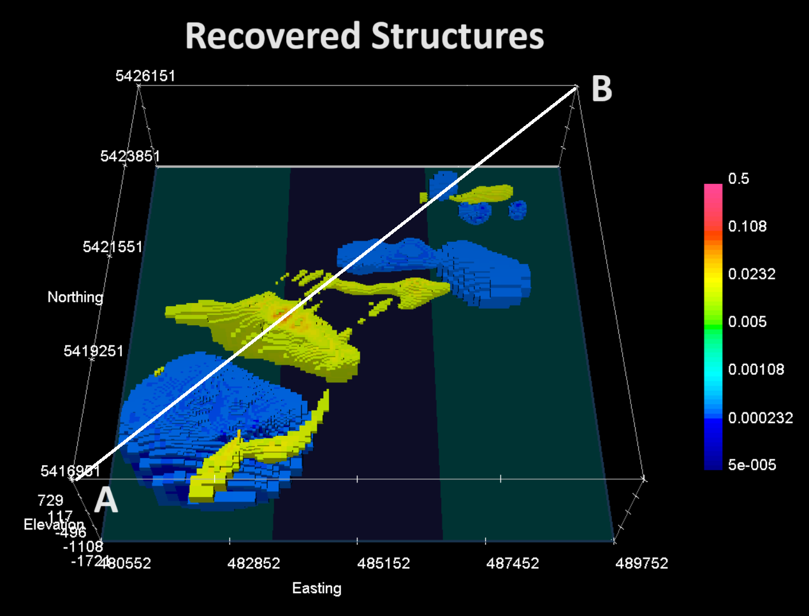
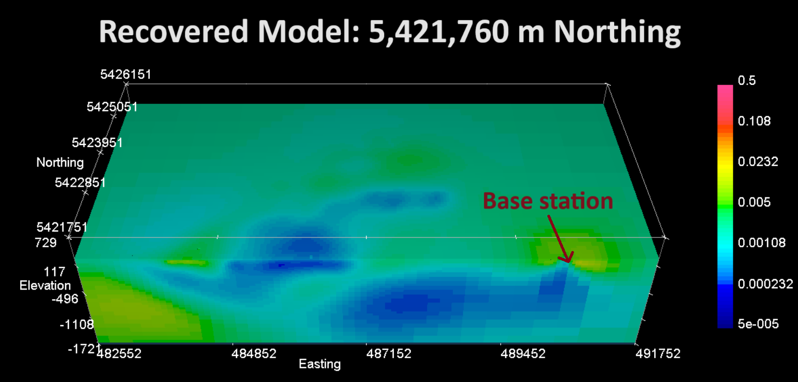
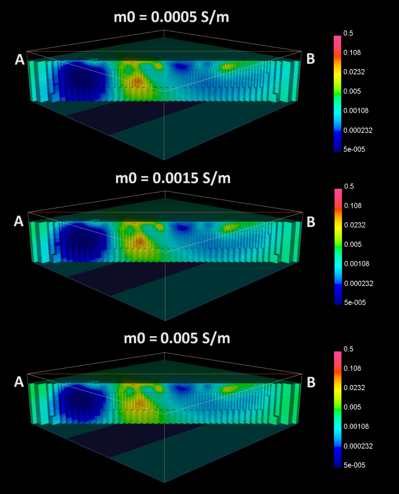

.. _comprehensive_workflow_mmt_7:

Inversion Results
=================

Here, we demonstrate a common practice for examining the output of the inversion code. This includes examining the convergence, the data misfit and the recovered model. Before looking at recovered models, the user is **strongly** urged to examine the convergence of the algorithm first (Tikhonov curve). By examining the convergence, we can:

    - see if the inversion is able to reach target misfit
    - infer whether the target misfit is reasonable; e.g. did we globally over or under-estimate the uncertainties on our data

We then assess how well a given recovered model explains the data by looking at the predicted data, observed data and normalized data misfit maps. From this we can determine whether:

    - the predicted data fits the amplitude, shape and character of observed anomalies for each component and for each frequency
    - the estimated uncertainties were reasonable for each component and for each frequency.
    - the inversion must be re-run with a new set of uncertainties

Only when the convergence and data misfit are acceptable can we infer geological structures from recovered models.

Convergence
^^^^^^^^^^^

Once the inversion has finished:

    - :ref:`View convergence <convergence_curve>`

The Tikhonov curve for our example inversion is shown below. According to the figure:

    - the inversion converges reasonably but doesn't reach target misfit (chi-factor = 0.5 in this case) after the total number of beta iterations (15).
    - the inversion reaches a chi-factor of 1 (data misfit equals number of data) somewhere between the 8th and 9th iteration. Assuming the estimate of our uncertainties is correct, the optimum recovered model should correspond to a chi-factor of 1.
    - the Tikhonov curve starts to flatten between the 7th and 10th iteration, indicating the region of the Tikhonov curve where recovered models start to over-fit the data.

Data Misfit
^^^^^^^^^^^

Now that we have selected an iteration (or range of iterations) that we feel explains the data without overfitting (e.g. 7-10):

    - :ref:`Load inversion results for these iterations <invLoadResults>`

According the Tikhonov curve, the recovered model at iteration 8 has a good change of explaining the data without fitting the noise. To be sure however, we must examine the observed data, predicted data and data misfit for the corresponding model. Here are some good questions to ask during this step:

    - Are the prominent anomaly features identified in the observed data also found in the predicted data? Is this true for all frequencies?
    - Are the ranges of normalized misfits for each frequency generally the same? If not, the uncertainties are not balanced between each frequency. In this case, new uncertainties should be applied and the inversion should be re-run.
    - Are there obvious coherent features in your normalized misfit maps? If so, this indicates you are over-fitting certain regions at the expense of others and that you must assign new uncertainties and re-run the inversion.
    

For the tutorial inversion, here are some things we noticed:

    - The general shape and amplitude of the main geophysical signatures are well reproduced by the predicted data at all frequencies.
    - Normalized misfits for the 3 highest frequencies are noticeably lower than normalized misfits for the 2 lowest frequencies, indicating the inversion is not fitting data at all frequencies evenly; i.e. under-fitting the lower frequencies.
    - Signatures in the normalized misfit maps at the 3 highest frequencies aren't particularly coherent. However, there are clearly coherent signatures in the normalized misfit map for 42 Hz and somewhat at 91 Hz.
    

For our example, better results could be obtained by increasing the global level of uncertainty for the data at the 3 highest frequencies. We may also need to adjust the uncertainties at our two lower frequencies to better fit anomalous signatures.

    Predicted data, observed data and normalized misfit for all frequencies. Predicted and observe data are plotted on the same scale. All normalized misfit maps are plotted on a range from -3 to 3.

Recovered Model
^^^^^^^^^^^^^^^

General
-------

Using **meshtools3d.exe** we plot the recovered model at the 8th iteration. Cutoffs have been used to show the margins of conductive and resistive features within the survey area. As expected, there is a large-scale resistive feature in the SW corner. There is a large NW-SE conductive feature nearer to the middle of the survey region, and a smaller NW-SE conductive feature to the NW. Finally, there is a secondary resistive structure centered at (486000, 5422500). Finally, there are some small conductive and resistive features in the NE>

    Recovered conductive and resistive structures.

Cross-section at base station
-----------------------------

Below, we plot an EW cross-section of the recovered model that bisects the base station location. As we can see, there is a doughnut-like conductive feature at the surface surrounding the base station location. And below the base station is a more resistive region. Given that MobileMT data are directly sensitive to the base station conductivity, the features recovered here may play a significant role in fitting the observed data. The extent to which these structures may impact our interpretation of the inversion result, and ways to mitigate this impact, are an area of ongoing research.

    Recovered model for EW cross-section bisecting the base station.

Inversion using different starting models
-----------------------------------------

Synthetic modeling studies have shown that the depths, margins and conductivities of recovered structures from MobileMT inversion can vary significantly based on the starting and reference model. Here, we show SW to NE cross-sections (A to B) for recovered models where 3 different conductivity were used as the starting and reference models: 0.0005 S/m, 0.0015 S/m and 0.005 S/m. In this case, the structures recovered for each of the 3 starting and reference model values is quite consistent.

    Recovered models for starting and reference models of 0.0005 S/m (top), 0.0015 S/m (middle), and 0.005 S/m (bottom). 
