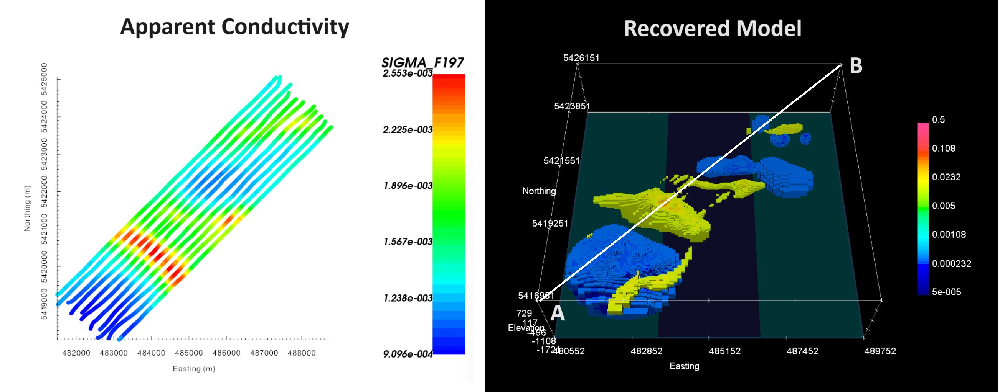

.. _comprehensive_workflow_mmt_index:

Comprehensive Workflows: MobileMT
=================================

**Author: Devin C. Cowan**

**Published: October, 2023**

Here, we present a general workflow for loading, interpreting and inverting `Expert Geophysics <https://www.expertgeophysics.com/wp-content/uploads/2020/01/EGL-MobileMT_19-08.pdf>`__ MobileMT data. We begin with CSV formatted data and local topography. Our goal is to invert the data to recover a 3D conductivity model. You may work with the tutorial dataset provided or your own data:

    - `Download the tutorial data <https://github.com/ubcgif/GIFtoolsCookbook/raw/master/assets/comprehensive_tutorial_mmt.zip>`_

The data used for this tutorial were collected at a test site near Cochrane, Ontario, Canada. We greatly appreciate Rio Tinto for providing data used to create this comprehensive workflow.

**Tutorial Sections**

.. toctree::
    :maxdepth: 1

    - Understanding MobileMT data <1_basic_anomalies>
    - Loading and visualizing Mobile MT data <2_load_data>
    - Assigning uncertainties <3_uncertainties>
    - Preparing data for inversion within the GIFtools framework <4_data_preparation>
    - Mesh design <5_mesh_design>
    - Setting appropriate parameters and running the inversion <6_inversion>
    - Examining convergence, data misfit and the recovered model <7_results>

 