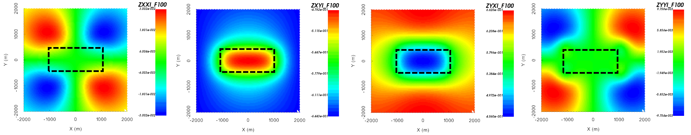
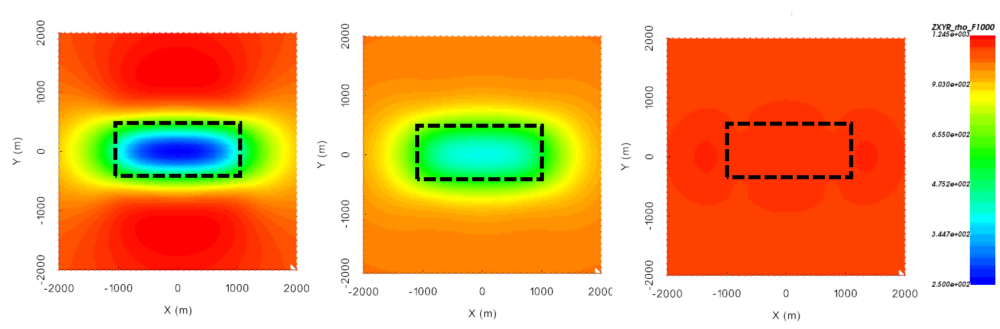

.. _comprehensive_workflow_mt_1:

Understanding MT Anomalies
==========================

In order to properly interpret magnetotelluric (MT) data, it is import to first understand the shape and characteristics of the anomalies due to basic structures. Here, we investigate the MT anomalies produced by compact conductors and resistors. The knowledge gained here can be used to determine the coordinate system and sign convention for field collected data, and the operations required to transform the raw impedance data into UBC-GIF format.

Impedance tensor (MT data) definition
-------------------------------------

The magnetotelluric technique records the horizontal components of the electric field (:math:`E_x` and :math:`E_y` ) and the horizontal components of the magnetic field (:math:`H_x` and :math:`H_y` ) at the Earth's surface. These field measurements are then used to compute a quantity which is directly dependent on the Earth's conductivity. If the Earth is a half-space, then for a plane-wave source whose electric field is polarized along the x-axis:

.. math::
	Z_{xy} = \frac{E_x}{H_y} = \sqrt{\frac{-i\omega \mu}{\sigma}}

For a 3-dimensional Earth, magnetotelluric data are defined by the **impedance tensor**. The impedance tensor can be defined using the ratios of electric and magnetic field components in both the x and y directions for 2 orthogonal plane-wave polarizations; one polarization with the electric field along the x-axis and one polarization with the electric file along the y-axis. Where the impedance tensor :math:`\mathbf{Z}` is a 2 by 2 matrix:

.. math::
    \mathbf{Z} = \mathbf{E H}^{-1}
    :label:

such that:

.. math::
    \begin{bmatrix} Z_{xx} & Z_{xy} \\ Z_{yx} & Z_{yy} \end{bmatrix} =
    \begin{bmatrix} E_{x}^{(1)} & E_{x}^{(2)} \\ E_{y}^{(1)} & E_{y}^{(2)} \end{bmatrix}
    \begin{bmatrix} H_{x}^{(1)} & H_{x}^{(2)} \\ H_{y}^{(1)} & H_{y}^{(2)} \end{bmatrix}^{-1}
    :label: impedance_tensor

and 1 and 2 refer to fields associated with plane waves polarized along two perpendicular directions.
    

.. _comprehensive_workflow_mt_1_conductor:

Impedances over a compact conductor
-----------------------------------

Let us work in the UBC-GIF data convention; where X is Northing, Y is Easting, Z is +ve downward and a :math:`-i\omega t` Fourier convention is used. The real and imaginary components of the :math:`Z_{xx}`, :math:`Z_{xy}`, :math:`Z_{yx}` and :math:`Z_{yy}` anomalies over a conductive block are shown below. The conductor is buried at a depth of 500 m. Its East-West dimension is 2000 m and its North-South dimension is 1000 m. The background conductivity is 0.001 S/m and the conductivity of the block is 0.1 S/m. If your data are in the UBC-GIF convention, then over a conductor:

	- :math:`Z_{xy}` data will be in the lower-right quadrant of the complex plane and :math:`Z_{yx}` data will be in the upper-left quadrant; unless data are collected near major 3D structures. For more detail on this, see :ref:`data conventions for MT <sign_mt_conv>`.
	- the amplitude of the :math:`Z_{xy}` and :math:`Z_{yx}` components decreases.
	- :math:`Z_{xy}` and :math:`Z_{yx}` data are sensitive to the conductor, whereas :math:`Z_{xx}` and :math:`Z_{yy}` data are only sensitive to the edges of 3D structures.

    From left to right: real component of :math:`Z_{xx}`, :math:`Z_{xy}`, :math:`Z_{yx}` and :math:`Z_{yy}` at 100 Hz over a conductor.

    From left to right: imaginary component of :math:`Z_{xx}`, :math:`Z_{xy}`, :math:`Z_{yx}` and :math:`Z_{yy}` at 100 Hz over a conductor.

.. _comprehensive_workflow_mt_1_resistor:

Impedances over a compact resistor
----------------------------------

Let us work in the UBC-GIF data convention; where X is Northing, Y is Easting, Z is +ve downward and a :math:`-i\omega t` Fourier convention is used. The real and imaginary components of the :math:`Z_{xx}`, :math:`Z_{xy}`, :math:`Z_{yx}` and :math:`Z_{yy}` anomalies over a resistive block are shown below. The resistor is buried at a depth of 500 m. Its East-West dimension is 2000 m and its North-South dimension is 1000 m. The background conductivity is 0.001 S/m and the conductivity of the block is 0.00001 S/m. If your data are in the UBC-GIF convention, then over a resistor:

	- :math:`Z_{xy}` data will be in the lower-right quadrant of the complex plane and :math:`Z_{yx}` data will be in the upper-left quadrant; unless data are collected near major 3D structures. For more detail on this, see :ref:`data conventions for MT <sign_mt_conv>`.
	- the amplitude of the :math:`Z_{xy}` and :math:`Z_{yx}` components increases.
	- :math:`Z_{xy}` and :math:`Z_{yx}` data are sensitive to the resistor, whereas :math:`Z_{xx}` and :math:`Z_{yy}` data are only sensitive to the edges of 3D structures.

    From left to right: real component of :math:`Z_{xx}`, :math:`Z_{xy}`, :math:`Z_{yx}` and :math:`Z_{yy}` at 100 Hz over a resistor.

    From left to right: imaginary component of :math:`Z_{xx}`, :math:`Z_{xy}`, :math:`Z_{yx}` and :math:`Z_{yy}` at 100 Hz over a resistor.

.. _comprehensive_workflow_mt_1_app_res:

Apparent resistivity maps and sounding curves
---------------------------------------------

Apparent resistivities are a good way to interpret MT data and they can be easily computed. From impedance tensor data, apparent resistivities can be computed using :math:`Z_{xy}` or :math:`Z_{yx}` at each frequency. The formula for computing the apparent resistivity is given by:

.. math::
	\rho_{app} = \frac{ \big | Z_{ij} \big |^{2} }{\omega \mu} \;\;\; \textrm{where} \;\;\; i \neq j

By computing apparent resistivities, you can:

	- estimate the background resistivity of your survey region
	- determine how the resistivity of an area changes with respect to depth, as different frequencies are sensitive to different depths
	- more easily identify potential conductive and/or resistive targets

Below, we show the apparent resistivities at 10 Hz, 100 Hz and 1000 Hz over both a conductor and a resistor. We see that at the highest frequency, the skin depth is small and we are not sensitive to the block. At lower frequencies, we see deeper and we become sensitive to the block. If the block is conductive, we see an anomalous decrease in apparent resistivity. And it the block is resistive, we see an anomalous increase in apparent resistivity.

    Apparent resistivities derived from :math:`Z_{xy}` at 10 Hz (left), 100 Hz (middle) and 1000 Hz (right) over a conductor.

    Apparent resistivities derived from :math:`Z_{xy}` at 10 Hz (left), 100 Hz (middle) and 1000 Hz (right) over a resistor.

MT systems collect data over a large range of frequencies. It is common to plot the apparent resistivities for a particular station as a function of frequency. This log-log plot is known as a sounding curve. An example is shown below.

At the highest frequency (smallest skin depth), the apparent resistivity is roughly 50 Ohm-meters. Between 50 Hz and 1000 Hz, we see that as we lower the frequency (and look deeper), we become more sensitive to a conductive structure. Below 50 Hz, the apparent resistivities increase as we become more sensitive to a deeper structures. Using a 1D interpretation of this sounding curve, we may assume that we have a moderately conductive surface geology about a more conductive structure which is on top of a resistivity basement. It should be noted that at lower frequencies, apparent resistivities are increasingly impacted by the effects of 3D structures.  

    Sounding curve for a single data location.

.. _comprehensive_workflow_mt_1_coordinates:

Impedance data and coordinate conventions
-----------------------------------------

Impedance data are generally defined using the **UBC-GIF convention**; X is Northing, Y is Easting and Z is +ve downward**. But what if they are not? How does this affect the shape and sign of the corresponding anomalies? We have chosen 2 examples to demonstrate the effects of the data convention. We will use the same conductive block model from earlier.

Impedance data are sometimes defined such that **X is Easting, Y is Northing and Z is +ve upward**. This is a natural way to define vector quantities but it is not the standard for impedance data. When comparing this convention with the UBC-GIF convention, you will notice that we have the same 4 data images, except the order is different. If the data columns are not labeled correctly, you will not be able to successfully invert the data with UBC-GIF codes.

There are other instances when the contractor will measure and compute the impedances for an orientation of their choosing. Below, we show the same data over a conductor in the case that **X is Northeast, Y is Southeast and Z is down**. You will notice that for the block, the anomalies line up with the Northeast and Southeast. Generally the contractor will correct these data and provide impedances in a standard coordinate system.

    Real component of :math:`Z_{xx}`, :math:`Z_{xy}`, :math:`Z_{yx}`and :math:`Z_{yy}` using **UBC-GIF convention**.

    Real component of :math:`Z_{xx}`, :math:`Z_{xy}`, :math:`Z_{yx}`and :math:`Z_{yy}` where **X is Easting, Y is Northing and Z is Up**.

    Real component of :math:`Z_{xx}`, :math:`Z_{xy}`, :math:`Z_{yx}` and :math:`Z_{yy}` where **X is Northeast, Y is Southeast and Z is down**.

.. note:: The ability to transform from the contractor's data convention to UBC-GIF convention has been built into GIFtools. We will demonstrate this in the workflow.

