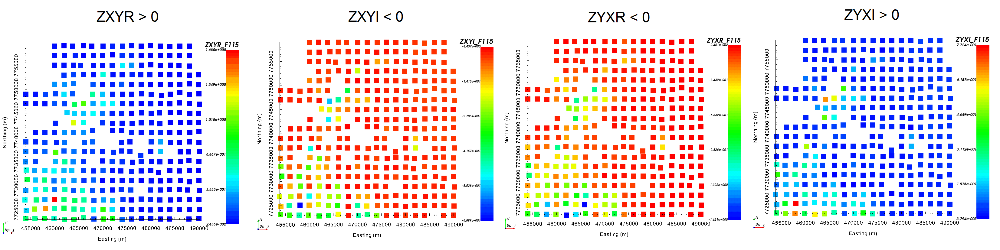

.. _comprehensive_workflow_mt_2:

.. important:: Tutorial data were acquired from a `Geoscience Australia public database <https://data.gov.au/dataset/ds-ga-b20cdc13-039f-4217-b154-9d6e01208054/details?q=>`__ . We would like to acknowledge Geoscience Australia and Geological Survey of Queensland for allowing us to use this dataset to complete the tutorial. To reduce computation time and memory requirements, we have chosen to start with a subset of the original dataset.

Loading and Transforming Field Data into GIF Convention
=======================================================

The first step in any project is to load field collected data and visualize it. Impedance data are challenging to work with for several reasons. First, they are computed by applying a non-trivial operation to the components of the measured fields. Second, impedance data are sometimes represented in a non-standard coordinate system.

Here, we will assume that you have some processed EDI formatted impedance data. The goal is to transform these data into UBC-GIF convention so that we can work within the GIFtools framework. Using contractor information and GIFtools, we will show how this is possible.

.. important:: Requires GIFtools v3.2 or later.

Starting Your Project
---------------------

    - Open GIFtools
    - :ref:`Set the working directory <projSetWorkDir>`

Import Files
------------

.. note:: If you do not have EDI formatted data from which to work with, you may `download tutorial data <https://github.com/ubcgif/GIFtoolsCookbook/raw/master/assets/comprehensive_tutorial_mt.zip>`_ . It is from this dataset that we will demonstrate the workflow.

Here, we import the impedance data and topography.

    - First, :ref:`import topography data (XYZ format) <importTopo>`. The data file is named *MTtopo.xyz*.

    - Next, :ref:`import impedance data from EDI files <importNSEMData_edi>`. For this step, you **must** know before-hand if your data are defined Northing-Easting-Down or Easting-Northing-Up. This will ensure your data columns are appropriately labeled after being loaded into GIFtools. The EDI files for the tutorial example are in the *EDIfiles* folder. If you are using the tutorial data:

        - We are loading data at 100 frequencies between 0.00034 Hz and 10400 Hz. Certain frequencies may be missing at certain stations.
        - You can choose to load all variables. But for this example you only need: FREQ, ZROT, ZXXR, ZXXI, ZXYR, ZXYI, ZYXR, ZYXI, ZYYR and ZYYI.
        - You assume the data are in UBC-GIF convention.

    - Once loaded, make sure to :ref:`set IO headers <objectSetioHeaders>` for all impedance data columns.

    - **Pro tip:** To avoid confusion between location and data coordinate systems, use the :ref:`set data headers <objectDataHeaders>` tool to define location columns as *Easting, Northing* and *Elevation*.

Asserting Data are in UBC-GIF Convention
----------------------------------------

Now that we have loaded the data and set the IO headers, we can take a first look at our data. Here, we determine if the impedance data are in UBC-GIF format. If not, we must apply the appropriate transformation.

From the :ref:`understanding anomalies section <comprehensive_workflow_mt_1>`, we know that UBC-GIF formatted impedance data has :math:`Z_{xy}` and :math:`Z_{yx}` values located in the lower-right and upper-left quadrants of the complex plane, respectively. So the first step is to examine the real and imaginary components of :math:`Z_{xy}` and :math:`Z_{yx}`. We suggest carrying out the analysis at frequencies between 10 Hz and 1000 Hz. Here are some things to consider:

    - If the sign of the real and imaginary components of :math:`Z_{xy}` are the same (also for :math:`Z_{yx}`), then your data are currently in a :math:`+i\omega t` Fourier convention. To fix this, you must multiply the ZXXI, ZXYI, ZYXI and ZYYI columns by -1. This can be done with the :ref:`basic calculator <objectCalculator>`.
    - If :math:`Z_{xy}` and :math:`Z_{yx}` values are **not** located in the appropriate quadrants of the complex plane, you chose the wrong *change of coordinates option* when :ref:`importing EDI standard MT data <importNSEMData_edi>`. In this case, it is better to re-import the data using the correct option. 

Below, we see the real and imaginary components of :math:`Z_{xy}` and :math:`Z_{yx}` at 115 Hz for our tutorial data set. According to the plots, :math:`Z_{xy}` and :math:`Z_{yx}` values are located in the lower-right and upper-left quadrants of the complex plane, respectively. This means they are in UBC-GIF format and we can move to the next step.

    From left to right: ZXYR, ZXYI, ZYXR and ZYXI at 115 Hz.

Rotating Impedance Tensor Data
------------------------------

It is standard practice for contractors to provide impedance data defined in the Easting and Northing directions or visa versa. This is true even if the electric and magnetic fields themselves were not measured along the Easting and Northing directions. So long as the horizontal fields were each measured along 2 orthogonal directions, you can transform the impedance tensor data into an Easting-Northing-Up or Northing-Easting-Down convention. This step is generally carried out by the contractor during initial data processing.

In rare instances, the impedance data may be provided by the contractor where X and Y are defined along two arbitrary (but orthogonal) directions. You may also choose to represent the impedance data this way to highlight certain geological features.

Once loaded into GIFtools, you can rotate the impedance tensor data using built-in functionality:

    - :ref:`Rotate impedance tensor <objectDataManipulationMT_rotate>`

**Example:** Let's assume that your data are in UBC-GIF format, but X is defined towards the Southeast (bearing 135 degrees from North), Y is defined towards the Southwest (90 degrees clockwise from X) and Z is positive downward. To rotate your data such that X = Northing, Y = Easting and Z = down, you would apply a rotation of -135 degrees.

.. note:: The dataset used for this tutorial did not need to undergo a rotation.
