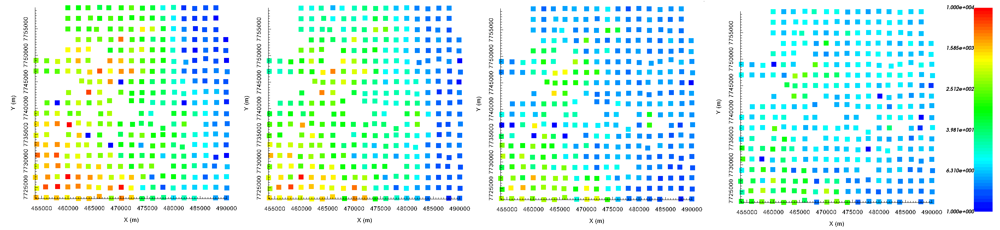
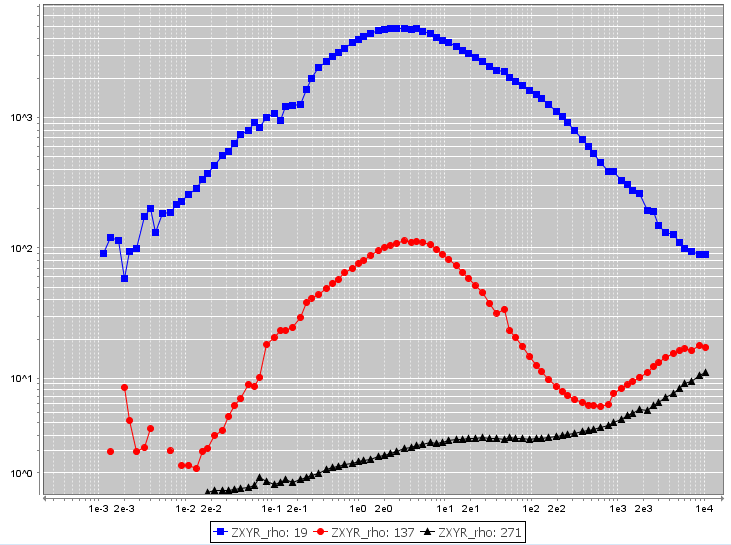

.. _comprehensive_workflow_mt_3:

Apparent Resistivities and Data Preparation
===========================================

At this point, we assume the data are loaded into GIFtools and that our impedance tensor values are defined in the standard UBC-GIF convention. It is difficult to gain information about the Earth's electrical resistivity from impedances. That is why the initial interpretation of the data is generally done using apparent resistivities. We will provide a basic interpretation for our tutorial data set.

When looking at your data for the first time, you will notice that 1) you have data at many frequencies, and 2) the range of frequencies spans many orders of magnitude. For the tutorial data set, we have data at 100 frequencies from 0.00034 Hz to 10400 Hz. It is impossible to invert all of the data at once. As a result, we must extract a reasonable set of frequencies that are sensitive to the target. We will discuss this here.

Examining Apparent Resistivities
--------------------------------

**Computing apparent resistivities**

If you have :ref:`set IO headers <objectSetioHeaders>` for the impedance data, it is easy to compute apparent resistivities. Apparent resistivities can be used to estimate the background conductivity and verify that the units of your impedances are correct. If your impedance data are not in the correct units, the range of values for the apparent resistivities will not be reasonable. To use this functionality:

    - :ref:`Compute apparent resistivities from impedances <objectDataManipulationMT_IMP2APP>`

**Interpreting apparent resistivity maps**

Below, we see the apparent resistivity maps obtained from the :math:`Z_{xy}` component at 2.03 Hz, 22.5 Hz, 229 Hz and 2200 Hz. The range of apparent resistivity values is reasonable (1 :math:`\Omega m` - 10000 :math:`\Omega m` ), indicating the impedance data are likely represented in the correct units for UBC-GIF codes. The maps indicate:

	- the near surface is conductive (inferred from high frequencies)
	- at depth, the Earth is resistive towards the Southwest and conductive in the East
	- nearly identical signatures were observed in the apparent resistivities computed from the :math:`Z_{yx}` component

    From left to right: apparent resistivity maps obtained from the :math:`Z_{xy}` component at 2.03 Hz, 22.5 Hz, 229 Hz and 2200 Hz.

**Interpreting sounding curves**

Below, we see sounding curves for the apparent resistivities computed from the :math:`Z_{xy}` component. We observe that:

	- In the Southwest, the Earth is more conductive near the surface and more resistive at depth
	- In the East, the Earth is more conductive at depth and less conductive at the surface
	- the Earth is generally more resistive towards the Southwest
	- at low frequencies, it is difficult to make an interpretation, as the data are more contaminated by 3D effects

    Sounding curves for 3 locations: Northeast (black), center (red) and Southwest (blue).

Frequency-Based Extraction
--------------------------

Because we cannot invert the data at all frequencies, we must decide which frequencies are sensitive to the target. Furthermore, we generally don't need all of the frequencies within our chosen range. To reduce computational demand, we extract and invert the data at a select set of frequencies. Some things we may consider during this step:

	- Assume the target is a compact conductor/resistor. We have inferred its horizontal position from apparent resistivity maps or prior knowledge. We can look at the sounding curves over the potential target to determine which frequencies are sensitive.
	- We want to learn about the basement geology and the near surface geology is well-constrained. We should use low frequencies.

Using GIFtools, we can extract data at a subset of the total range of frequencies. To do this:

	- :ref:`Frequency-based extraction of data<objectTimeFreqExtract>`

For the tutorial data, we extracted the data at 4 logarithmically spaced frequencies from 2.34 Hz to 460 Hz.

.. important:: As a general rule, our extracted data should be at frequencies that span a maximum of 3 orders of magnitude. This ensures the smallest cells in the mesh can adequately model the highest frequency. And ensures we can create a large enough mesh adequately model the lowest frequency.

Defining Receivers
------------------

E3DMT v1 models the electric and magnetic fields at discrete points whereas E3DMT v2 allows the user to define the receivers. If you intend to invert data with E3DMT v2, this step is required. To define the electric and magnetic field receivers, we use the following functionality:

	- :ref:`Set/reset receivers from data locations<objectDataTypeMT_snid>`

**Our approach:**

According to the contractor, the electric field dipoles had lengths of 100 m. Phoenix MTC‐150L coils were used to measure the magnetic fields. Receivers measuring the magnetic fields are much smaller than the cell dimensions being used to model the fields. If the contractor does not provide you with the coil receiver's dimensions, you may choose a value such as 1 m or 4 m. We used the following parameters to fill the fields:

	- **Hx, Hy receiver width: 4 m**
	- **Hx, Hy number of segments: 4**
	- **Ex, Ey receiver length: 100 m**
	- **Ex, Ey number of segments: 4**
	- **Orientation from Nothing (deg): 0** (since data are defined Northing-Easting-Down)

.. note:: If the loop receivers are square, choose the number of segments to be 4. GIFtools will define the loop as a square with side length equal to the value specified.
