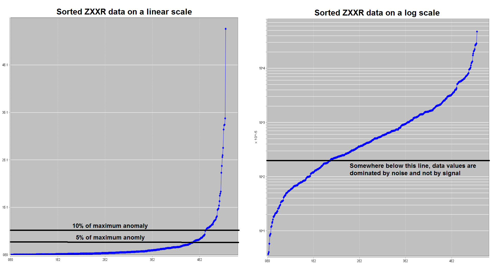

.. _comprehensive_workflow_mt_4:

Assigning Uncertainties
=======================

Here, we provide a basic approach for assigning uncertainties to impedance data. The role of uncertainties in geophysical inversion is presented in the :ref:`fundamentals of inversion <Fundamentals_Uncertainties>`. When assigning uncertainties, we want to ensure we fit the anomaly and not the background. We also want to ensure we fit each component and frequency equally.

To examine sorted data and apply uncertainties:

    - Use the :ref:`GUI for applying frequency-dependent uncertainties <objectAssignUncertGUI>`.

Percent Versus Floor Uncertainty
--------------------------------

**Off-Diagonal Impedances (ZXYR, ZXYI, ZYXR and ZYXI):**

For off-diagonal impedance tensor data (ZXYR, ZXYI, ZYXR and ZYXI), the range of data values is significantly different for each component and for each frequency. In general:

    - impedances at higher frequencies are larger in magnitude than impedances observed at lower frequencies.
    - for an individual component, the data can span multiple orders of magnitude.
    - off-diagonal impedance data values are non-zero unless there is significant 3D structure effects.

Therefore **the uncertainties applied to off-diagonal impedance data should be dominated by a percent**; as opposed to a floor which assigns equal uncertainty to all data values.

Since the magnitude of the data is frequency-dependent, it is obvious we much assign frequency-dependent uncertainties. But what about balancing the uncertainties between each component? For this, we consider the apparent resistivity formula:

.. math::
    \rho_{app} = \frac{ \big | Z_{ij} \big |^{2} }{\omega \mu} \;\;\; \textrm{where} \;\;\; i \neq j

For a given frequency, this formula states that small :math:`Z_{xy}` and small :math:`Z_{yx}` values correspond to small apparent resistivities. So if you apply only a floor uncertainty to the impedance data, you would be over-fitting resistive structures and under-fitting conductive structures.

**Diagonal Impedances (ZXXR, ZXXI, ZYYR and ZYYI):**

Diagonal impedances are impacted by 3D effects. In the absence of 3D effects, the diagonal impedances are theoretically equal to zero. If you were to apply only a percent uncertainty to the data, you would over-fit the background values and under-fit the anomalies. Therefore, **the uncertainties applied to diagonal impedance data should be dominated by a floor**. For simple geologies:

    - ZXXR, ZXXI, ZYYR and ZYYI data at a particular frequency may or may not span the same range of values. If not, you may need to apply a different floor to each component and/or frequency.

.. note:: When the inversion is complete, we will be able to assess whether the estimated uncertainties on our data were correct. If not, the inversion will need to be re-run with a new set of uncertainties.

General Approach
----------------

**Off-Diagonal Impedances (ZXYR, ZXYI, ZYXR and ZYXI):**

It is common to apply uncertainties of 5% - 10% as a first estimate. You may choose to apply higher or lower percentages to different frequencies if you believe the data are more or less noisy, respectively. We may also add a very small floor to the uncertainties in the rare case there are data approximately equal to zero.

**Diagonal Impedances (ZXXR, ZXXI, ZYYR and ZYYI):**

There are a few options for choosing the floor uncertainty values for each component at each frequency:

    1) The user may take some fractional percents of the largest anomalous value and use that as the floor.
    2) The user may sort the data by absolute value, and choose a threshold at which the data values contain an insignificant amount of signal and are dominated by noise.

Since the diagonal impedances do less to constrain the inversion result than the off-diagonal components, it is best to over-estimate the uncertainties for ZXXR, ZXXI, ZYYR and ZYYI rather than to under-estimate the uncertainties. To ensure that off-diagonal impedances are driving the inversion, sometimes very large uncertainties are applied to the diagonal impedances.

    Option 1 for choosing uncertainties (left). Option 2 for choosing uncertainties (right).

Uncertainties for Tutorial Data
-------------------------------

**Off-Diagonal Impedances (ZXYR, ZXYI, ZYXR and ZYXI):**

For off-diagonal impedance components, we applied both a percent and a floor. For all components and for all frequencies, the percent uncertainty was 10%. Choosing a floor was more involved.

From the higher frequency data, we saw significant fluctuations in the apparent resistivities corresponding to the near-surface. We felt that the uncertainty in the apparent resistivities was roughly 1 :math:`\Omega m`. To convert this to impedances, we used the apparent resistivity formula. So for each frequency, the floor is given by:

.. math::
    \varepsilon (f) = \sqrt{2\pi \mu f (1 \Omega m)}

This resulted in floor uncertainties of: 0.0043, 0.01, 0.025 and 0.06 V/A. Essentially, the floor uncertainties ensures we do not try to fit the fluctuations in the very high conductivities which are likely at the Earth's surface.

When inverting these data for the first time, we did not apply this floor. We found that our inversion did not converge, we over-fit the near surface and we did not recover resistive structures very well.

**Diagonal Impedances (ZXXR, ZXXI, ZYYR and ZYYI):**

For diagonal impedance components, we applied a floor uncertainty equal to 5% the maximum value. This was done separately for each component and for each frequency.

**Erroneous Data:**

In both the diagonal and off-diagonal components, there were obvious erroneous data. To keep the tutorial simple, we did not address this. As a result, we will likely over-fit these data values. In practice, you make choose to remove the erroneous data or individually apply a very large uncertainty to them. To switch an individual datum to NaN or to assign a large uncertainty, you can manually edit each datum though:

    - :ref:`Table viewer <viewData_table>`

