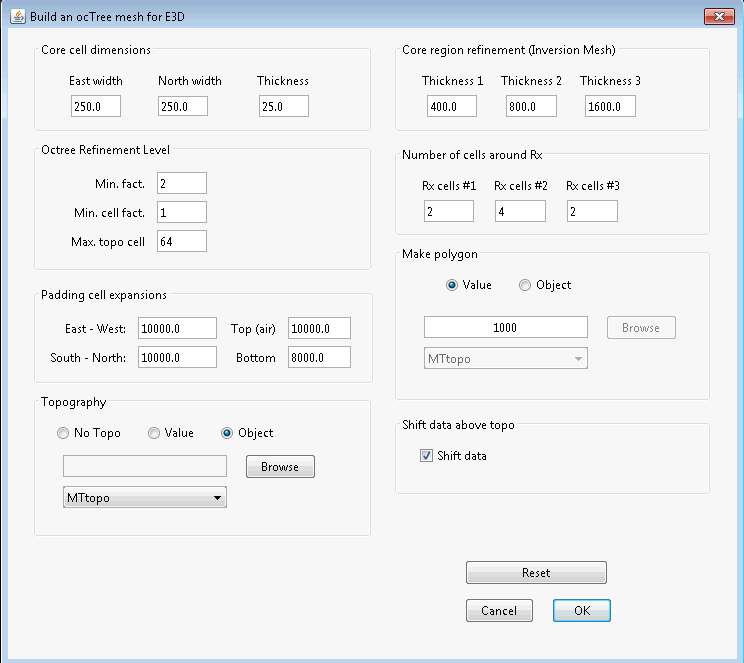

.. _comprehensive_workflow_mt_5:

Mesh Design
===========

Here we provide a basic approach for mesh design when inverting MT data. The field data provided was collected in a region with minimal topography. However, we will complete this step assuming we must account for significant topography.

Skin Depth
^^^^^^^^^^

For frequency-domain data, an important step is to compute the minimum and maximum skin depth for the data you want to invert; e.g. the data sensitive to structures you would like to recover. The skin depth depends on frequency and the electrical resistivity/conductivity:

.. math::
	\delta \approx 500 \sqrt{\frac{\rho}{f}} = 500 \sqrt{\frac{1}{\sigma f}}

The background resistivity can be obtained from the apparent resistivity maps and sounding curves.

**Our Approach:**

According to the apparent resistivity maps and sounding curves, the Earth is fairly conductive. Over the range of frequencies we are inverting, we estimated a background resistivity of 20 :math:`\Omega m`. From the skin depth formula:

	- :math:`\delta_{min}` = 104 m
	- :math:`\delta_{max}` = 1462 m

Create Mesh
^^^^^^^^^^^

Here, we explain how to create an OcTree mesh based on MT survey geometry. We also explain the reasoning for the parameter values entered. We can create OcTree meshes from MT surveys with the following utilities:

	- :ref:`create OcTree mesh with E3DMT utilities <createE3DMToctreeMesh>`
	- :ref:`create OcTree mesh with E3DMT v2 utilities <createE3DMTv2octreeMesh>`

Once you have created the object, complete the following steps:

	1) Set the data object corresponding to the survey
	2) Define the mesh using *Edit Options*
	3) Run the utility
	4) Load results

For the field data provided, we chose to create the mesh using E3DMT v2 utilities. This was done because we are able to define the dipole and loop receivers. The parameters set in *Edit Options* are shown below along with reasoning for several important choices. For definitions of the parameters, consult the `E3DMT <https://e3dmt.readthedocs.io/en/e3dmt/content/inputfiles/createOcTree.html>`__ or `E3DMT v2 <https://e3dmt.readthedocs.io/en/e3dmt_v2/content/inputfiles/createOcTree.html>`__ manual.

    Parameters used to define the mesh for the field dataset using E3DMT v2 mesh utility.

**Minimum cell width (vertical):** The minimum vertical cell width is determined primarily by the smallest skin depth. If the topography is flat and the geology is relatively simple, the minimum vertical cell width can be roughly 10%-20% the minimum skin depth. For the tutorial data set, a minimum vertical cell width of 25 m was chosen.

**Minimum cell width (horizontal):** The minimum horizontal cell width is usually determined by the station spacing. It is good to have a least 3 cells between each station. For the tutorial data, the station spacing is roughly 2 km. Since the source is a vertically propagating plane-wave, we can discretize much more coarsely in the horizontal than in the vertical. However there are limits to this. To balance mesh size and ensure we model the fields correctly, we chose a minimum horizontal cell width of 250 m. 

**Max. topo cell:** Even if the topography is significant, we do not want to over-discretize in regions far away from the survey, as the fields there do not greatly impact the data. As a result, this parameter was set to a larger number. If you want to more finely discretize the topography, set this to 8, 4, or even 2. E3DMT v1 does not have this option.

**Padding cell expansions:** The extent of the mesh depends on the largest skin depth. The mesh should extend 2-3 times the largest skin depths from the survey region in all directions. Because OcTree meshes pad out so effectively, setting this to be very large does not add many additional cells.

**Core region discretization:** *Thickness 1 *should be used to discretize the region sensitive to the highest frequencies (2-3 smallest skin depths). *Thickness 2* and *3* should be used to discretize the additional regions sensitive to he lower frequencies. *Thickness 1 + Thickness 2 + Thickness 3* should be roughly equal to at least 1 largest skin depth.

**Number of cells around Rx:** The number of fine mesh cells near receivers does need to be as large for natural source EM modeling as is does for controlled source EM modeling. Fields associated with natural sources are are much smoother. You can make the mesh a much more reasonable size by taking advantage of this, however sufficient discretization is still required to model the fields accurately.

**Make polygon:** For UBC-GIF v2 codes, this parameter controls the horizontal extent of the core mesh region. In practice, this should be 1-2 times the smallest skin depth.

**Shift data:** We chose to shift the data locations so that receivers lie on the discretized topography. If you fail to do this, you may be measuring electric fields in the air. **See important notices below**.

.. important:: If you choose to *shift data* for E3DMT v2 utilities, the mesh utility will create a receivers file. When loading output, a new data object is created under the mesh utility. All the receivers are organized to measure the fields at the appropriate places. But if you are concerned, you can repeat the steps in the :ref:`data preparation section <comprehensive_workflow_mt_4>` .
