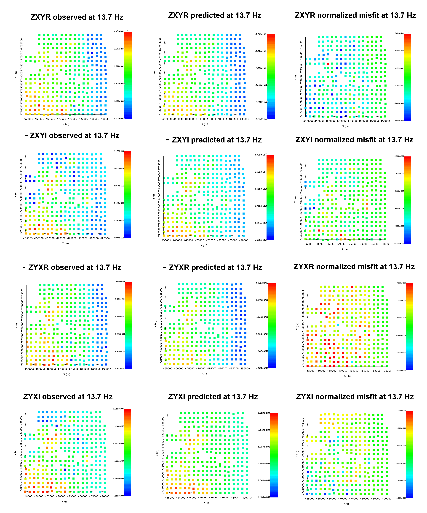
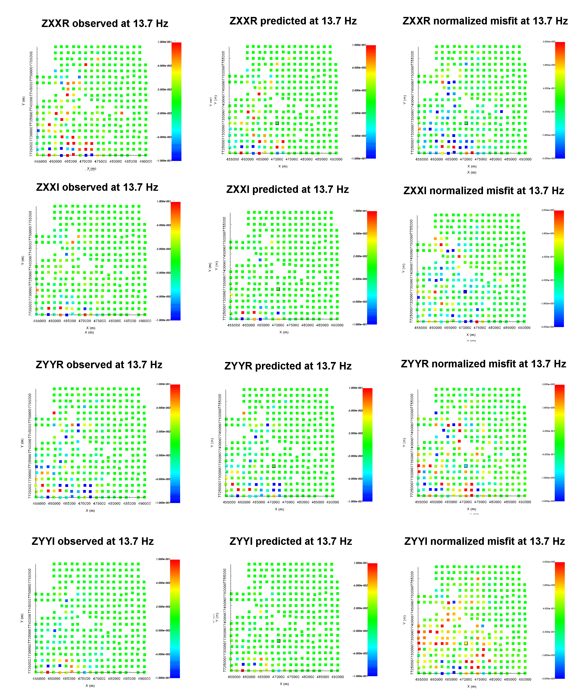
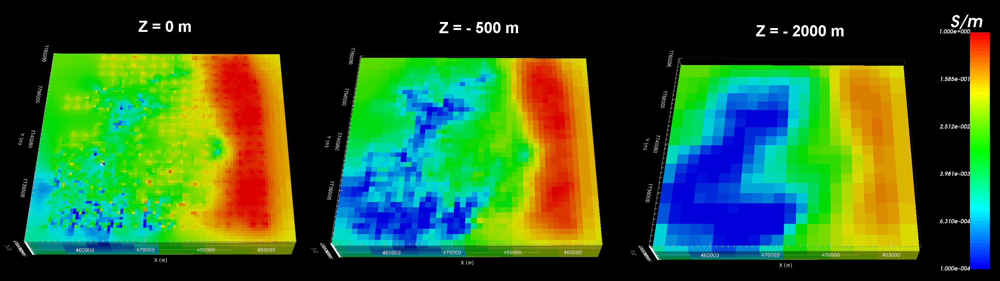

.. _comprehensive_workflow_mt_7:

Inversion Results
=================

Here, we demonstrate a common practice for examining the output of the inversion code. This includes examining the convergence, the data misfit and the recovered model. Before looking at recovered models, the user is **strongly** urged to examine the convergence of the algorithm first (Tikhonov curve). By examining the convergence, we can:

	- determine if our data is in UBC-GIF data convention. The data misfit will be large and will not reduce at each iteration otherwise.
	- see if the inversion is able to reach target misfit
	- infer whether the target misfit is reasonable; i.e. did we globally over or under-estimate the uncertainties on our data

We then assess how well a given recovered model explains the data by looking at the predicted data, observed data and normalized data misfit maps for a given iteration. From this we can determine whether:

	- the predicted data fits the amplitude, shape and character of observed anomalies for each component and for each frequency
	- the estimated uncertainties were reasonable for each component and for each frequency.
	- the inversion must be re-run with a new set of uncertainties

Only when the convergence and data misfit are acceptable can we infer geological structures from recovered models.

Convergence
^^^^^^^^^^^

Once the inversion has finished:

	- :ref:`View convergence <convergence_curve>`

The Tikhonov curve for our tutorial inversion is shown below. According to the figure:

	- the inversion reaches target misfit (chi-factor = 1 in this case) after 6 iterations. Thus the algorithm is converging over the course of the beta cooling schedule.
	- the Tikhonov curve starts to flatten out at the 4th iteration, indicating the point on the Tikhonov curve after which recovered models start to over-fit the data.
	- Globally, we have likely under-estimated the uncertainties on our data. Or, most likely, we should have removed any erroneous data values.

.. figure:: images/convergence.png
    :align: center
    :width: 500

Data Misfit
^^^^^^^^^^^

Now that we have selected an iteration (or range of iterations) that we feel explains the data without overfitting:

    - :ref:`Load inversion results for these iterations <invLoadResults>`

According the Tikhonov curve, the recovered model at iteration 4 has a good chance of explaining the data without fitting the noise. To be sure however, we must examine the observed data, predicted data and data misfit for the corresponding model. Here are some good questions to ask during this step:

	- Are the prominent anomaly features identified in the observed data also found in the predicted data? Is this true for all components and for all frequencies?
	- Are there obvious coherent features in the normalized misfit maps? If so, this indicates you are over-fitting certain regions at the expense of others and that you must assign new uncertainties and re-run the inversion.
	- Are the ranges of normalized misfits for each component and for each frequency generally the same? If not, the uncertainties are not balanced between components and/or frequencies. In this case, new uncertainties should be applied and the inversion should be re-run.

**Off-Diagonal Components:**

The observed data, predicted data and normalized misfits for off-diagonal impedance data are shown below at 13.7 Hz. We plotted -ZXYI and -ZYXR so that we could plot the values on a log scale. From these plots, and plots at other frequencies, we found that:

	- Predicted data generally reproduce the main features seen in the observed data. However, we did not fit localized small impedance values because the uncertainties on those data were set fairly high (see ZXYI plot below).
	- With some exceptions (ZYXR at 13.7 Hz for example), the range of normalized misfits is more or less the same for all off-diagonal components and for all frequencies.
	- Most of the normalized misfit maps do not show coherent structures.
	- By trying to fit erroneous data values, we likely under-fit the data in other areas.

    Observed data, predicted data and normalized misfit for all off-diagonal impedance components at 13.7 Hz. For each component, predicted and observe data are plotted on the same scale. All normalized misfit maps are plotted on a range from -3 to 3.

**Diagonal Components:**

The observed data, predicted data and normalized misfits for diagonal impedance data are shown below at 13.7 Hz. From these plots, and plots at other frequencies, we found that:

	- The predicted data explains most, but not all, of the large diagonal impedances.
	- With some exceptions (ZXXR at 2.34 Hz for example), the range of normalized misfits is more or less the same for all diagonal components and for all frequencies.
	- Most of the normalized misfit maps do not show coherent structures.
	- Uncertainties were set to prioritize fitting the off-diagonal components. Thus, we generally have a poorer fit of the diagonal components and smaller misfits.

    Observed data, predicted data and normalized misfit for all diagonal impedance components at 13.7 Hz. For each component, predicted and observe data are plotted on the same scale (-0.1 - 0.1). All normalized misfit maps are plotted on a range from -3 to 3.

Recovered Model
^^^^^^^^^^^^^^^

The conductivity model recovered at the 4th iteration is shown below at 3 depths. According to the recovered model:

	- We can see some pixelation in the recovered model right at the surface. This could be because insufficient interface weighting was applied. It could also be due to the inversion trying to fit erroneous data.
	- There is a large conductive structure in the East which extends to depth.
	- The near surface conductivity is highly variable but is generally fairly conductive.
	- In the West, there is a large resistive structure at depth.

    Recovered model at iteration 4.

