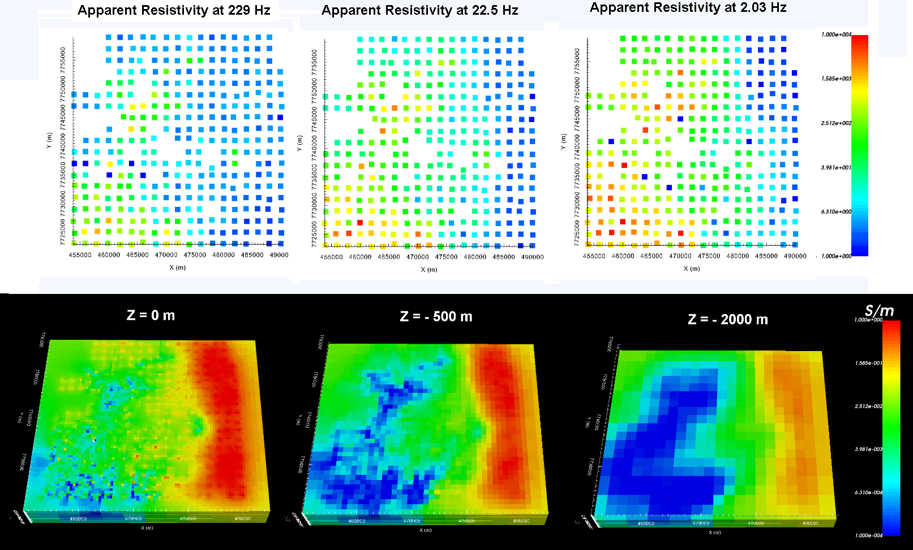

.. _comprehensive_workflow_mt_index:

Comprehensive Workflows: Magnetotellurics
=========================================

**Author: Devin C. Cowan**

**Published: March, 2020**

Here, we present a general workflow for loading, interpreting and inverting magnetotelluric (MT) data. We begin with MT data in EMAP standard EDI file format. Our goal is to invert the data to recover a 3D conductivity model. You may work with the tutorial dataset provided or your own data:

    - `Download the tutorial data <https://github.com/ubcgif/GIFtoolsCookbook/raw/master/assets/comprehensive_tutorial_mt.zip>`_

These data were acquired from a `Geoscience Australia public database <https://data.gov.au/dataset/ds-ga-b20cdc13-039f-4217-b154-9d6e01208054/details?q=>`__ . We would like to acknowledge Geoscience Australia and Geological Survey of Queensland for allowing us to use this dataset to complete the tutorial. To reduce computation time and memory requirements, we have chosen to start with a subset of the original dataset.

**Tutorial Sections**

.. toctree::
    :maxdepth: 1

    - Understanding MT anomalies <1_basic_anomalies>
    - Loading geophysical data and ascertaining if it is in GIF convention <2_load_data>
    - Preparing data for inversion within the GIFtools framework <3_data_preparation>
    - Standard assignment of uncertainties to MT data <4_uncertainties>
    - Mesh design <5_mesh_design>
    - Setting appropriate parameters and running the inversion <6_inversion>
    - Examining convergence, data misfit and the recovered model <7_results>

 