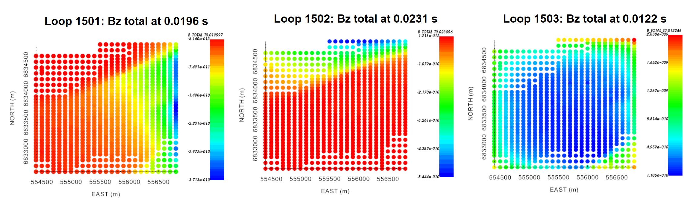

.. _comprehensive_workflow_utem_2:

.. include:: <isonum.txt>

Loading UTEM Data
=================

The first step in any project is to load field collected data and visualize it. UTEM data are challenging to work with for several reasons. First, the data may be provided using on of many representations: B, dB/dt, primary reduced, channel reduced, etc... Second, we must appropriately account for the primary field. And third, the waveform and/or data locations associated with each source loop may be different. 

Here, we load UTEM data into GIFtools. And if the data are B-field or dB/dt measurements, we then ensure the units are consistent with those required by GIFtools. **The tutorial UTEM data** are total B-field measurements within AMIRA TEM files.

.. important:: Requires GIFtools v3.2 or later.

Starting Your Project
---------------------

    - Open GIFtools
    - :ref:`Set the working directory <projSetWorkDir>`

Import Files
------------

.. note:: If you do not have AMIRA TEM formatted data from which to work with, you may `download the tutorial data <https://github.com/ubcgif/GIFtoolsCookbook/raw/master/assets/comprehensive_tutorial_utem.zip>`_ . It is from this dataset that we will demonstrate the workflow.

Here, we import the UTEM data and topography. These can be imported from the *assets* folder. We assume the data corresponding to each transmitter loop is stored within a separate file.

    - First, :ref:`import topography data (XYZ format) <importTopo>`. The data file is named *topo_local.xyz*.

    - For each transmitter loop, use **Create** |rarr| **Folder** within GIFtools to keep track of things. Name each folder according to the loop ID. In our case, we have *Loop_1501, Loop_1502* and *Loop_1503*.

    - To import the UTEM data for each loop, **first** select the corresponding folder. Then:

        - If your data are stored within AMIRA TEM files, :ref:`import AMIRA TEM file <importAMIRATEM>` to *TEM3Dsounding* object. **For the tutorial data**, the name of each TEM file has the form *Loop_150x_nT_90.tem*.

        - If your data are stored within XYZ files, use :ref:`import XYZ file <importXYZemData>` to *TEM3Dsounding* object

.. note:: **For the tutorial data,** we renamed each of the loaded data objects to keep track of subsequent processing steps more easily. Our names contained the loop number and directional component (e.g. *Loop_1501_X*).

Units and Normalization
-----------------------

B-field or dB/dt Data
^^^^^^^^^^^^^^^^^^^^^

If UTEM data are provided as B-field or dB/dt measurements, we must ensure the units are compatible with GIFtools and the UBC-GIF codes. Within the UBC-GIF framework, time channels are represented in seconds, B-field TEM data are represented in Teslas, and dB/dt data are represented in T/s. We must also ensure B or dB/dt data for each transmitter has been normalized by the current waveform amplitude. And in the case of dB/dt data, we must convert to the corresponding B-field representation; required for removing primary signal from total field data.

For your dataset, carry out the following steps **if necessary** for all data objects:

    - convert time channel column values to seconds using the :ref:`column calculator <objectCalculator>`
    - convert B-field data to Teslas or dB/dt data to T/s using the :ref:`column calculator <objectCalculator>`
    - normalize by the corresponding transmitter waveform amplitude using the :ref:`column calculator <objectCalculator>`
    - if converting from dB/dt to B-field, multiply the data by T/4 where T is the period of the waveform. The explanation for this can be found in the :ref:`understanding anomalies section <comprehensive_workflow_utem_1>`.

.. note:: It will be important to keep track of what each data column represents as we move through the tutorial. When modifying each data object, we suggest keeping the original data column intact, creating a new column for the final values and calling this new column 'B_TOTAL'. 

**For the tutorial dataset**, the time channels were provided in *ms*, UTEM data were provided as B-field measurements using units of *nT* and the data were not previously normalized by the transmitter waveform amplitude. As a result, we applied the following operations:

    - converted the time channels column from ms to seconds; i.e. multiply by 0.001
    - converted the data values from nT to Teslas; i.e. multiply by 1e-9.
    - normalized the data values by the transmitter waveform amplitude. In our case:

        - Loop 1501: 6.012 A
        - Loop 1502: 5.531 A
        - Loop 1503: 4.460 A

Below, we :ref:`plot <viewData>` the vertical component of the total B-field for each of our receiver loops. According to our data:

    - Data were collected at the same locations for all 3 transmitter loops. But data for each loop was collect at different time channels. This is common for surface UTEM surveys. Provided the period of the transmitter waveforms are sufficiently different, data for multiple transmitter loops can be collected simultaneously then separated using digital signal processing techniques.
    - Signatures in the data are greatly impacted by the primary field. Recall that UTEM instruments measure fields during the on-time. To interpret the response from any conductive targets, we will need to remove the primary field.
    - Loop 1501 lies to the East of the receiver locations, loop 1502 lies to the North, and loop 1503 surrounds the receiver locations. 

    Vertical component of the total B-field for all transmitter loops at times near 0.01 s.

Standard UTEM Data Representations
^^^^^^^^^^^^^^^^^^^^^^^^^^^^^^^^^^

UTEM data are frequently provided as primary reduced, channel reduced or primary normalized data. Since these data representations require normalizing by the primary field, we simply need to ensure that the time channel values are in seconds. The conversion to actual field values is discussed in the following section.

