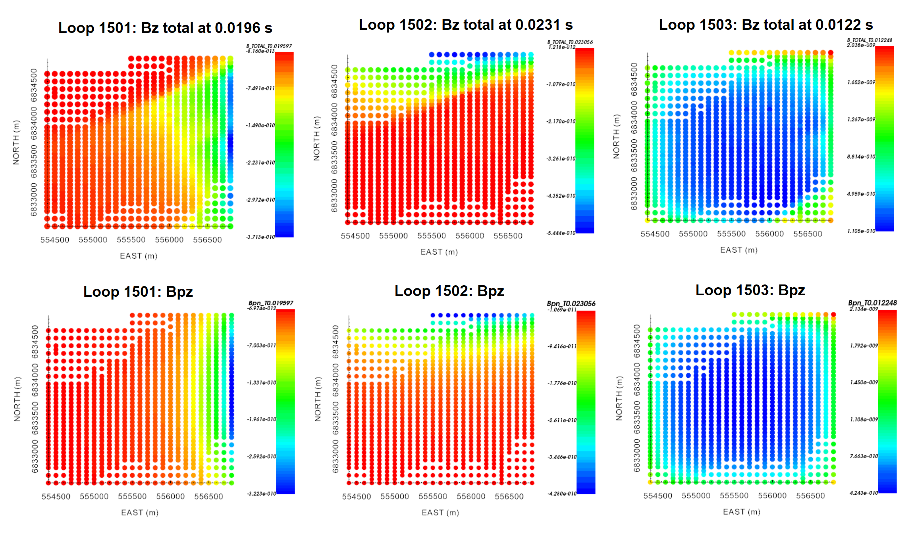
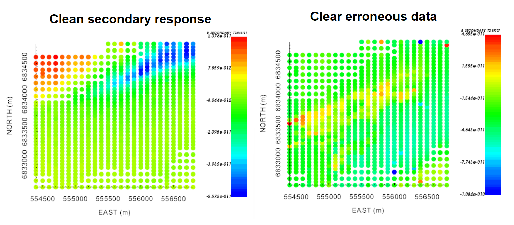
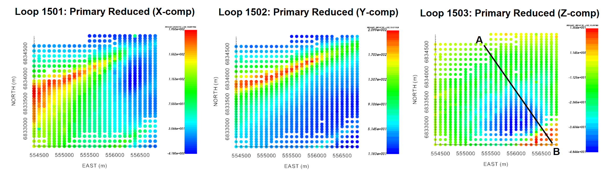
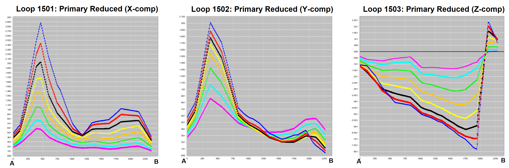
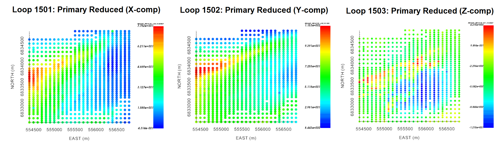

.. _comprehensive_workflow_utem_3:

Survey Geometry and Data Visualization
======================================

By plotting total B-field data, we learned that signatures in the total field are greatly influenced by the primary field; as UTEM systems collect data during the on-time. When provided with total B-field or dB/dt measurements, we must transform the data into a representation that is suitable for interpreting the EM responses from conductive targets (e.g. primary normalized, primary reduced, channel reduced). If the latter is provided, we will need to transform the data back into a representation that can be inverted.

It is clear the representation of the data being inverted is not the same as the representation of the data used for interpretation. And as such, we need a means of converting between the two. Except when working with channel reduced data, this conversion requires that we know the primary field. Here, we define the survey geometry (source and receivers) for each data object and use it to compute the analytic primary field. We then demonstrate how total B-field measurements can be converted to representations used for plotting, and visa versa.

Defining the Survey Geometry
----------------------------

During the survey, it is common for practitioners to map the wire path of each transmitter loop with GPS and convert the values to UTM coordinates. The set of discrete wire segments defining the loop can be used to compute the primary field analytically according to the Biot-Savart law. The orientations of UTEM receivers are also collected. This information is especially important when field components are not necessarily collected along the X, Y and Z directions.

Transmitters
^^^^^^^^^^^^

To define the transmitter for each data object, we:

    - use the :ref:`create single inductive/galvanic sources <objectEMdtype_EM3Dsounding_tx_surface>` functionality
    - select 'load text file'
    - find the XYZ file in the *assets* folder containing the nodes which define the loop, then load; e.g. *wire_path_1501.txt*
    - the click 'OK'

.. important:: The XYZ file containing the nodes for the transmitter has **no headers**. And unlike topography files, the first line **is not** the number of nodes. Finally, the first and last line **must be the same** in order to close the loop and define an inductive source!

Receivers
^^^^^^^^^

To define the receivers for each data object, we:

    - use the :ref:`create surface/airborne sources <objectEMdtype_EM3Dsounding_rx_airborne>` functionality
    
**For the tutorial data:**

    - select 'square loop' and set the 'loop width' to 1 m. So long as the loop dimension is sufficiently smaller than the minimum cell size used to construct the mesh, we are effectively modeling the fields at a point.
    - set the 'loop path/integration path' to be 'Right-handed/CCW'. We will be inverting the data with the *TDRH v2* code, which uses a universally right-handed coordinate system.
    - since the tutorial data are defined along the X, Y and Z directions, and the bearing is left as 0 (Northing), within the 'Orientation' box:

        - Select 'Horizontal co-planar' to define X-component data
        - Select 'Vertical co-axial' to define Y-component data
        - Select 'Vertical co-planar' to define Z-component data

Computing the Primary Field
---------------------------

We have defined the transmitter and receivers for all data objects.
For each data object, we compute and created columns for the magnetic field along the receiver direction as well as the magnitude.
This is accomplished using:

    - :ref:`Compute Biot-Savart Primary Field<objectEMBiotSavart>`. Choose the 'B-field' option.

.. important::

    - This functionality computes components of the field assuming a right-handed coordinate system. We strongly urge the user to work in a coordinate system with X (Easting), Y (Northing) and Z (+ve up).
    - The order in which you define the nodes for transmitter loops matters, as it determines the direction of current flow.

Before transforming field data into a representation suitable for interpretation, the primary field computed in GIFtools can be used to

    - decipher the coordinate system used by the dataset and determine whether it must be transformed into the standard right-handed Cartesian components
    - determine whether the data are in fact defined using the correct units 

**For the tutorial data,** we show the vertical component of the total B-field and primary B-field. Examination concluded that the UTEM data loaded into GIFtools used the standard Cartesian coordinate system (i.e. right-handed). The vertical component of the primary and total fields for loop 1503 are similar in magnitude; which is expected given the survey geometry. As a result, we are confident the field values are in the correct units (i.e. Teslas).

    Vertical component of the total B-field and primary B-field for all transmitter loops at times near 0.01 s.

Isolating Secondary Field and Removing Erroneous Data
-----------------------------------------------------

Here, the analytic primary field is removed from the total field data. We then examine the resulting data objects and remove any erroneous receivers. In our case, the data for each transmitter and receiver orientation is stored in a different *TEM3Dsounding* object. For each object, we subtract the field in the orientation of the receiver ('Bpn') from the total field ('B_TOTAL'). If you happened to be working with *TEMdata* objects, you would need to subtract the 'Bpx', 'Bpy' and 'Bpz' columns accordingly. To remove the primary field:

    - use the :ref:`column calculator <objectCalculator>`. Make sure to create a new column and name it something like 'B_SECONDARY' to avoid later confusion.

Ideally, the primary field would have been removed precisely and the user could observe the secondary TEM response cleanly. However, it is common for certain receivers to collect poor quality data. Data for these receivers must be remove from each data object. **For the tutorial data,** we see examples where the secondary field data are clean and where erroneous data must be removed.

To remove erroneous data:

    - Select the data object and :ref:`plot with VTK viewer <viewData>`
    - Select the 'B_SECONDARY' column from the 'Current data' drop-down menu.
    - Click the 'Edit' tab, select the square selector icon. While this icon is highlighted, you can select data. Next, click 'View' to go back.
    - For each time channel selected from the drop-down menu, examine the plot. If you identify a bad receiver, hold Ctrl and select the data point. If you are not holding Ctrl, you will un-select all previous data points.
    - Once all the desired points are selected, click the 'Edit' tab, then click the 'Simple edit' tab.

        - Under 'Data selection', click 'Data not highlighted'
        - Under 'Delete', click 'Delete locations'
        - Provide a name for the data object that will be created. We suggest appending '_clean' onto the end of the original name
        - Click 'Apply'

Make sure to go through the 'clean' data objects and ensure you didn't miss any remaining erroneous data. Also ensure that you have no obvious remaining signature from the primary field. If the primary field has not be adequately removed, it may impact your interpretation and final inversion result.

Converting Between UTEM Data Representations
--------------------------------------------

In :ref:`understanding UTEM anomalies <comprehensive_workflow_utem_1_plotting>` we defined the conversions between measured fields and various data conventions used for plotting. In each case, the conversion may be done using:

    - the :ref:`column calculator <objectCalculator>` 

**For the tutorial data,** we have already computed the secondary field and we would like to plot primary reduced data. In this case, we simply need to divide the secondary field column ('B_SECONDARY') by the magnitude of the primary field ('B_abs') that we computed analytically, then multiply by 100 (if desired). When doing the initial division, we create a data column 'PRIMARY_REDUCED'. The reverse could be done to convert from primary reduced data to secondary/total field data. It is also possible to subtract the latest time channel from all times if the user would like to work with channel reduced data.

.. _comprehensive_workflow_utem_3_interp:

Preliminary Interpretation
--------------------------

Below, we have provided several meaningful plots used to interpret the data from its primary reduced representation. From examining the data maps, we determine 2 notable signatures:

    - A large WSW to ENE trending feature in the Northern region of the data coverage. This signature is most prominent in data collected using loops 1501 and 1502; i.e. the loops that are offset from the receiver locations.
    - An isolated conductor in the middle/Southeast region of the data coverage. This signature is prominent in data collected using loop 1503.

    Primary reduced data at Ch4 for: Loop 1501 (X-component), 1502 (Y-component) and 1503 (Z-component).

    Primary reduced data profiles (Ch0 - Ch8) for: Loop 1501 (X-component), 1502 (Y-component) and 1503 (Z-component).

The late time data is particularly interesting. First, inductive signatures have not completely decayed by the latest time channel (Ch0). This indicates structures with relatively high conductivities. We also see positive values in the Z-component of the primary reduced data for loop 1503. According to our :ref:`understanding anomalies <comprehensive_workflow_utem_1_susceptible>`, this is indicative of a magnetostatic response.

The presence of highly susceptible materials creates two potential problems. First, the magnetostatic response can mask a portion of the observed TEM signatures (especially at late times). Second, magnetic susceptibility impacts the time-decay behaviour of TEM responses from conductive targets if sufficiently high. As a result, we may need to take magnetic susceptibility into account when inverting the tutorial data.

    Primary reduced data at Ch0 for: Loop 1501 (X-component), 1502 (Y-component) and 1503 (Z-component).

